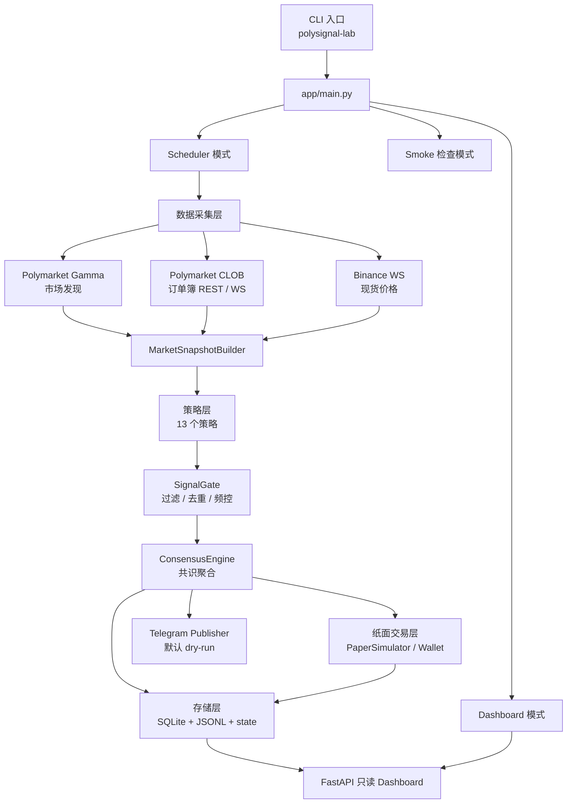
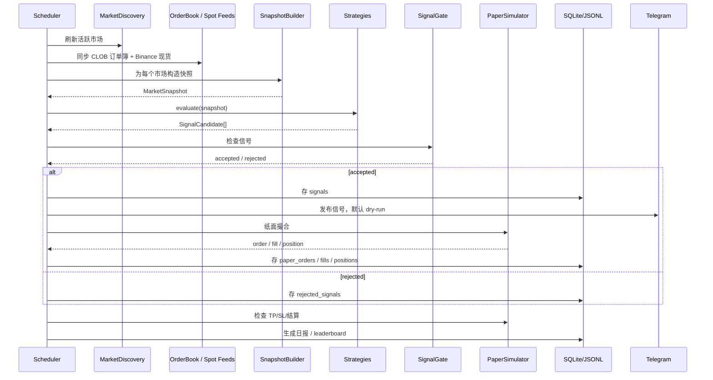
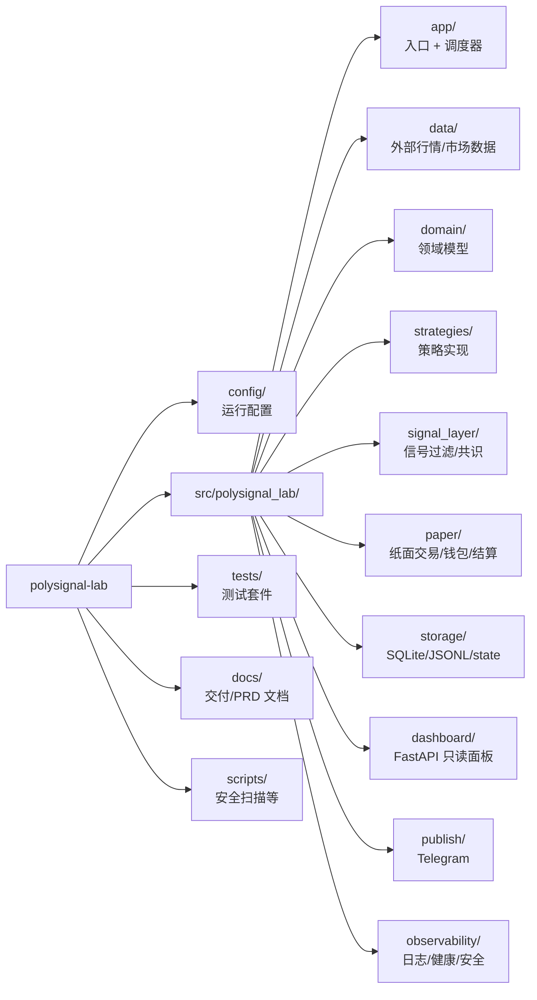
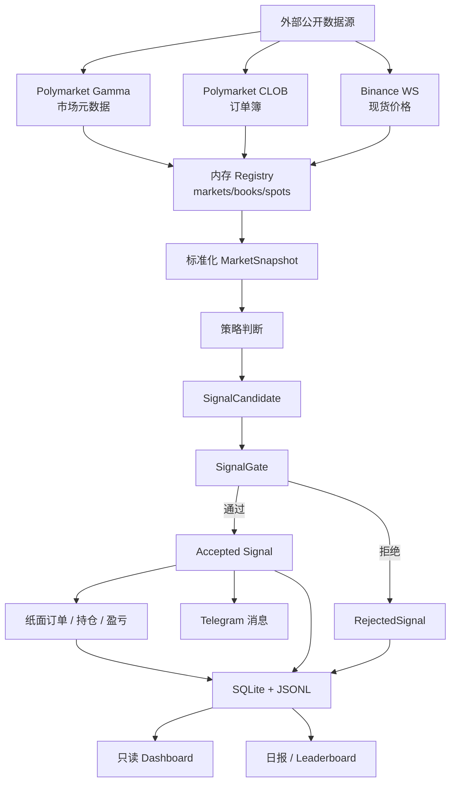
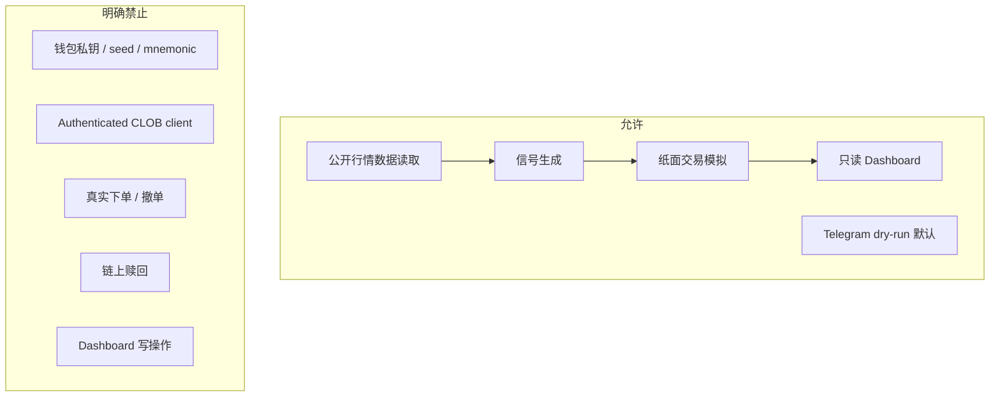
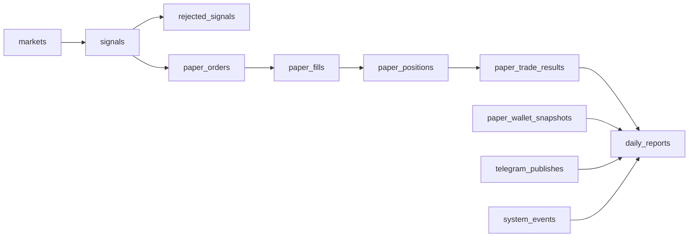
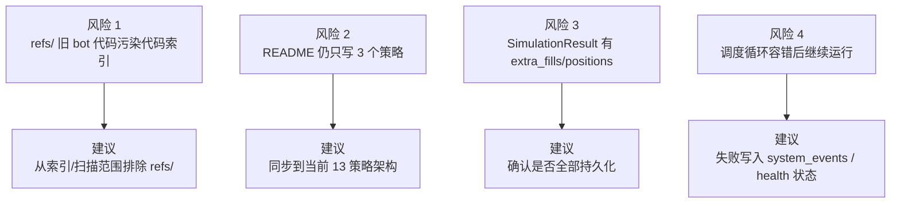

# PolySignal Lab 项目架构图解

> 生成日期：2026-06-23  
> 范围：当前仓库 `src/polysignal_lab/`、`config/`、`tests/`、运行入口与主要数据流。

## 1. 一句话概览

PolySignal Lab 是一个 **只读 Polymarket 短周期信号 + 纸面交易验证系统**：读取公开行情数据，生成策略信号，通过 gate/共识层过滤，默认 dry-run 发布 Telegram，并将信号、纸面订单、成交、持仓、结算和日报写入 SQLite/JSONL，最后由 FastAPI Dashboard 只读展示。

## 2. 总体架构

## 3. 一次调度循环

## 4. 目录分层

## 5. 数据流向

## 6. 安全边界

## 7. 核心文件地图

| 区域 | 文件/目录 | 职责 |
|---|---|---|
| CLI 入口 | `src/polysignal_lab/app/main.py` | 解析 runtime mode，启动 scheduler/dashboard/smoke |
| 调度器 facade | `src/polysignal_lab/app/scheduler.py` | 组装数据源、策略、gate、纸面交易、存储、发布器 |
| 调度循环 | `src/polysignal_lab/app/scheduler_runtime.py` | 主循环、周期刷新、信号处理、结算、日报 |
| 市场数据 | `src/polysignal_lab/app/scheduler_market_data.py` | 市场发现、CLOB book、WS 订阅、resolved market 拉取 |
| 信号处理 | `src/polysignal_lab/app/scheduler_processing.py` | strategy evaluate、gate、持久化、Telegram、纸面撮合 |
| 报告/结算 | `src/polysignal_lab/app/scheduler_reporting.py` | TP/SL/settlement、daily report、leaderboard |
| 配置模型 | `src/polysignal_lab/config.py` | Pydantic 配置、安全环境校验、YAML/env override |
| 策略注册 | `src/polysignal_lab/strategies/factory.py` | config 名称到策略类的 registry |
| 策略接口 | `src/polysignal_lab/strategies/base.py` | `BaseStrategy.evaluate()` 与候选信号构造 |
| Gate | `src/polysignal_lab/signal_layer/gate.py` | 市场、时间、book/spot 新鲜度、价差、置信度、去重、频控 |
| 纸面交易 | `src/polysignal_lab/paper/simulator.py` | taker/passive/multi-leg paper execution |
| Dashboard | `src/polysignal_lab/dashboard/app.py` | FastAPI 只读 API 与 HTML 首页 |
| SQLite schema | `src/polysignal_lab/storage/sqlite_schema.py` | canonical 表结构和索引 |
| 运行配置 | `config/signal_bot.yaml` | asset/timeframe、数据源、策略、paper、telegram、dashboard 配置 |

## 8. 存储模型

## 9. 当前值得关注的架构风险

## 10. 总结

当前架构已经是完整产品化骨架，不是临时脚本：

- 入口清楚：`app/main.py`。
- 调度主线清楚：market discovery → snapshot → strategies → gate → consensus → paper/storage/publish。
- 安全边界清楚：只读、无 secret、无真实交易客户端、无下单/撤单/赎回。
- 审计链路完整：SQLite canonical storage + JSONL audit + state snapshots。
- Dashboard 明确只读。

优先改进项：

1. 复查 `extra_fills/extra_positions` 是否漏存。
2. 隔离 `refs/`，避免旧 bot 代码污染代码索引和安全扫描。
3. 更新 README，使策略数量和当前运行架构一致。
4. 将 scheduler 持续失败状态显式写入 `system_events` 或 health surface。
