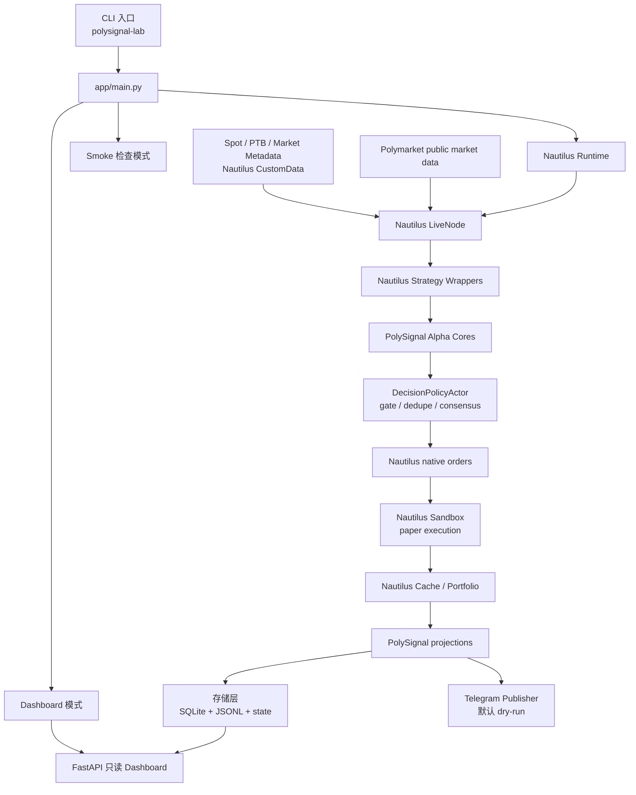
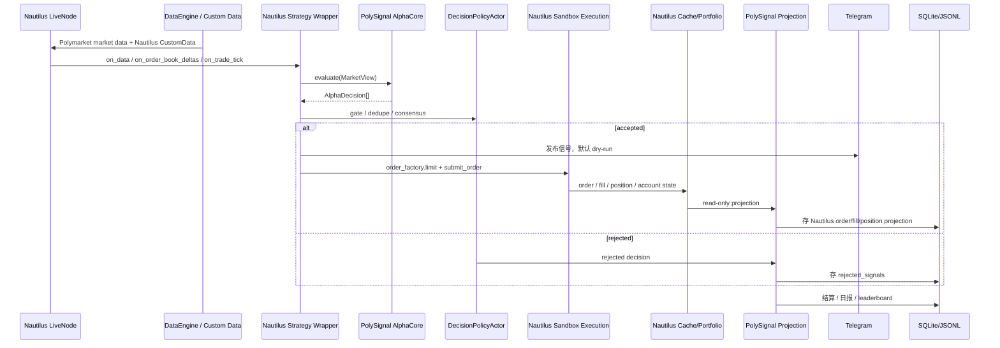
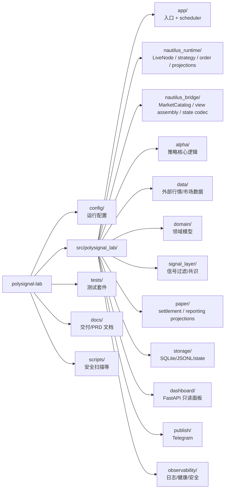
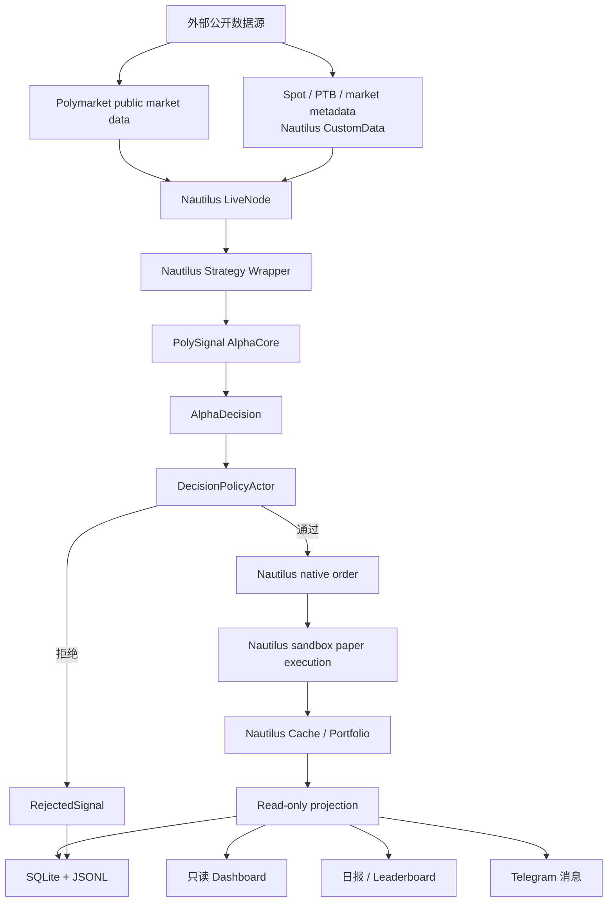
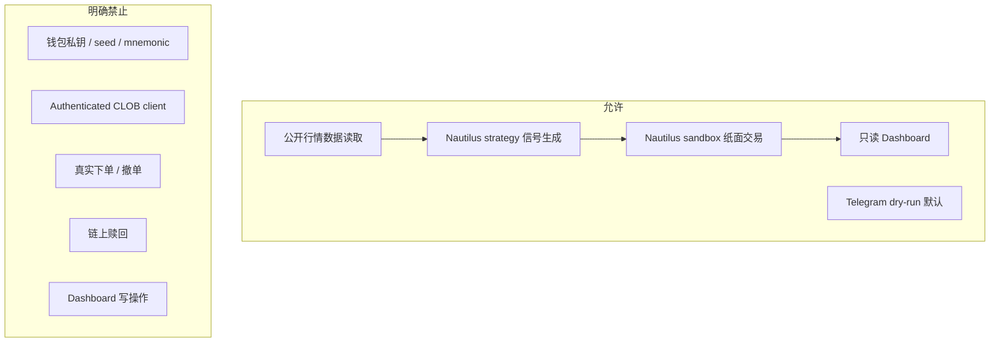
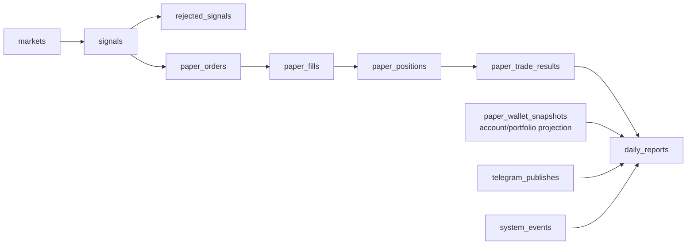
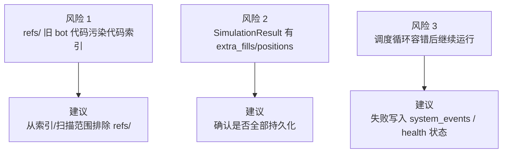

# PolySignal Lab 项目架构图解

> 生成日期：2026-06-23  
> 范围：当前仓库 `src/polysignal_lab/`、`config/`、`tests/`、运行入口与主要数据流。

## 1. 一句话概览

PolySignal Lab 是一个 **只读 Polymarket 短周期信号 + Nautilus 纸面交易验证系统**：读取公开 Polymarket 行情和 Nautilus `CustomData` 业务数据，在 Nautilus `LiveNode` strategy callbacks 中运行策略，通过 gate/共识层过滤，默认 dry-run 发布 Telegram，并将 Nautilus order/fill/position/account 投影、结算和日报写入 SQLite/JSONL，最后由 FastAPI Dashboard 只读展示。

## 2. 总体架构

## 3. 一次 Nautilus 纸面交易循环

## 4. 目录分层

## 5. 数据流向

## 6. 安全边界

## 7. 核心文件地图

| 区域 | 文件/目录 | 职责 |
|---|---|---|
| CLI 入口 | `src/polysignal_lab/app/main.py` | 解析 runtime mode；生产配置默认启动 Nautilus |
| Nautilus 入口 | `src/polysignal_lab/nautilus_runtime/node.py` | 组装 LiveNode、actor、strategy、cache projection |
| Nautilus 配置 | `src/polysignal_lab/nautilus_runtime/live_node.py` | 通过 LiveNode builder 注册 Polymarket data client 与 sandbox paper execution client |
| Nautilus 策略 | `src/polysignal_lab/nautilus_runtime/native_strategy.py` | 在 Nautilus callbacks 中运行 alpha core、处理 order/fill/position events |
| Nautilus 下单 | `src/polysignal_lab/nautilus_runtime/native_order.py` | 将 approved decision 映射为 Nautilus native limit order |
| Nautilus 投影 | `src/polysignal_lab/nautilus_runtime/cache_reader.py` | 只读读取 Nautilus orders/fills/positions/account/portfolio |
| Bridge | `src/polysignal_lab/nautilus_bridge/` | `MarketCatalog` business-key lookup、market view assembly、state codec |
| Alpha core | `src/polysignal_lab/alpha/` | engine-agnostic 策略判断 |
| 报告/结算 | `src/polysignal_lab/app/scheduler_reporting.py` | settlement、daily report、leaderboard；读取 Nautilus projections |
| 配置模型 | `src/polysignal_lab/config.py` | Pydantic 配置、安全环境校验、YAML/env override |
| Gate | `src/polysignal_lab/signal_layer/gate.py` | 市场、时间、book/spot 新鲜度、价差、置信度、去重、频控 |
| Dashboard | `src/polysignal_lab/dashboard/app.py` | FastAPI 只读 API 与 HTML 首页 |
| SQLite schema | `src/polysignal_lab/storage/sqlite_schema.py` | canonical 表结构和索引 |
| 运行配置 | `config/signal_bot.yaml` | asset/timeframe、数据源、策略、Nautilus、paper、telegram、dashboard 配置 |

## 8. 存储模型

## 9. 当前值得关注的架构风险

## 10. 总结

当前架构已经是完整产品化骨架，不是临时脚本：

- 入口清楚：`app/main.py`。
- 调度主线清楚：Nautilus data callbacks → alpha cores → gate → consensus → Nautilus sandbox order/fill → cache/portfolio projection → storage/publish。
- 安全边界清楚：只读、无 secret、无真实交易客户端、无下单/撤单/赎回。
- 审计链路完整：SQLite canonical storage + JSONL audit + state snapshots。
- Dashboard 明确只读。

优先改进项：

1. 复查 `extra_fills/extra_positions` 是否漏存。
2. 隔离 `refs/`，避免旧 bot 代码污染代码索引和安全扫描。
3. 将 scheduler 持续失败状态显式写入 `system_events` 或 health surface。（注：Legacy Scheduler 模式已在最终迁移中移除）
