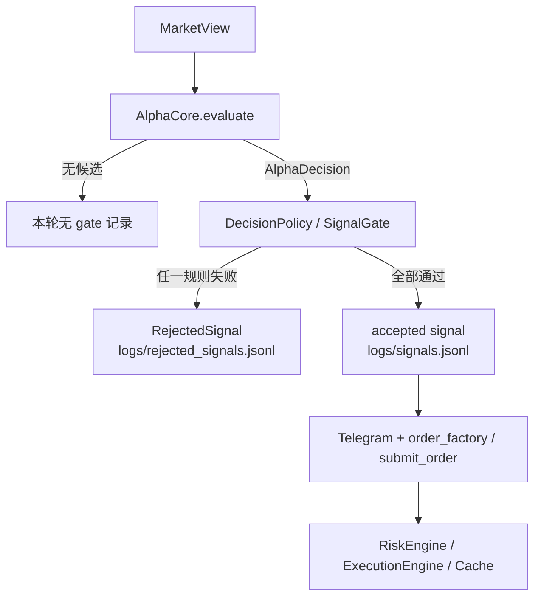
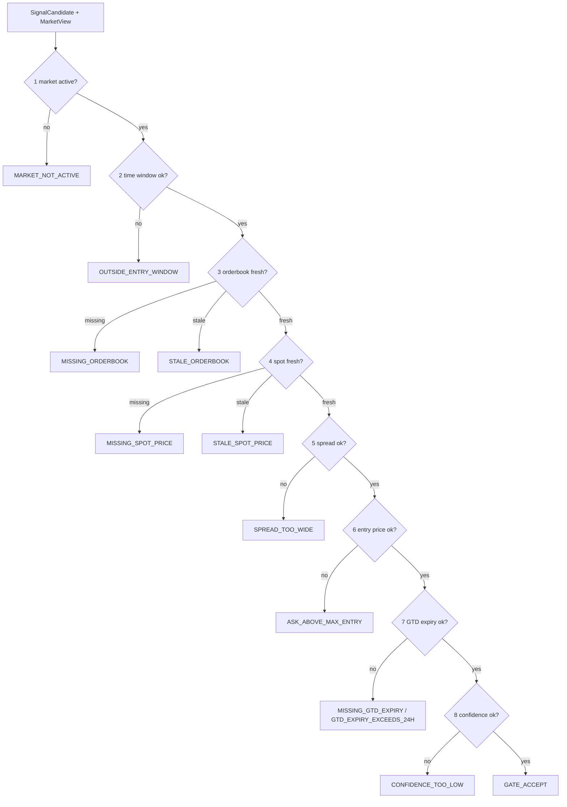
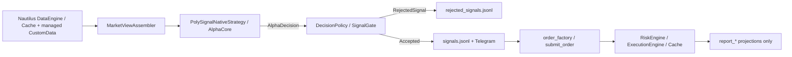

# Signal Gate 拦截规则与判定标准

> Living document. **Gate 规则权威**（顺序、拒绝码、判定细节）。
> 产品级摘要见 [`PRD.md`](PRD.md) §18；决策所有权见 [`ARCHITECTURE_OWNERSHIP.md`](ARCHITECTURE_OWNERSHIP.md)。
>
> `SignalGate` 是**业务资格**检查，**不是** Nautilus RiskEngine。账户余额、名义上限、submit rate 由 RiskEngine / ExecutionEngine 拥有。

`SignalGate` 在候选进入 Telegram 发布与 `submit_order` 之前做统一拦截。

> Alpha / Strategy 产出 `MarketView` → `AlphaDecision` → `SignalCandidate`；Gate 只检查已生成的候选。策略内部 `return []` 不会写入 `rejected_signals.jsonl`。



## Gate 总体规则

Gate 按固定顺序检查，**第一个失败项立即返回**；后续规则不再执行。

当前 `prevalidate` 检查（代码权威）：



**已移除（不得再当作 Gate 步骤）**：独立 `_dedupe` / `_rate_limit`、跨策略 `SignalArbiter` / `ConsensusEngine`。in-flight 重复提交由 Strategy pipeline 以 `DUPLICATE_IN_FLIGHT_SIGNAL` 处理，不是账户账本。

## 规则表

| 顺序 | Gate 函数 | 通过标准 | 拒绝码 | 当前标准来源 |
|---:|---|---|---|---|
| 1 | `_market_active` | market active | `MARKET_NOT_ACTIVE` | `MarketView` |
| 2 | `_time_window` | 普通信号：`seconds_to_close > 0`；`reduce_only` 跳过 | `OUTSIDE_ENTRY_WINDOW` | `SignalCandidate` |
| 2a | `_time_window` | `PASSIVE_GTD` 且有 `expiry_seconds` 时跳过普通到期检查 | — | `order_intent` |
| 3 | `_book_freshness` | 候选方向 book 存在且 freshness ≤ 阈值 | `MISSING_ORDERBOOK`, `STALE_ORDERBOOK` | `data.polymarket.max_book_staleness_ms` + 策略 freshness policy |
| 4 | `_spot_freshness` | spot 存在且 freshness ≤ 阈值；`reduce_only` 跳过 | `MISSING_SPOT_PRICE`, `STALE_SPOT_PRICE` | spot 来自 Cache/`CustomData`；阈值字段现仍读 `data.binance.max_price_staleness_ms`（遗留配置键，非 Binance 直连行情） |
| 5 | `_spread` | 非 GTD：`book.spread <= max_spread`（默认 `0.12`） | `SPREAD_TOO_WIDE` | 候选 metrics |
| 6 | `_max_entry` | 非 GTD：ask ≤ `max_entry_price` | `ASK_ABOVE_MAX_ENTRY` | 候选 max entry |
| 7 | `_gtd_expiry` | 非 GTD 跳过；GTD 必须 `0 < expiry_seconds <= 86400` | `MISSING_GTD_EXPIRY`, `GTD_EXPIRY_EXCEEDS_24H` | 候选 order intent |
| 8 | `_confidence` | `confidence >= min_confidence_to_publish` | `CONFIDENCE_TOO_LOW` | `signal.min_confidence_to_publish` |

## Freshness 阈值怎么算

```text
if candidate.freshness_policy.<field> is None:
    threshold_ms = global_config_value
else:
    threshold_ms = min(global_config_value, candidate.freshness_policy.<field>)
```

策略可以更严格，但不能放宽全局上限。

当前主配置：

| 项目 | 当前值 |
|---|---:|
| 全局 order book freshness | `data.polymarket.max_book_staleness_ms = 60000` ms |
| 全局 spot freshness 配置键 | `data.binance.max_price_staleness_ms = 60000` ms（键名遗留） |
| 发布最低置信度 | `signal.min_confidence_to_publish = 0.50` |

## 价格与 spread 规则图

```mermaid
flowchart TD
    A[候选 side: UP/DOWN] --> B[view.book_for(side)]
    B --> C{book exists?}
    C -- no --> M[MISSING_ORDERBOOK]
    C -- yes --> D{book.freshness <= threshold?}
    D -- no --> S[STALE_ORDERBOOK]
    D -- yes --> E{PASSIVE_GTD?}
    E -- yes --> OK1[跳过 spread / max_entry]
    E -- no --> F{book.spread <= max_spread?}
    F -- no --> W[SPREAD_TOO_WIDE]
    F -- yes --> G{ask <= max_entry_price?}
    G -- no --> H[ASK_ABOVE_MAX_ENTRY]
    G -- yes --> OK2[进入 confidence]
```

## 拒绝记录会写什么

每次被 Gate 拦截会生成 `RejectedSignal`：

```text
logs/rejected_signals.jsonl
├─ rejected_id
├─ rejected_at
├─ gate_name       # 例如 _spot_freshness
├─ reason_code     # 例如 STALE_SPOT_PRICE
├─ candidate       # 原始 SignalCandidate
└─ details
   ├─ strategy / asset / timeframe / market_id / side
   ├─ confidence
   ├─ entry_reference_price / max_entry_price
   ├─ seconds_to_close
   └─ freshness 规则会额外写 source / lag_ms / threshold_ms / policy_source
```

## 常见原因怎么读

| 现象 | 典型拒绝码 | 含义 | 优先检查 |
|---|---|---|---|
| 容器 healthy 但没有新信号 | `STALE_SPOT_PRICE` | spot 停更或超过 freshness | RTDS/CustomData lag、`rejected_signals.jsonl` |
| 行情卡住 | `STALE_ORDERBOOK` | 候选方向盘口过期 | DataEngine/Cache book freshness |
| 有行情但不发 | `CONFIDENCE_TOO_LOW` | 置信度低于发布阈值 | `candidate.confidence` |
| 临近结算异常 | `OUTSIDE_ENTRY_WINDOW` | `seconds_to_close <= 0` | market end / view.created_at |
| 提交被引擎拒 | （非 Gate） | 余额/名义/速率 | **RiskEngine** / sandbox 事件 |

## 当前生产链路



排查顺序：

1. `/api/health`：spot/book lag。
2. `logs/rejected_signals.jsonl`：`reason_code`。
3. freshness：`details.lag_ms` vs `threshold_ms`。
4. 仅 `GATE_ACCEPT` 后进入 Telegram 与 `submit_order`；其后拒单查 Cache/RiskEngine，不查 Gate。
