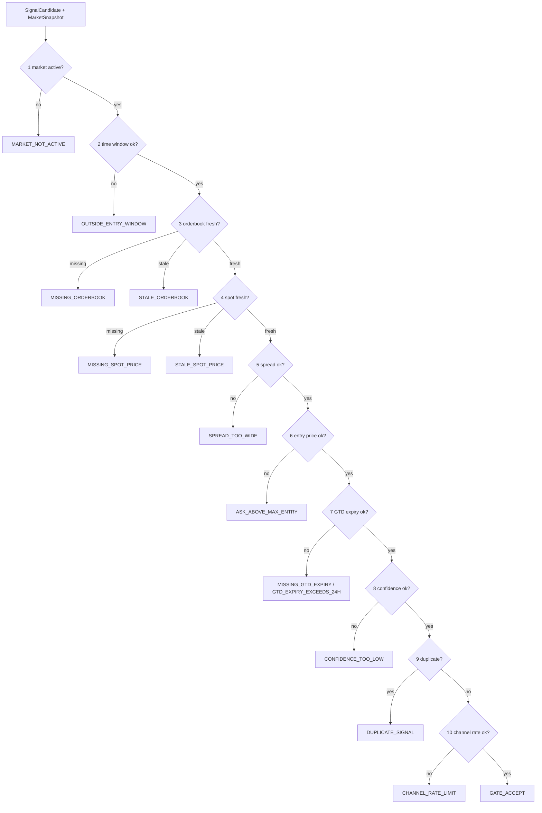
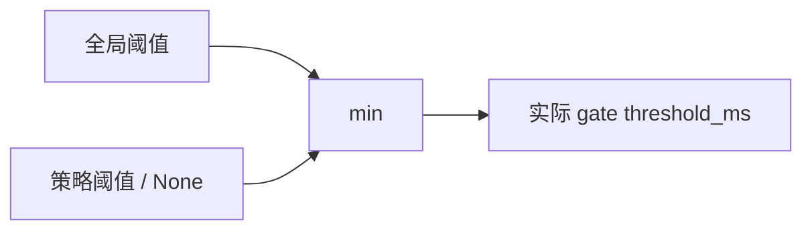

# Signal Gate 拦截规则与判定标准

`SignalGate` 是策略候选信号进入发布、共识、纸交易之前的统一拦截层。

> 策略先用 `MarketSnapshot` 生成 `SignalCandidate`；Gate 只检查已经生成的候选。策略内部 `return []` 的筛选不会写入 `rejected_signals.jsonl`。

```mermaid
flowchart TD
    A[MarketSnapshot] --> B[strategy.evaluate(snapshot)]
    B -->|无候选| X[本轮无 gate 记录]
    B -->|SignalCandidate| C[SignalGate.evaluate]
    C -->|任一规则失败| R[RejectedSignal<br/>logs/rejected_signals.jsonl]
    C -->|全部通过| P[accepted signal<br/>logs/signals.jsonl]
    P --> D[Consensus / Publish / Paper]
```

## Gate 总体规则

Gate 按固定顺序检查，**第一个失败项立即返回**；后续规则不再执行。



## 规则表

| 顺序 | Gate 函数 | 通过标准 | 拒绝码 | 当前标准来源 |
|---:|---|---|---|---|
| 1 | `_market_active` | `snapshot.market.is_active == true` | `MARKET_NOT_ACTIVE` | 市场状态 |
| 2 | `_time_window` | 普通信号：`seconds_to_close > 0` | `OUTSIDE_ENTRY_WINDOW` | `SignalCandidate.seconds_to_close` |
| 2a | `_time_window` | `PASSIVE_GTD` 且有 `expiry_seconds` 时跳过普通到期检查 | — | `order_intent`, `expiry_seconds` |
| 3 | `_book_freshness` | 候选方向对应 order book 存在，且 `book.freshness_ms(snapshot.created_at) <= threshold_ms` | `MISSING_ORDERBOOK`, `STALE_ORDERBOOK` | `data.polymarket.max_book_staleness_ms` + 策略 freshness policy |
| 4 | `_spot_freshness` | spot 存在，且 `spot.freshness_ms(snapshot.created_at) <= threshold_ms` | `MISSING_SPOT_PRICE`, `STALE_SPOT_PRICE` | `data.binance.max_price_staleness_ms` + 策略 freshness policy |
| 5 | `_spread` | 非 GTD：`book.spread <= candidate.metrics["max_spread"]`；未提供时默认 `0.12` | `SPREAD_TOO_WIDE` | 候选 metrics |
| 6 | `_max_entry` | 非 GTD：`snapshot.ask_for(side) <= candidate.max_entry_price` | `ASK_ABOVE_MAX_ENTRY` | 候选 max entry |
| 7 | `_gtd_expiry` | 非 GTD 跳过；GTD 必须 `0 < expiry_seconds <= 86400` | `MISSING_GTD_EXPIRY`, `GTD_EXPIRY_EXCEEDS_24H` | 候选 order intent |
| 8 | `_confidence` | `candidate.confidence >= signal.min_confidence_to_publish` | `CONFIDENCE_TOO_LOW` | `signal.min_confidence_to_publish` |
| 9 | `_dedupe` | 开启 dedupe 时，`dedupe_key` 在 TTL 内不能重复 | `DUPLICATE_SIGNAL` | `signal.dedupe_enabled`, `signal.dedupe_ttl_sec` |
| 10 | `_rate_limit` | 每小时总信号、单市场信号未超限 | `CHANNEL_RATE_LIMIT` | `signal.max_signals_per_hour`, `signal.max_signals_per_market` |

## Freshness 阈值怎么算

Order book 和 spot freshness 都用同一个规则：

```text
if candidate.freshness_policy.<field> is None:
    threshold_ms = global_config_value
else:
    threshold_ms = min(global_config_value, candidate.freshness_policy.<field>)
```

含义：策略可以更严格，但不能放宽全局上限。



当前主配置：

| 项目 | 当前值 |
|---|---:|
| 全局 order book freshness | `data.polymarket.max_book_staleness_ms = 60000` ms |
| 全局 spot freshness | `data.binance.max_price_staleness_ms = 60000` ms |
| 发布最低置信度 | `signal.min_confidence_to_publish = 0.50` |
| dedupe TTL | `signal.dedupe_ttl_sec = 300` sec |
| 每市场最大发送 | `signal.max_signals_per_market = 3` |
| 每小时最大发送 | `signal.max_signals_per_hour = 60` |

当前启用策略的 freshness policy：

| 策略 | order book 阈值 | spot 阈值 | 实际效果 |
|---|---:|---:|---|
| `vwap_momentum` | `60000` ms | `60000` ms | 使用全局 60s |
| `late_consensus` | `1500` ms | `1500` ms | Gate 使用 1.5s，更严格 |
| `ptb_diff` | `round(exit_config.market_data_max_lag_sec * 1000)`；当前 `1.2s = 1200` ms | 同左 | Gate 使用 1.2s，更严格 |

## 价格与 spread 规则图

```mermaid
flowchart TD
    A[候选 side: UP/DOWN] --> B[snapshot.book_for(side)]
    B --> C{book exists?}
    C -- no --> M[MISSING_ORDERBOOK]
    C -- yes --> D{book.freshness <= threshold?}
    D -- no --> S[STALE_ORDERBOOK]
    D -- yes --> E{PASSIVE_GTD?}
    E -- yes --> OK1[跳过 spread / max_entry]
    E -- no --> F{book.spread <= max_spread?}
    F -- no --> W[SPREAD_TOO_WIDE]
    F -- yes --> G{ask_for(side) <= max_entry_price?}
    G -- no --> H[ASK_ABOVE_MAX_ENTRY]
    G -- yes --> OK2[进入后续 confidence / dedupe / rate limit]
```

## 拒绝记录会写什么

每次被 Gate 拦截会生成 `RejectedSignal`：

```text
logs/rejected_signals.jsonl
├─ rejected_id
├─ rejected_at
├─ gate_name       # 例如 _spot_freshness
├─ reason_code     # 例如 STALE_SPOT_PRICE
├─ candidate       # 原始 SignalCandidate
└─ details
   ├─ strategy / asset / timeframe / market_id / side
   ├─ confidence
   ├─ entry_reference_price / max_entry_price
   ├─ seconds_to_close
   ├─ dedupe_key
   └─ freshness 规则会额外写 source / lag_ms / threshold_ms / policy_source
```

日志里也会出现同一原因：

```text
GATE_REJECT _spot_freshness STALE_SPOT_PRICE market=<id> side=<UP|DOWN> reason=STALE_SPOT_PRICE
```

## 常见原因怎么读

| 现象 | 典型拒绝码 | 含义 | 优先检查 |
|---|---|---|---|
| 容器 healthy 但没有新信号 | `STALE_SPOT_PRICE` | spot 价格停更或超过策略 freshness 阈值 | dashboard `/health` 的 spot lag、`logs/rejected_signals.jsonl` |
| CLOB 行情卡住 | `STALE_ORDERBOOK` | 候选方向盘口过期 | CLOB WS/REST 健康、book freshness |
| 策略频繁给同一个方向 | `DUPLICATE_SIGNAL` | dedupe TTL 内重复 | `dedupe_key`, `signal.dedupe_ttl_sec` |
| 有行情但不发 | `CONFIDENCE_TOO_LOW` | 候选置信度低于发布阈值 | `candidate.confidence`, `signal.min_confidence_to_publish` |
| 某个市场突然不发 | `CHANNEL_RATE_LIMIT` | 市场或频道发送限额触发 | `max_signals_per_market`, `max_signals_per_hour` |
| 临近结算异常 | `OUTSIDE_ENTRY_WINDOW` | 普通信号 `seconds_to_close <= 0` | market end time、snapshot created_at |

## 当前生产链路中的关键点

```mermaid
flowchart LR
    M[MarketSnapshotBuilder] --> S[Strategy]
    S -->|SignalCandidate| G[SignalGate]
    G -->|RejectedSignal| RJ[rejected_signals.jsonl]
    G -->|Accepted Signal| SG[signals.jsonl]
    SG --> PB[Telegram / Paper]

    H[/api/health] --> L1[signal_gate rejected counts]
    H --> L2[snapshot_builder max_freshness_lag_ms]
    H --> L3[spot / book component lag]
```

排查顺序：

1. 看 `/api/health`：先确认组件是否 `degraded`，尤其 spot lag 和 book lag。
2. 看 `logs/rejected_signals.jsonl` 最新 `reason_code`：确认是哪个 gate 拦截。
3. 对 freshness 类拒绝，看 `details.lag_ms` 与 `details.threshold_ms`：它直接说明超了多少。
4. 只有 `GATE_ACCEPT` 后才会进入 `signals.jsonl`、Telegram 和 paper 流程。
