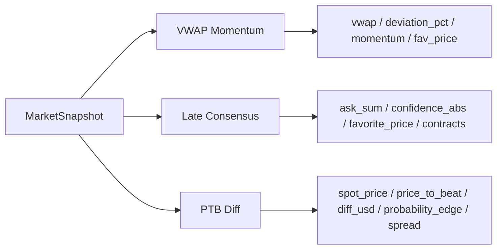
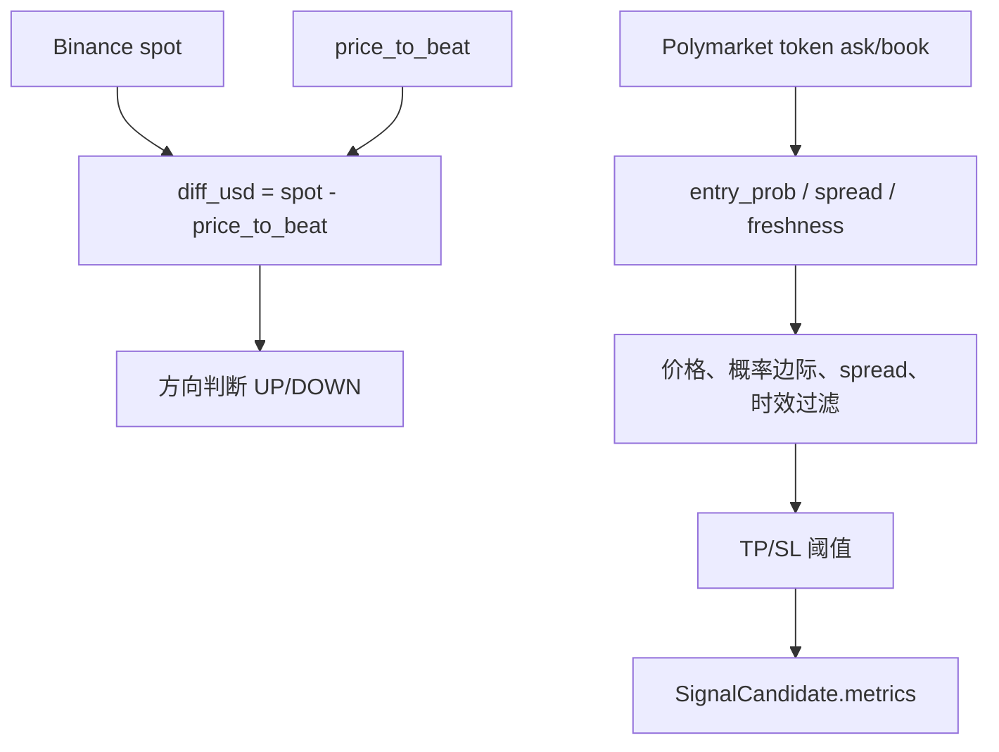

# 当前策略指标获取方法

当前实现不是“策略直接请求指标 API”。链路是：

> 外部行情源 → 本地 Registry → `MarketSnapshot` → `strategy.evaluate(snapshot)` → `SignalCandidate.metrics`

```mermaid
flowchart TD
    A[Polymarket 市场发现 / MarketRegistry.active] --> B[活跃 markets]

    C[Polymarket CLOB WS/REST] --> D[OrderBookRegistry]
    E[Binance Spot WS] --> F[SpotRegistry]
    G[PriceToBeatProvider] --> H[PTB / anchor price]

    B --> I[MarketSnapshotBuilder]
    D --> I
    F --> I
    H --> I

    I --> J[MarketSnapshot]
    J --> K[scheduler evaluate_once]
    K --> L[strategy.evaluate(snapshot)]

    L --> M[策略内部计算指标]
    M --> N[SignalCandidate.metrics]
    N --> O[SignalGate / Consensus / Paper]
```

## Snapshot 提供的基础数据

`MarketSnapshotBuilder` 从本地状态组装统一输入：

- `OrderBookRegistry.books_for_market(market)`：UP / DOWN order book。
- `SpotRegistry.get(asset)`：现货价格。
- `PriceToBeatProvider.get(market)`：PTB / anchor price。
- `FreshnessState`：order book 与 spot 的 freshness。

同时派生：

- `up_ask` / `down_ask`
- `up_bid` / `down_bid`
- `max_spread`
- `ask_sum`
- `ask_skew`
- `favorite_side`
- `seconds_to_close`
- `spot_price`
- `price_to_beat`
- `diff_usd`

```mermaid
flowchart TD
    OB[OrderBookRegistry.books_for_market] --> MS[MarketSnapshot]
    SP[SpotRegistry.get(asset)] --> MS
    PTB[PriceToBeatProvider.get] --> MS

    MS --> A[ask / bid]
    MS --> B[spread]
    MS --> C[ask_sum / ask_skew]
    MS --> D[seconds_to_close]
    MS --> E[spot - price_to_beat = diff_usd]
```

## 当前主配置启用策略

`config/signal_bot.yaml` 当前启用：

- `vwap_momentum`
- `late_consensus`
- `ptb_diff`



## VWAP Momentum

```mermaid
flowchart TD
    A[UP/DOWN order book] --> B[price = best_ask 或 last_trade_price]
    B --> C[写入策略内部 TradeHistory]
    C --> D[latest UP / DOWN price]
    D --> E[选 favorite side]
    E --> F[计算 VWAP]
    F --> G[deviation_pct = (fav_price - vwap) / vwap]
    C --> H[计算 momentum]
    G --> I[SignalCandidate.metrics]
    H --> I
```

特点：VWAP 和 momentum 不是外部指标服务返回的；策略用 snapshot 中的盘口价格维护本地滚动历史后计算。

## Late Consensus

```mermaid
flowchart TD
    A[up_ask + down_ask] --> B[ask_sum]
    A --> C[confidence_abs = abs(up_ask - down_ask)]
    A --> D[选 ask 更高的一边为 favorite]
    E[seconds_to_close] --> F[入场时间窗]
    F --> G[动态 contracts]
    B --> H[SignalCandidate.metrics]
    C --> H
    D --> H
    G --> H
```

特点：主要依赖当前 snapshot 的盘口 ask 与剩余时间。

## PTB Diff



特点：用现货价格减 PTB 判断方向，再结合 token ask、spread、freshness 过滤。

## 结论

当前策略指标大多是每次评估时从 `MarketSnapshot` 即时派生；少数滚动指标由策略实例内部维护缓存。系统没有独立的“统一技术指标服务”，策略也不直接向外部指标 API 拉取指标。
