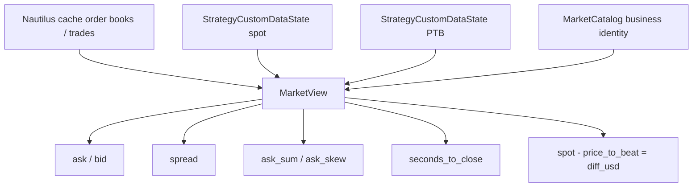
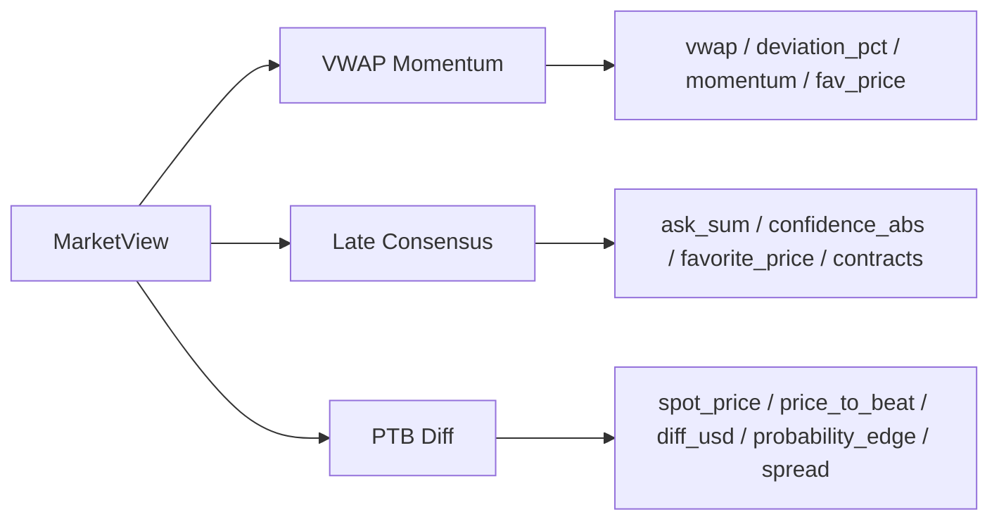
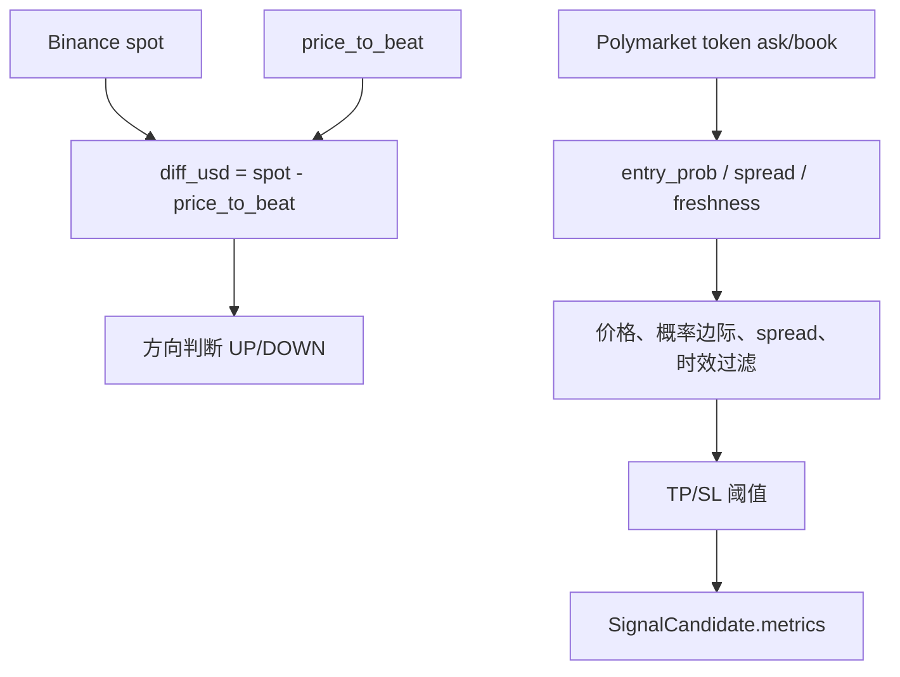

# 当前策略指标获取方法

> Living document. **行情/指标如何进入 Strategy**。
> 所有权与运行时禁止面见 [`ARCHITECTURE_OWNERSHIP.md`](ARCHITECTURE_OWNERSHIP.md)、[`RUNTIME_BOUNDARY.md`](RUNTIME_BOUNDARY.md)。

当前 native runtime 不是策略直接请求指标 API，也不再通过独立 scheduler 组装第二套行情真相。链路是：

> Gamma 市场发现 → Nautilus `TradingNode` / Polymarket `LiveDataClient` → `DataEngine` / `Cache` → `MarketViewAssembler` → `PolySignalNativeStrategy` callback → `AlphaCore.evaluate(view)` → `DecisionPipeline` / `DecisionPolicy` → Nautilus `order_factory` / `submit_order`

现货与业务派生数据通过 Nautilus-managed `CustomData` 进入策略：

- Polymarket RTDS managed data client 发布 `PolySignalSpotData`；
- `MarketRotationActor` 发布市场 metadata、market universe 和 price-to-beat data；
- `StrategyCustomDataState` 保存策略本地派生状态；
- Nautilus cache 的 order book、trade、position、order、fill 是 runtime truth source；
- `MarketCatalog` 只负责 condition/token 到业务 market/side 的映射，不复制 Nautilus instrument truth。

```mermaid
flowchart TD
    A[Gamma market discovery] --> B[TradingNode / MarketRotationActor]
    C[Polymarket LiveDataClient] --> D[Nautilus DataEngine / Cache]
    E[Managed RTDS LiveDataClient] --> F[PolySignal CustomData]
    B --> F
    B --> G[MarketCatalog]
    D --> H[MarketViewAssembler]
    F --> H
    G --> H
    H --> I[PolySignalNativeStrategy callbacks]
    I --> J[AlphaCore.evaluate(view)]
    J --> K[DecisionPipeline / DecisionPolicy]
    K --> L[Nautilus order_factory / submit_order]
```

## `MarketView` 提供的基础数据

`MarketViewAssembler` 从 Nautilus cache 投影与策略本地 `CustomData` 组装只读输入：

- UP / DOWN order book 与 trade projections；
- `StrategyCustomDataState` 中的现货价格；
- price-to-beat / anchor price；
- order book、现货和 instrument freshness；
- `seconds_to_close` 与 `MarketCatalog` 的业务 identity。

同时派生：

- `up_ask` / `down_ask`
- `up_bid` / `down_bid`
- `max_spread`
- `ask_sum`
- `ask_skew`
- `favorite_side`
- `seconds_to_close`
- `spot_price`
- `price_to_beat`
- `diff_usd`



## 当前主配置启用策略

`config/signal_bot.yaml` 当前启用：

- `vwap_momentum`
- `late_consensus`
- `ptb_diff`



## VWAP Momentum

```mermaid
flowchart TD
    A[UP/DOWN order book] --> B[price = best_ask 或 last_trade_price]
    B --> C[写入策略内部 TradeHistory]
    C --> D[latest UP / DOWN price]
    D --> E[选 favorite side]
    E --> F[计算 VWAP]
    F --> G[deviation_pct = (fav_price - vwap) / vwap]
    C --> H[计算 momentum]
    G --> I[SignalCandidate.metrics]
    H --> I
```

特点：VWAP 和 momentum 不是外部指标服务返回的；策略用 snapshot 中的盘口价格维护本地滚动历史后计算。

## Late Consensus

```mermaid
flowchart TD
    A[up_ask + down_ask] --> B[ask_sum]
    A --> C[confidence_abs = abs(up_ask - down_ask)]
    A --> D[选 ask 更高的一边为 favorite]
    E[seconds_to_close] --> F[入场时间窗]
    F --> G[动态 contracts]
    B --> H[SignalCandidate.metrics]
    C --> H
    D --> H
    G --> H
```

特点：主要依赖当前 snapshot 的盘口 ask 与剩余时间。

## PTB Diff



特点：用现货价格减 PTB 判断方向，再结合 token ask、spread、freshness 过滤。

## 结论

当前策略指标大多是每次评估时从 `MarketView` 即时派生；少数滚动指标由策略实例内部维护缓存。系统没有独立的“统一技术指标服务”，策略也不直接向外部指标 API 拉取指标。
