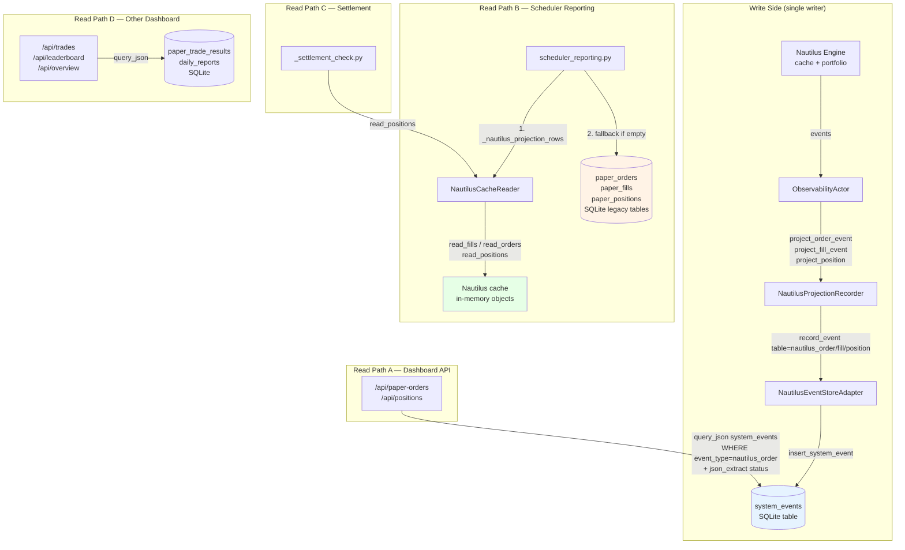

# Dashboard Data Source Unification — Design Analysis

**Date:** 2026-07-07
**Status:** Proposal / Pre-RFC
**Scope:** Whether to unify all Dashboard + reporting data reads onto a single projection stream

---

## 1. Problem Statement

The system currently reads order/fill/position data through **three distinct paths** depending on caller context, using **two different projection functions** and **two different storage schemas**. This creates an audit-split risk: the same logical order can render differently in the Dashboard vs. a daily report vs. a settlement check.

---

## 2. Current Architecture — Data Flow Map



### Three Distinct Read Sources

| Consumer | Primary Source | Fallback Source | Projection Function |
|---|---|---|---|
| `/api/paper-orders` | `system_events` WHERE event_type=`nautilus_order` | *(none)* | `projections.project_order_event` (persisted via `NautilusProjectionRecorder`) |
| `/api/positions` | `system_events` WHERE event_type=`nautilus_position` | *(none)* | `projections.project_position` (persisted) |
| `scheduler_reporting` fills | `NautilusCacheReader.read_fills()` (in-memory) | `paper_fills` (SQLite legacy table) | `projections.project_fill_event` (live) → legacy fallback is raw legacy schema |
| `scheduler_reporting` orders | `NautilusCacheReader.read_orders()` (in-memory) | `paper_orders` (SQLite legacy table) | `projections.project_order_event` (live) → legacy fallback is raw legacy schema |
| `scheduler_reporting` equity | `NautilusCacheReader.read_account_projection()` | *(hardcoded starting_equity)* | `projections.project_account` |
| `_settlement_check` positions | `NautilusCacheReader.read_positions()` | *(none)* | `projections.project_position` (live) |
| `/api/trades` | `paper_trade_results` (SQLite) | *(none)* | *(own schema — DailyReport/PaperTradeResult)* |

### Key Observation: Two Projection Moments

The system has **the same projection functions** (`projections.py`) used at **two different moments**:

1. **At write time** — `NautilusProjectionRecorder` calls `project_order_event(event)` and persists the dict into `system_events.payload_json`. The Dashboard reads this persisted projection.

2. **At read time** — `NautilusCacheReader` calls the same functions against the live Nautilus cache objects. `scheduler_reporting` reads this live projection.

These produce the same schema **only if the Nautilus cache state is identical to what was persisted**. In practice they diverge because:
- The cache is **ephemeral** — restarting Nautilus loses unflushed state.
- `system_events` is **append-only** — an order status change generates a new row; the cache shows the latest state.
- The cache-reader fill fallback scans `order.events` (line 36–43), which may contain events not yet written to `system_events`.

---

## 3. Schema & Performance Risks

### 3.1 `system_events` Has No Index on `event_type` or `created_at`

```sql
CREATE TABLE IF NOT EXISTS system_events (
    event_id TEXT PRIMARY KEY,
    event_type TEXT NOT NULL,
    severity TEXT NOT NULL,
    created_at TEXT NOT NULL,
    payload_json TEXT NOT NULL
)
```

**No index exists** for `(event_type, created_at)`. The `INDEX_DDL_STATEMENTS` list (sqlite_schema.py:184–191) covers `markets`, `signals`, `strategy_status`, `paper_positions`, `paper_trade_results`, and `anchor_prices` — but **not** `system_events`.

Current Dashboard queries:
```sql
-- /api/paper-orders
SELECT payload_json FROM system_events
WHERE event_type=? ORDER BY created_at DESC LIMIT ?

-- /api/paper-orders?status=FILLED
SELECT payload_json FROM system_events
WHERE event_type=? AND json_extract(payload_json, '$.status')=?
ORDER BY created_at DESC LIMIT ?
```

**Impact:** Full table scan + JSON extraction on every request. Tolerable at current volume (~hundreds of events/day), but **does not scale** if `system_events` is promoted to the canonical read source for reporting (which processes up to 10,000 rows).

### 3.2 Legacy Tables Have Structured Columns

`paper_orders` has indexed `(strategy, asset, timeframe)` and explicit `status` column — the exact fields reporting filters by. Moving reporting to `system_events` without a materialized projection loses these indexed access paths.

### 3.3 Payload Schema: Shared Fields and Real Gaps

The Nautilus projection (`projections.project_order_event`) already emits many of the same top-level keys as the legacy `paper_orders` schema — the schemas are closer than they first appear:

| Field | Nautilus projection payload | Legacy `paper_orders` payload | Match? |
|---|---|---|---|
| ID | `paper_order_id` + `client_order_id` | `paper_order_id` | same |
| Signal | `signal_id` (top-level, from tags) | `signal_id` (top-level) | same |
| Strategy | `strategy` (top-level, from tags) | `strategy` (top-level) | same |
| Market | `market_id` (top-level, from tags) | `market_id` (top-level) | same |
| Side | `side` (from `order_side` attr) | `side` | same key |
| Status | Nautilus lifecycle status | `OrderStatus` enum value | differs |
| Timestamps | `ts` (Nautilus `ts_event`) | `created_at` | differs (key name) |
| Asset | *(not present)* | `asset` (top-level) | missing |
| Timeframe | *(not present)* | `timeframe` (top-level) | missing |
| Market slug | *(not present)* | `market_slug` (top-level) | missing |

**The real gaps** are not in the shared order fields but in:
1. **Missing domain context** — `asset`, `timeframe`, `market_slug` do not exist in the Nautilus projection and cannot be derived without a market registry lookup at projection time.
2. **Append vs. latest semantics** — `system_events` appends a new row per state transition (SUBMITTED → ACCEPTED → FILLED); legacy tables upsert to show latest state. Reports expect one row per order with final status.
3. **Status enum mapping** — Nautilus status strings (`SUBMITTED`, `ACCEPTED`, `PARTIALLY_FILLED`) vs. the app-level `OrderStatus` enum may differ in edge cases.

---

## 4. Options Analysis

### Option A: Unified Materialized Projection Table (Recommended)

Create a dedicated `order_projections` (and `fill_projections`, `position_projections`) table with explicit, indexed columns. Write side populates it through `NautilusProjectionRecorder`; all consumers read from it.

**Pros:**
- Single source of truth for all consumers
- Proper SQL indexes; no `json_extract` scans
- Schema is versioned and validated
- Backfill is a one-time migration from `system_events` payloads
- `system_events` remains the immutable audit log (append-only, never queried for display)

**Cons:**
- New table DDL + migration
- Two writes per event (audit log + projection table) — but already effectively happening
- Need parity tests to validate projection ↔ legacy equivalence

**Schema sketch:**
```sql
CREATE TABLE IF NOT EXISTS order_projections (
    client_order_id TEXT PRIMARY KEY,
    instrument_id TEXT NOT NULL,
    strategy TEXT NOT NULL DEFAULT '',
    market_id TEXT NOT NULL DEFAULT '',
    condition_id TEXT NOT NULL DEFAULT '',
    signal_id TEXT NOT NULL DEFAULT '',
    side TEXT NOT NULL,
    order_type TEXT NOT NULL,
    order_intent TEXT NOT NULL DEFAULT 'default',
    quantity REAL NOT NULL DEFAULT 0,
    price REAL NOT NULL DEFAULT 0,
    status TEXT NOT NULL,
    reject_reason TEXT,
    ts TEXT NOT NULL,
    payload_json TEXT NOT NULL
);
CREATE INDEX idx_op_status_ts ON order_projections(status, ts);
CREATE INDEX idx_op_strategy_ts ON order_projections(strategy, ts);
```

**Migration path:**
1. Add table DDL + index to `sqlite_schema.py`
2. Extend `NautilusProjectionRecorder.record_order_event` to upsert into `order_projections` (idempotent on `client_order_id`)
3. Backfill script: read `system_events WHERE event_type='nautilus_order'`, parse `payload_json`, insert into `order_projections`
4. Switch `/api/paper-orders` to read `order_projections`
5. Switch `scheduler_reporting` to read `order_projections` (remove `NautilusCacheReader` fallback → `paper_orders` fallback)
6. Add parity test: for each row in `order_projections`, validate it matches what `NautilusCacheReader` would produce
7. Mark `paper_orders`/`paper_fills`/`paper_positions` tables as legacy-only; remove from `COUNT_TABLES`

### Option B: Everyone Reads `system_events` Directly

Point `scheduler_reporting` at `system_events` instead of `NautilusCacheReader` + legacy fallback.

**Pros:**
- Minimal code change — just swap the query source

**Cons:**
- **No index on `(event_type, created_at)`** — full scan on reporting's 10k-row queries
- **`json_extract` for status filtering** — O(n) JSON parse per row
- **Missing fields** — `asset`, `timeframe`, `market_slug` not present in Nautilus projection; reporting would need to join or enrich
- **Append-only event log** — same order has multiple rows (SUBMITTED → ACCEPTED → FILLED); reporting needs "latest status" logic that doesn't exist
- The event types `nautilus_order`/`nautilus_fill`/`nautilus_position` are classified as `BEST_EFFORT_TELEMETRY` (observability.py:39–45), meaning writes to `system_events` under these types are lossy under SQLite lock contention; not suitable as a reporting source of truth

**Verdict:** Rejected. Using a raw event log as a read model violates CQRS principles and introduces both performance and correctness risks.

### Option C: Everyone Reads `NautilusCacheReader` (In-Memory Only)

Point Dashboard at the same `NautilusCacheReader` the reports use.

**Pros:**
- True single source — Nautilus cache is the runtime authority

**Cons:**
- Cache is **ephemeral** — Dashboard shows nothing after a restart until the engine repopulates
- Cache holds only **current state** — no historical orders/fills; Dashboard loses scrollback
- Dashboard would need a live Nautilus engine reference — currently it only has `SQLiteStore`
- `scheduler_reporting` already falls back from cache → legacy precisely because the cache loses data

**Verdict:** Rejected. Read models need durable storage; the cache is not it.

### Option D: Status Quo + Index Fix (Tactical)

Add the missing index on `system_events` and leave the architecture as-is.

**Pros:**
- Zero migration risk
- Dashboard performance improves immediately

**Cons:**
- Audit split persists — reports and Dashboard can show conflicting data
- Legacy fallback in `scheduler_reporting` still mixes schemas
- Three read paths remain; maintenance burden continues

**Verdict:** Acceptable as a tactical P0 if the full migration can't be staffed immediately, but does not solve the architectural problem.

---

## 5. Recommendation

**Option A (Materialized Projection Table)** is the correct long-term architecture. It should be delivered in phases:

### Phase 0 — Tactical Index Fix (P0, immediate)
Add `CREATE INDEX IF NOT EXISTS idx_system_events_type_ts ON system_events(event_type, created_at)` to `INDEX_DDL_STATEMENTS`. This unblocks Dashboard performance regardless of which option is chosen.

### Phase 1 — Projection Tables + Writer (P1)
- Define `order_projections`, `fill_projections`, `position_projections` DDL
- Extend `NautilusProjectionRecorder` to upsert into projection tables
- Backfill script from existing `system_events` rows

### Phase 2 — Consumer Migration (P1)
- Dashboard reads projection tables instead of `system_events`
- `scheduler_reporting` reads projection tables instead of `NautilusCacheReader` + legacy fallback
- `_settlement_check` reads projection tables for durable position status

### Phase 3 — Legacy Deprecation (P2)
- Mark `paper_orders`/`paper_fills`/`paper_positions` as legacy-only
- Remove `insert_paper_order`/`insert_paper_fill`/`upsert_paper_position` from `PersistenceService`
- Remove from `COUNT_TABLES`
- Migration script for any historical data that only exists in legacy tables

### Phase 4 — Parity Tests (spans all phases)
- Snapshot test: given a set of Nautilus events, verify the projection table content matches what `NautilusCacheReader` would return
- Regression test: verify Dashboard API responses match between old (`system_events`) and new (`order_projections`) paths
- Golden-file test: known set of orders → expected projection rows

---

## 6. Blast Radius Summary

| Component | Files Affected | Test Coverage |
|---|---|---|
| Dashboard API | `dashboard/app.py` | `tests/test_dashboard.py` |
| Scheduler Reporting | `app/scheduler_reporting.py` (444 lines, mixed concerns) | limited |
| Settlement Check | `app/_settlement_check.py` | unknown |
| Projection Recorder | `nautilus_runtime/projection_recorder.py` | none |
| Cache Reader | `nautilus_runtime/cache_reader.py` | `tests/test_nautilus_cache_reader.py` |
| Projections | `nautilus_runtime/projections.py` | `tests/test_nautilus_projections.py` |
| SQLite Schema | `storage/sqlite_schema.py` | none |
| SQLite Store | `storage/sqlite_store.py` | `tests/test_storage_reporting_publish.py` |
| Persistence Service | `app/services/persistence_service.py` | `tests/test_persistence_service.py` |
| Observability | `nautilus_runtime/observability.py` | `tests/test_nautilus_observability.py` |

**Total files directly affected:** ~10
**Total consumers to migrate:** 4 distinct read paths
**Estimated effort:** Phase 0 is a 1-line DDL fix; Phases 1–3 are ~2–3 sessions of focused work; Phase 4 is ongoing.

---

## 7. Open Questions

1. **Should `nautilus_order`/`nautilus_fill`/`nautilus_position` event types be promoted from `BEST_EFFORT_TELEMETRY` to `DURABLE_OR_DEGRADED`?**
   Currently these event types are classified as best-effort (observability.py:39–45), meaning their writes into `system_events` can be silently dropped under lock contention. If projection tables derive from these events, the writer must not silently drop them.

2. **Upsert vs. append semantics for projection tables?**
   An order transitions through multiple states (SUBMITTED → ACCEPTED → FILLED). The projection table should hold the **latest state** (upsert on `client_order_id`) — unlike `system_events` which appends every state change.

3. **Should `scheduler_reporting.py` be decomposed before or during this migration?**
   At 444 lines mixing Nautilus projection fallback, report input collection, and publishing, it would benefit from decomposition. The projection migration is a natural point to extract the data-collection layer into a separate module.

4. **What about `paper_trade_results` and `daily_reports`?**
   These are already populated by the settlement/reporting pipeline (not by Nautilus events). They remain unaffected by this migration and continue to serve `/api/trades` and `/api/leaderboard`.
