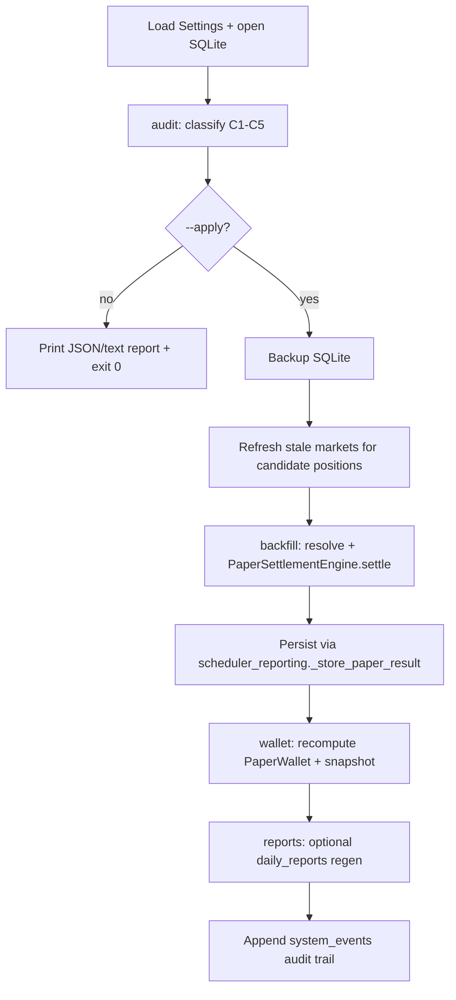

# Settlement DB Repair Script Plan

**Date:** 2026-07-05  
**Status:** Draft — design only, not implemented  
**Scope:** One-off / repeatable offline repair for paper settlement state in SQLite + JSONL/state files, after missed `check_settlements()` cycles (e.g. sync `run_nautilus_cli` without report loop).  
**Goal:** Close legitimately resolvable open positions, backfill missing `paper_trade_results`, reconcile wallet snapshots, and optionally regenerate affected `daily_reports` — without live trading, redeem, or silent mutation of already-correct historical results.

## Background

### What broke

Production Nautilus runtime (`polysignal-nautilus`, Docker `command: ["nautilus"]`) used sync `run_nautilus_cli()`, which blocked on `TradingNode.run()` but did **not** start `_run_nautilus_report_loop` → `_check_iteration_settlements` → `scheduler.check_settlements()`.

Fills were mirrored into `paper_positions` / `paper_fills`, but resolution settlement never ran on schedule.

### What the settlement oracle already defines

Per `docs/superpowers/specs/2026-06-24-13-polymarket-settlement-oracle-design.md`:

- Authoritative resolution: chain CTF payout > Gamma exact > WS hint.
- Settlement accounting: `PaperSettlementEngine.settle(position, market, outcome_value=..., details=...)`.
- Provenance belongs in `PaperTradeResult.details` (`settlement_source`, `payout_values_by_token`, `condition_id`, conflict flags).
- Non-goal: full historical closed-market backfill; **only guarantee open paper positions can be settled correctly**.

This repair script is the controlled exception for **already-missed** settlements caused by runtime housekeeping absence — not a general re-oracle of all history.

## Affected tables and files

| Store | Table / file | Role in repair |
|-------|----------------|----------------|
| SQLite | `paper_positions` | Primary scan target (`status = OPEN`) |
| SQLite | `paper_trade_results` | Missing rows to insert; existing rows usually left alone |
| SQLite | `markets` | Market metadata + `payload_json` for resolver input |
| SQLite | `paper_fills` | Rebuild / validate stake basis |
| SQLite | `paper_wallet_snapshots` | Append corrected snapshot after repair |
| SQLite | `daily_reports` | Optional regenerate for under-reported days |
| SQLite | `system_events` | Append `settlement_repair_*` audit events |
| JSONL | `paper_trade_results`, `paper_positions`, `paper_wallet_snapshots` | Mirror SQLite writes (best-effort; SQLite is source of truth for repair) |
| State | `state/open_positions.json`, `state/paper_wallet.json` | Overwrite from reconciled wallet after repair |

Do **not** modify Nautilus telemetry tables (`nautilus_*`) or `@refs/`.

## Inconsistency classes

The script should classify rows before any write.

### C1 — Missed settlement (primary)

- `paper_positions.status = OPEN`
- Position has valid fill metadata (`token_id`, `shares`, `stake_usdc`, `side`)
- `SettlementResolver.resolve_market(market)` returns `resolved` or `cancelled`
- No `paper_trade_results` row for `paper_position_id`

**Action:** settle + persist (Mode `backfill`).

### C2 — CLOSED position without result

- `paper_positions.status = CLOSED`
- No matching `paper_trade_results.paper_position_id` in `payload_json`

**Action:** if resolver still returns same outcome, insert missing result; if ambiguous, flag for manual review.

### C3 — Wallet drift

- Latest `paper_wallet_snapshots` inconsistent with:
  - `starting_balance - sum(open.stake_usdc) + sum(closed.settlement_value)`
  - or `realized_pnl != sum(closed.pnl_usdc)`

**Action:** recompute wallet in memory, append new snapshot + state files (Mode `wallet`).

### C4 — Stale market metadata

- `markets.status` in `{CLOSED, ACTIVE}` but Gamma/chain shows `resolved` with terminal `outcomePrices`
- Blocks resolver if market row is the only source

**Action:** refresh market row from `GammaResolutionClient` before resolve (read-only network); do not invent payout without evidence.

### C5 — Existing result likely wrong (out of default scope)

- `paper_trade_results` exists but `details.settlement_source` missing and `result = UNKNOWN`
- Or conflict system event exists

**Action:** report only unless `--force-correct` (explicit, logged, requires human ack).

## Non-goals

- No on-chain redeem, wallet signing, or authenticated CLOB calls.
- No automatic rewrite of results that already have authoritative `settlement_source=chain` provenance.
- No Telegram resend unless `--publish-telegram` (default off).
- No modification of strategy signals, fills, or Nautilus execution logs.

## Proposed script

**Path:** `scripts/repair_settlement_results.py`  
**Entry:** `python -m scripts.repair_settlement_results ...`  
**Runtime:** offline; **scheduler / Docker container must be stopped** to avoid SQLite lock races.

### CLI surface

```text
python -m scripts.repair_settlement_results \
  --config config/signal_bot.yaml \
  --data-dir . \
  --mode audit \
  --dry-run \
  --since 2026-06-01 \
  --until 2026-07-05 \
  --market-id <optional> \
  --position-id <optional> \
  --backup ./backups/pre-repair-YYYYMMDD.sqlite \
  --publish-telegram \
  --force-correct
```

| Flag | Default | Meaning |
|------|---------|---------|
| `--mode` | `audit` | `audit` \| `backfill` \| `wallet` \| `reports` \| `all` |
| `--dry-run` | **on** | Print planned mutations; no writes |
| `--apply` | off | Alias for `--dry-run=false` |
| `--backup` | required on apply | Copy SQLite before mutation |
| `--since` / `--until` | optional | Filter by `opened_at` / `closed_at` |
| `--publish-telegram` | off | Call publish path after durable persist |
| `--force-correct` | off | Allow C5 corrections |

### Execution phases



## Reuse production code (do not reimplement settlement math)

| Concern | Reuse |
|---------|--------|
| Config / RPC / Gamma URLs | `load_settings()`, `Settings.data.polymarket.settlement` |
| Resolver wiring | Same construction as `PolySignalScheduler.__init__` (`CtfResolutionClient`, `GammaResolutionClient`, `SettlementResolver`) |
| Settlement math | `PaperSettlementEngine.settle()` |
| Market lookup | `persistence.query_json("markets", ...)` then optional Gamma refresh |
| Position load | `persistence.restore_open_positions()` + optional CLOSED scan |
| Persist result | `scheduler_reporting._store_paper_result()` (or extract shared `persist_paper_trade_result()` if import from private helper is undesirable) |
| Wallet snapshot | `scheduler_state.persist_state()` after in-memory wallet rebuild |
| Daily report | `scheduler_reporting.generate_daily_report()` only after deleting affected `daily_reports` rows for dates where closed_at changed |

### Minimal scheduler bootstrap (no websockets)

```python
settings = load_settings(config_path)
scheduler = PolySignalScheduler(settings, base_dir=data_dir)
init_scheduler_paper_components(scheduler)
await scheduler._restore_wallet_state()
# Do NOT start websockets or TradingNode
```

For each candidate OPEN position:

1. Load `Market` from SQLite `markets` (fallback: reconstruct minimal `Market` from position `payload_json` if market row missing).
2. `decision = await scheduler.settlement_resolver.resolve_market(market)`.
3. If `unknown`: skip, record in audit report.
4. If `cancelled` / `resolved`: mirror `check_settlements()` branches in `scheduler_reporting.py`.
5. On `--apply`, call `_store_paper_result()`; on dry-run, emit planned `PaperTradeResult` dict.

**Important:** Reuse the same cancelled-market handling (`market.model_copy(update={"status": MarketStatus.CANCELLED})`) documented in the settlement oracle spec — do not call `settle()` with stale ACTIVE market for cancelled decisions.

## Wallet reconciliation algorithm

After backfill (or standalone `--mode wallet`):

1. `cash = starting_balance_usdc`.
2. For each `paper_fills` / open position: subtract `stake_usdc` when position still OPEN at end of replay.
3. For each `paper_trade_results`: add `settlement_value`, accumulate `pnl_usdc` into `realized_pnl`.
4. Compare to latest `paper_wallet_snapshots` and `state/paper_wallet.json`.
5. If delta within epsilon (`1e-6`): no-op.
6. Else: set in-memory `PaperWallet`, call `persist_state()`, append SQLite snapshot.

Do **not** delete historical wallet snapshots; append a new row tagged `details.repair_run_id`.

## Daily report regeneration

`generate_daily_report()` skips if a row already exists for `report_date`. Repair flow:

1. Collect distinct `closed_at` dates (in app timezone) for newly inserted results.
2. For each affected date: `DELETE FROM daily_reports WHERE report_date = ?` (and optional telegram publish row if tied).
3. Run `generate_daily_report()` once per date with a temporary scheduler whose wallet snapshot reflects post-repair state.

Only regenerate dates touched by repair; do not rebuild entire history unless `--reports-full-history` (discouraged).

## Audit output

`--mode audit` prints:

```json
{
  "run_id": "repair-20260705-abc",
  "classes": {
    "C1_missed_settlement": [{"paper_position_id": "...", "market_id": "...", "planned_result": "WIN"}],
    "C3_wallet_drift": {"cash_delta": 12.5, "realized_pnl_delta": 3.0},
    "C5_manual_review": []
  },
  "skipped_unknown": [{"paper_position_id": "...", "reason": "NO_RESOLVED_EVIDENCE"}]
}
```

On apply, append `system_events`:

- `event_type`: `settlement_repair_applied`
- `severity`: `INFO`
- payload: `run_id`, counts, backup path, git commit hash (optional)

## Safety checklist

1. Stop `polysignal-lab` container / any process holding SQLite.
2. Default dry-run; require explicit `--apply`.
3. Mandatory `--backup` on apply.
4. Idempotent backfill: skip if `paper_trade_results` already exists for `paper_position_id` unless `--force-correct`.
5. Single-writer: script holds SQLite lock; no concurrent runtime.
6. Network calls are read-only (Gamma / Polygon JSON-RPC) per settlement oracle boundaries.
7. Never delete `paper_fills` or `paper_positions` rows; only upsert position status and insert results.

## Tests (TDD before implementation)

**File:** `tests/test_repair_settlement_results.py`

| Test | Asserts |
|------|---------|
| `test_audit_finds_open_position_on_resolved_market` | C1 detected, no DB writes in dry-run |
| `test_backfill_closes_position_and_inserts_result` | OPEN→CLOSED, `paper_trade_results` WIN/LOSS, provenance in `details` |
| `test_backfill_idempotent_skips_existing_result` | Second run no duplicate rows |
| `test_backfill_unknown_leaves_position_open` | Resolver mock returns `unknown` |
| `test_wallet_reconcile_fixes_cash_after_backfill` | Snapshot cash matches replay |
| `test_apply_requires_backup` | Exit 2 without `--backup` |
| `test_cancelled_market_refunds_stake` | VOID + `settlement_value == stake_usdc` |

Use `tmp_path` SQLite + mocked `SettlementResolver` (same patterns as `test_scheduler_settlement_resolution.py`).

## Suggested rollout

1. Implement `audit` only; run against production SQLite copy in staging.
2. Review audit JSON; confirm C1 count matches dashboard open positions on ended markets.
3. Stop container; run `backfill --apply` with backup.
4. Run `wallet`; verify dashboard counts / equity.
5. Run `reports` for affected dates only.
6. Restart container with report-loop fix deployed; confirm no new C1 accumulation.

## Acceptance criteria

1. Every OPEN position on a market resolvable via production `SettlementResolver` is either settled (CLOSED + result row) or explicitly listed in `skipped_unknown` with reason.
2. Backfilled `PaperTradeResult` rows include `details.settlement_source` and `payout_values_by_token` when chain/gamma provides them.
3. Post-repair wallet snapshot satisfies replay equation within `1e-6`.
4. Dry-run produces identical classification counts on repeated runs (deterministic).
5. Script exits non-zero if any `--apply` persistence step fails; no partial close without rollback policy (use per-position try/except; failed positions stay OPEN).

## Open questions (resolve before implementation)

1. **JSONL repair:** Mirror all SQLite writes to JSONL in v1, or document SQLite-only repair with JSONL append best-effort?
2. **Nautilus-only fills:** If position exists only in `nautilus_fill` telemetry but not `paper_fills`, should script synthesize position from telemetry first? (Likely yes for Nautilus runtime — check `mirror_nautilus_fill_into_scheduler` field requirements.)
3. **Telegram:** Suppress resend of old results by default; only same-day closes if `--publish-telegram`?

## File checklist (implementation task)

- [ ] `scripts/repair_settlement_results.py`
- [ ] `tests/test_repair_settlement_results.py`
- [ ] Optional: extract `persist_paper_trade_result()` from `scheduler_reporting.py` if private import is unacceptable
- [ ] README snippet under `scripts/` or ops runbook (one paragraph, not a new design doc)
