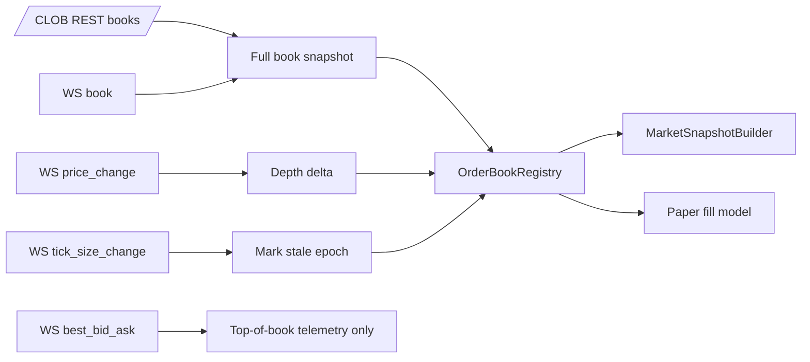

# 01 CLOB Book Reconciliation Design

**Status:** Approved
**Scope:** One standalone architecture change. Do not execute with specs 02-08 in the same implementation batch.
**Goal:** Make Polymarket order book state safe enough for signal gates and paper fills by treating WebSocket data as a reconciled local book, not as best-effort price hints.

## Problem

PolySignal currently updates in-memory order books in `src/polysignal_lab/data/polymarket_clob_ws.py` from public CLOB WebSocket events. The handler accepts `book`, `price_change`, `best_bid_ask`, `last_trade_price`, and `market_resolved`, but ignores `tick_size_change` and silently drops unknown events. `_with_best_bid_ask()` currently rewrites top levels using old sizes, which can make a price-only event look like executable depth.

Polymarket official docs state that the market channel emits `book`, `price_change`, `tick_size_change`, `last_trade_price`, `best_bid_ask`, `new_market`, and `market_resolved`; `best_bid_ask` contains top prices, not depth. Official orderbook docs also expose full `/book` and batch `/books` snapshots with `hash`, `timestamp`, `tick_size`, and `min_order_size`.

## Non-goals

- No live trading, order placement, cancellation, redemption, or authenticated CLOB access.
- No migration to another SDK in this spec.
- No full historical market-data warehouse.
- No scheduler decomposition; spec 08 covers lifecycle boundaries separately.

## Target behavior

1. A book is fill-eligible only after a full `book` snapshot or REST `/books` snapshot.
2. Every paper-fill path checks fill eligibility immediately before simulating execution, including `BestAskTakerFillModel`, FAK/FOK `BestAskTakerExecutor`, and passive GTD `PassiveGtdExecutor` resting-order fills.
3. `price_change` events may update depth only for books that already have a valid snapshot.
4. `best_bid_ask` updates price telemetry only; it must not create or modify depth used by fill simulation.
5. `tick_size_change` marks the affected token book as stale and starts a new book epoch. The book remains ineligible for paper fills until a fresh full snapshot arrives.
6. `market_resolved` is queued for settlement/reporting and increments lifecycle metrics.
7. Unknown events are counted by event type and ignored safely.
8. Startup reseeds active token IDs through batch `/books`; reconnect reseed is not currently present and must be added as a hook before accepting post-reconnect deltas where possible.
9. Stale/invalid/missing-snapshot reasons are visible in diagnostics and rejected paper-fill metrics through a concrete counter sink.

## Proposed interfaces

### `BookEpochState`

A small internal state record, likely in `src/polysignal_lab/data/book_reconciliation.py` or near `OrderBookRegistry`:

```python
@dataclass(slots=True)
class BookEpochState:
    token_id: str
    epoch: int
    has_snapshot: bool
    stale_reason: str | None
    last_hash: str | None
    last_source_timestamp: datetime | None
    last_received_at: datetime | None
```

The current `OrderBook` model does not preserve the CLOB snapshot `hash`, so hash/sequence detection requires storing `last_hash` or equivalent snapshot metadata in the reconciliation state when a full snapshot is ingested.

### Registry additions

`OrderBookRegistry` should expose:

```python
def mark_stale(self, token_id: str, reason: str) -> None: ...
def is_fill_eligible(self, token_id: str, max_staleness_ms: int, now: datetime) -> bool: ...
def update_from_snapshot(self, book: OrderBook) -> None: ...
def update_from_delta(self, book: OrderBook) -> None: ...
def telemetry_for(self, token_id: str) -> dict[str, str | int | float | None]: ...
```

The exact implementation can stay lock-backed and in-process; no new database is required.

## Data flow



## Error handling

- JSON parse failure: increment `ws_decode_errors`, ignore message.
- Delta before snapshot: increment `delta_without_snapshot`, keep existing no-book state.
- Tick-size change: mark stale with reason `TICK_SIZE_CHANGE_RESEED_REQUIRED`.
- REST reseed failure: keep stale state; gate rejects via existing `STALE_ORDERBOOK` or a more specific reason if added.
- Hash/timestamp regression, once the snapshot hash or equivalent metadata is stored: mark stale with reason `BOOK_SEQUENCE_INVALID` and require reseed.

## Acceptance criteria

- Fill eligibility gates every paper-fill entry point: `BestAskTakerFillModel`, FAK/FOK `BestAskTakerExecutor`, and passive GTD `PassiveGtdExecutor` resting-order fills.
- `best_bid_ask` cannot change bid/ask depth used by fill simulation.
- `tick_size_change` causes the token to be rejected for paper fills until a new full snapshot.
- `price_change` without prior snapshot is counted and does not create a book.
- Startup/reconnect batch reseed path keeps current read-only boundary; reconnect handling adds the missing reseed hook before accepting post-reconnect deltas where possible.
- Existing tests for WebSocket book and price-change parsing still pass after being tightened.
- New tests cover: tick-size stale epoch, best-bid/ask telemetry-only, delta-before-snapshot, REST reseed recovery, and counter-sink emission for rejected fill reasons.

## Test strategy

- Unit tests in `tests/test_market_data.py` or `tests/test_websocket_contracts.py` for each event type.
- Paper simulation regressions in `tests/test_paper_simulation.py`: stale books reject fills across taker, FAK/FOK `BestAskTakerExecutor`, and passive GTD `PassiveGtdExecutor` resting-order paths.
- Read-only smoke remains bounded and must not call authenticated endpoints.

## Rollout

1. Add reconciliation state and tests with WebSocket handler changes.
2. Enable REST reseed on startup and add the currently missing reconnect reseed hook before post-reconnect deltas are accepted where possible.
3. Wire diagnostics/rejected-fill counters to the concrete sink chosen for this change; spec 04 can later publish them to dashboard health.
4. Keep config defaults unchanged except any new metric/diagnostic flags.