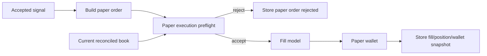

# 03 Paper Execution Realism Design

**Status:** Draft for review
**Scope:** One standalone architecture change. Do not execute with specs 01-02 or 04-08 in the same implementation batch.
**Goal:** Make paper trading results more trustworthy by revalidating market conditions at simulated execution time and recording why fills are accepted or rejected.

## Problem

PolySignal already has a paper simulator, wallet, fill model, exposure gates, SQLite storage, and daily reports. The current flow stores/publishes a signal, gets the current order book, and calls `PaperSimulator.process_signal()`. This is safe, but it can overstate paper quality if the signal was based on a snapshot that becomes stale or if the entry edge disappears before simulated execution.

Comparable projects with stronger paper/shadow systems re-check live CLOB price/depth at execution time, reject edge-vanish scenarios, and expose fill assumptions in reports.

## Non-goals

- No live trading.
- No authenticated CLOB user channel.
- No portfolio optimizer or Kelly sizing in this spec.
- No historical replay backtester; this spec only improves forward paper execution.

## Target behavior

1. A paper order enters an execution preflight step before fill simulation.
2. Preflight verifies:
   - orderbook exists;
   - orderbook is fill-eligible and fresh;
   - top-N depth can satisfy stake under current fill model;
   - current ask/bid still respects `SignalCandidate.max_entry_price`;
   - inferred edge has not vanished when candidate includes model probability/edge metrics.
3. Every paper rejection has a stable reason code.
4. Fill metrics include staleness, available depth, slippage assumption, price checked at execution, and whether edge was revalidated.
5. Daily reports and dashboard can distinguish signal quality from paper execution quality.

## Proposed components

### `PaperExecutionPreflight`

New service near `src/polysignal_lab/paper/`:

```python
@dataclass(frozen=True, slots=True)
class PaperExecutionDecision:
    accepted: bool
    reason_code: str
    metrics: dict[str, bool | float | str | None]
```

```python
class PaperExecutionPreflight:
    def evaluate(self, signal: SignalCandidate, orderbook: OrderBook | None, now: datetime) -> PaperExecutionDecision: ...
```

### Reason codes

- `PAPER_MISSING_ORDERBOOK`
- `PAPER_STALE_ORDERBOOK`
- `PAPER_DEPTH_TOO_THIN`
- `PAPER_ENTRY_PRICE_MOVED`
- `PAPER_EDGE_VANISHED`
- `PAPER_EXTREME_SLIPPAGE`
- `PAPER_EXPOSURE_LIMIT_REACHED`
- `PAPER_WALLET_INSUFFICIENT_CASH`

Existing wallet/exposure rejections can keep their current semantics but should be normalized into the same report surface.

## Data flow



## Acceptance criteria

- Accepted signals can still be stored and published even when paper execution rejects; paper result clearly says why.
- If price moves above max entry before paper execution, the paper order is rejected.
- If book depth is insufficient for configured stake and `reject_if_partial` is true, the paper order is rejected.
- If candidate metrics include a probability edge and current price removes that edge, the paper order is rejected.
- Existing fill behavior remains unchanged for orders that pass preflight.

## Test strategy

- Unit tests for each `PaperExecutionPreflight` reason code.
- Regression tests in `tests/test_paper_simulation.py` for stale/missing/thin books.
- Storage test proving rejected paper order persists with metrics.
- Report/dashboard test proving rejected paper order counts do not appear as filled positions.

## Reporting requirements

Daily report should include:

- signal count;
- paper orders attempted;
- fills;
- rejects by reason;
- average execution staleness;
- average available depth;
- configured slippage/depth assumptions.

## Rollout

1. Add preflight and tests without changing strategy logic.
2. Route `PaperSimulator.process_signal()` through preflight.
3. Persist and report new metrics.
4. Tune thresholds only after observing reject distributions.