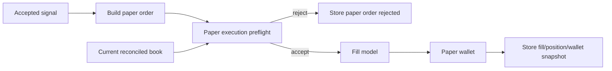

# 03 Paper Execution Realism Design

**Status:** Approved
**Scope:** One standalone architecture change. Do not execute with specs 01-02 or 04-08 in the same implementation batch.
**Goal:** Make paper trading results more trustworthy by revalidating market conditions at simulated execution time and recording why fills are accepted or rejected.

## Problem

PolySignal already has a paper simulator, wallet, fill model, exposure gates, SQLite storage, and daily reports. The current flow stores/publishes a signal, gets the current order book, and calls `PaperSimulator.process_signal()`. This is safe, but it can overstate paper quality if the signal was based on a snapshot that becomes stale or if the entry edge disappears before simulated execution.

Comparable projects with stronger paper/shadow systems re-check live CLOB price/depth at execution time, reject edge-vanish scenarios, and expose fill assumptions in reports.

## Non-goals

- No live trading.
- No authenticated CLOB user channel.
- No portfolio optimizer or Kelly sizing in this spec.
- No historical replay backtester; this spec only improves forward paper execution.

## Target behavior

1. A paper order enters an execution preflight step before fill simulation.
2. Preflight verifies:
   - orderbook exists;
   - orderbook is fill-eligible and fresh;
   - when the applicable intent/fill model requires a full fill, executable ask depth up to the order limit price can satisfy stake (`OrderBook.depth_until(limit_price)` semantics, not an implicit top-N depth cap);
   - current ask/bid still respects `SignalCandidate.max_entry_price`;
   - inferred edge has not vanished when candidate includes model probability/edge metrics.
3. Every paper rejection has a stable reason code.
4. Fill metrics include staleness, available depth, slippage assumption, price checked at execution, and whether edge was revalidated.
5. Daily reports and dashboard can distinguish signal quality from paper execution quality.

## Proposed components

### `PaperExecutionPreflight`

New service near `src/polysignal_lab/paper/`:

```python
@dataclass(frozen=True, slots=True)
class PaperExecutionDecision:
    accepted: bool
    reason_code: str
    metrics: dict[str, bool | float | str | None]
```

```python
class PaperExecutionPreflight:
    def evaluate(self, signal: SignalCandidate, orderbook: OrderBook | None, now: datetime, intent: OrderIntent | None = None) -> PaperExecutionDecision: ...
```

Preflight must be order-intent-aware and must not collapse existing fill semantics into one generic depth rule:

- default best-ask taker keeps the current slippage and optional depth-check behavior;
- `TAKER_FAK` may accept a partial executable fill up to the limit price, rejecting only no-liquidity or post-slippage limit violations;
- `TAKER_FOK` requires the full stake to be executable up to the limit price before any fill;
- `PASSIVE_GTD` is a resting intent: enqueue/expiry and later bid-cross fill semantics are preserved, so preflight can validate intent setup but must not require immediate taker depth.

### Reason codes

- `PAPER_MISSING_ORDERBOOK`
- `PAPER_STALE_ORDERBOOK`
- `PAPER_DEPTH_TOO_THIN`
- `PAPER_ENTRY_PRICE_MOVED`
- `PAPER_EDGE_VANISHED`
- `PAPER_EXTREME_SLIPPAGE`
- `PAPER_EXPOSURE_LIMIT_REACHED`
- `PAPER_WALLET_INSUFFICIENT_CASH`

These `PAPER_*` codes are report-facing names, not a silent replacement for current wallet/fill/intent reasons. Add a compatibility mapping from existing reasons such as `STALE_ORDERBOOK`, `MISSING_BEST_ASK`, `ASK_ABOVE_MAX_ENTRY`, `SLIPPAGE_EXCEEDS_MAX_ENTRY`, `INSUFFICIENT_DEPTH`, `FOK_INSUFFICIENT_DEPTH`, `FAK_NO_LIQUIDITY`, `GTD_EXPIRED`, and `WALLET_INSUFFICIENT_CASH` into the paper reporting surface while preserving the original reason in stored metrics for debugging.

## Data flow



## Acceptance criteria

- Accepted signals can still be stored and published even when paper execution rejects; paper result clearly says why.
- If price moves above max entry before paper execution, the paper order is rejected.
- If executable depth up to `limit_price` is insufficient for configured stake and the applicable intent/fill model requires a full fill, the paper order is rejected.
- If candidate metrics include a probability edge and current price removes that edge, the paper order is rejected.
- Existing fill behavior remains unchanged for orders that pass preflight.

## Test strategy

- Unit tests for each `PaperExecutionPreflight` reason code and compatibility mapping from current fill/wallet/intent reasons into normalized `PAPER_*` report reasons.
- Regression tests in `tests/test_paper_simulation.py` for stale/missing/thin books.
- Storage test proving rejected paper order persists with metrics.
- Report/dashboard test proving rejected paper order counts do not appear as filled positions and new aggregate fields are populated from stored raw metrics.

## Reporting requirements

Daily report/dashboard payloads need explicit aggregate fields derived from stored paper order/fill metrics. Current persistence can retain raw per-order metrics, but the report model/report builder only aggregate rejected paper order count and stale filled order count today. Add aggregates for:

- attempted paper orders by intent;
- fills and partial fills by intent;
- rejects by normalized `PAPER_*` reason and original reason;
- average execution staleness;
- average executable depth up to `limit_price`;
- configured slippage/depth assumptions.

## Rollout

1. Add preflight and tests without changing strategy logic.
2. Route `PaperSimulator.process_signal()` through preflight.
3. Persist and report new metrics.
4. Tune thresholds only after observing reject distributions.