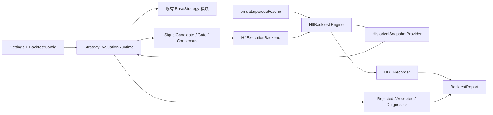

# 10 统一 HftBacktest 精确回测系统设计

**Status:** Draft
**Scope:** 一个独立的架构变更。先完成设计审阅，再按独立 worktree 执行实现；不要与既有 01-09 规格合并开发。
**Goal:** 将 `refs/pm-hftbacktest/` 描述的 Polymarket HftBacktest 接入 PolySignal Lab，使历史策略回测与正式运行复用同一套策略模块、调度排序、风控门控与订单意图语义，并把撮合、队列、延迟、手续费和成交记录交给 HftBacktest 负责。

## 背景依据

- `refs/pm-hftbacktest/README.rst` 描述的 `pm-hftbacktest` 提供 Polymarket tick 级回测、`polymarket_to_hbt()` 数据转换、`BacktestAssetPoly()` 资产预设、`ROIVectorMarketDepthBacktest()` 回测器和 `Recorder`。
- `refs/pm-hftbacktest/docs/order_fill.rst` 明确 HftBacktest 是 market-data replay based backtesting，成交模型必须理解“无市场冲击”假设，并可选择 `NoPartialFillExchange` 或 `PartialFillExchange` 以及队列模型。
- `refs/pm-hftbacktest/docs/latency_models.rst` 区分 feed latency、order entry latency、order response latency，并支持 constant latency、interpolated order latency 等模型。
- `refs/pm-hftbacktest/py-hftbacktest/hftbacktest/data/utils/polymarket.py` 已提供 Polymarket L2 DataFrame 到 HftBacktest event array 的转换，并调用 `correct_event_order()` 修正 exchange/local timestamp 顺序。
- 当前项目的策略入口是 `BaseStrategy.evaluate(snapshot)`，调度入口是 `scheduler_processing.evaluate_once()`，已存在 `StrategyScheduleEntry`、有序策略执行、信号仲裁、`SignalGate`、`ConsensusEngine`、`PaperSimulator`、`PaperWallet` 等运行时组件。

## 问题

PolySignal Lab 当前没有正式历史回测入口。已有纸面交易路径用于前向运行，但它不是 tick 级历史回放系统：

1. **策略研究与运行路径可能分叉**：如果新增独立研究脚本或手写回放循环，策略条件、调度顺序、门控、副作用和订单意图容易与正式运行不一致。
2. **成交精度不足**：`PaperSimulator` 当前主要基于当前 orderbook 与本地 fill model 判断成交，无法完整表达 queue position、order latency、response latency、partial fill、交易事件驱动成交等 HFT 回测因素。
3. **数据时钟不统一**：正式运行使用 wall clock 和实时 registry；历史回测需要 exchange/local timestamp 驱动的 deterministic clock，不能把当前系统时间混入历史快照。
4. **回测产物缺少可审计性**：需要可复现的输入数据、配置、策略版本、延迟模型、队列模型、费用模型、信号、订单、成交、仓位、PnL 和差异诊断。
5. **禁止再次自研回测器**：本规格不得实现自有撮合、深度穿透、队列推进或延迟模拟；这些职责必须由 HftBacktest 承担。

## 非目标

- 不实现新的自研 replay engine、matching engine、queue model、latency model 或 fill model。
- 不把现有策略复制成 `@njit` 版本；历史回测必须调用当前 `src/polysignal_lab/strategies/*` 模块。
- 不引入真实下单、私钥、签名、授权 CLOB 写入或生产资金路径。
- 不把 `refs/pm-hftbacktest/` 源码直接 vendoring 到 `src/`；依赖通过 PyPI 包或明确的本地开发依赖接入。
- 不在本规格中优化全量参数搜索、分布式任务调度或研究 UI；先提供确定性单配置回测。
- 不用 `PaperSimulator` 代替 HftBacktest 成交模型；纸面交易可以复用订单意图构建与报表结构，但成交由 HftBacktest 产出。

## 方案比较

### 方案 A：新增独立研究脚本

在 `scripts/` 中读取历史 parquet，自行循环 orderbook、调用策略、计算成交。

- 优点：实现快，依赖少。
- 缺点：违反“不额外自行写回测”；会复制策略调度、风控和成交逻辑；长期必然与正式运行漂移。
- 结论：拒绝。

### 方案 B：统一运行时策略内核 + HftBacktest 执行后端（推荐）

抽出一个运行时可复用的 `StrategyEvaluationRuntime`，正式运行和历史回测都通过同一个策略 schedule、snapshot、candidate、arbiter、gate、consensus 顺序。历史回测只替换数据源、时钟和执行后端：数据源来自 HftBacktest replay，订单提交与成交查询通过 HftBacktest API 完成。

- 优点：满足“策略回测与运行使用同一个模块”；HftBacktest 负责撮合、队列、延迟、费用和 recorder；PolySignal Lab 只做适配、配置、审计和报表。
- 缺点：需要抽离当前 scheduler 中与 wall clock、服务生命周期、Telegram 发布、SQLite 状态恢复耦合的逻辑。
- 结论：采用。

### 方案 C：将策略迁移为 HftBacktest `@njit` 策略

把每个策略重写成 HftBacktest 原生 `@njit` 函数，直接在 HFT 回测循环内下单。

- 优点：性能最好，贴近 HftBacktest 示例。
- 缺点：策略逻辑与正式运行模块分叉；Python 策略状态、`SignalCandidate`、`SignalGate`、consensus、配置 schema 都需要重写。
- 结论：拒绝，除非未来为性能单独做代码生成，并证明生成物来自同一策略定义。

## 目标行为

1. **同一策略模块**：回测不得导入 `scripts/analysis` 中的策略，也不得维护第二套策略实现；必须通过现有 `build_strategy_schedule(settings.strategies)` 创建策略实例。
2. **同一策略调度语义**：回测使用与正式运行相同的 `StrategyScheduleEntry`、priority、depends_on、execution_mode、cross-market context、signal arbitration 和 serial commit 顺序。
3. **同一信号与门控语义**：回测中的候选信号仍由 `BaseStrategy.evaluate(MarketSnapshot)` 产生，并经过 `SignalArbiter`、`SignalGate`、`ConsensusEngine`。门控 rejected records 与 accepted signals 必须可持久化到回测结果集中。
4. **HftBacktest 独占成交职责**：回测订单提交、排队、成交、部分成交、手续费、延迟、仓位和 recorder 由 HftBacktest API 负责。PolySignal Lab 不计算“是否穿价成交”。
5. **历史时钟驱动**：snapshot `created_at`、freshness、signal timestamp、order created timestamp 和 report window 均来自 HftBacktest current timestamp 或事件 local/exchange timestamp，不允许使用 `utc_now()` 作为历史事实时间。
6. **Polymarket 数据原生转换**：Polymarket L2 parquet/DataFrame 通过 upstream `polymarket_to_hbt()` 进入 event array；转换前只允许做 schema 校验、数据选择、缓存和 provenance 记录。
7. **二元市场 side 映射显式化**：回测沿用 `BacktestAssetPoly` 的 Polymarket 约定：HBT asset 表示 UP/YES 合约净仓位，正仓为 UP，负仓按 upstream 示例解释为 DOWN。若该约定与某个策略或市场的 token-pair 语义冲突，启动校验必须失败，而不是本地实现一个替代成交模型。
8. **正式运行隔离**：安装或配置回测依赖不得改变默认 scheduler、dashboard、Telegram、paper-trading 启动行为；`pm-hftbacktest` 仅在回测 CLI/服务路径中 lazy import。
9. **结果可复现**：每次回测生成 `backtest_run_id`，记录数据源 URL/path、data hash、config hash、git commit、strategy schedule、HftBacktest exchange/queue/latency/fee config、输入市场集合和完整输出 artifacts。

## 当前状态约束

- `PolySignalScheduler.__init__()` 当前直接创建 market discovery、REST/WebSocket、publisher、health、paper portfolio 等服务；回测不能实例化这些 live 服务作为副作用。
- `scheduler_processing.evaluate_once()` 当前从 `scheduler.ctx.markets.active()` 读取 markets，并通过 `SnapshotService` 构造 snapshot；回测需要可注入的 historical snapshot provider。
- `MarketSnapshotBuilder.build()` 当前调用 `utc_now()` 和实时 registries；回测需要历史 clock 版本，或把 clock 注入 builder。
- `SignalGate.evaluate()` 会突变 deduper/rate limiter；`ConsensusEngine.add()` 会突变 consensus buffer；回测必须保留这个 serial commit 顺序以复现运行时行为。
- `PaperSimulator.process_signal()` 会构造 `PaperOrder` 并使用本地 fill model；回测只能复用订单意图、订单记录和报表映射，不能复用本地 fill decision。
- `PaperWallet` 当前负责纸面 cash/exposure/position；HftBacktest 回测的权威仓位和成交来自 HBT recorder。若需要展示 PolySignal 风格 wallet summary，必须从 HBT recorder 派生，不反向驱动成交。
- `pyproject.toml` 当前没有 `pm-hftbacktest`、`polars`、`numba` 或 maturin runtime 依赖；默认安装必须保持轻量，回测依赖应作为 optional extra 或独立 dependency group 接入。
- 安全扫描禁止交易写入客户端模式；回测路径不得引入 authenticated CLOB client 或 credential env 读取。

## 设计概览



核心分层：

1. `StrategyEvaluationRuntime`：从 scheduler 中抽离无 I/O 的策略评估、仲裁、gate、consensus、接受/拒绝通知逻辑。
2. `HistoricalSnapshotProvider`：从 HftBacktest depth/position/time 构造运行时 `MarketSnapshot`，保持字段与实时 snapshot 一致。
3. `HftExecutionBackend`：将 accepted `SignalCandidate` 的 `OrderIntent` 映射为 HftBacktest `submit_buy_order()` / `submit_sell_order()` / cancel API。
4. `BacktestRunService`：负责数据加载、HBT asset 初始化、回测时钟推进、runtime 调用、执行后端调用、artifact 写入。
5. `BacktestReportBuilder`：把 HBT recorder、accepted/rejected signals、orders、fills、positions、PnL、latency/queue config 合并为可审计输出。

## Proposed interfaces

### BacktestConfig

```python
class BacktestConfig(BaseModel):
    enabled: bool = False
    data_source: Literal["pmdata_parquet", "local_parquet"] = "local_parquet"
    input_paths: list[str] = Field(default_factory=list)
    pmdata_api_key_env: str | None = None
    market_slugs: list[str] = Field(default_factory=list)
    start_ts: datetime | None = None
    end_ts: datetime | None = None
    step_ns: int = 100_000_000
    exchange_model: Literal["partial_fill", "no_partial_fill"] = "partial_fill"
    queue_model: Literal["risk_adverse", "prob_queue"] = "risk_adverse"
    order_latency_model: Literal["constant", "from_feed"] = "constant"
    order_entry_latency_ns: int = 20_000_000
    order_response_latency_ns: int = 20_000_000
    maker_fee_rate: float = 0.0
    taker_fee_rate: float = 0.006
    output_dir: str = "reports/backtests"
```

`Settings` 增加 `backtest: BacktestConfig`，但默认 `enabled=false`，正式运行不读取 pmdata key，不导入 HftBacktest。

### StrategyEvaluationRuntime

```python
@dataclass(slots=True)
class RuntimeEvaluationResult:
    accepted: list[SignalCandidate]
    rejected: list[RejectedSignal]
    consensus: list[SignalCandidate]

class StrategyEvaluationRuntime:
    def __init__(
        self,
        schedule: list[StrategyScheduleEntry],
        gate: SignalGate,
        consensus: ConsensusEngine,
        arbiter: SignalArbiter,
        persistence: RuntimePersistencePort,
        clock: Clock,
    ) -> None: raise NotImplementedError

    async def evaluate_batch(
        self,
        snapshots: list[tuple[int, MarketSnapshot]],
    ) -> RuntimeEvaluationResult: raise NotImplementedError
```

该 runtime 从 `scheduler_processing` 提取现有 `evaluate_candidates_ordered()`、`_arbitrate_envelopes()`、`commit_candidates_serial()` 语义。正式 scheduler 和 backtest service 都调用它。

### HistoricalSnapshotProvider

```python
class HistoricalSnapshotProvider(Protocol):
    def snapshot_for_asset(
        self,
        market: Market,
        hbt_asset_no: int,
        hbt_timestamp_ns: int,
    ) -> MarketSnapshot | None: raise NotImplementedError
```

职责：读取 HftBacktest 当前 depth，构造 `OrderBook`、`FreshnessState`、spot/price-to-beat metadata，并保证 `snapshot.created_at` 来自 `hbt_timestamp_ns`。

### HftExecutionBackend

```python
@dataclass(frozen=True, slots=True)
class HftSubmittedOrder:
    signal_id: str
    hbt_order_id: int
    asset_no: int
    logical_side: Side
    hbt_side: Literal["buy", "sell"]
    limit_price: float
    quantity: float
    time_in_force: str

class HftExecutionBackend:
    def submit_signal(self, signal: SignalCandidate, snapshot: MarketSnapshot) -> HftSubmittedOrder | None: raise NotImplementedError
    def cancel_expired(self, timestamp_ns: int) -> list[int]: raise NotImplementedError
    def collect_fills(self) -> list[PaperFill]: raise NotImplementedError
```

`submit_signal()` 只做 signal/order-intent 到 HftBacktest order API 的映射；它不得查看 orderbook 并自行决定成交。

OrderIntent 映射：

| PolySignal `OrderIntent` | HftBacktest TIF | 说明 |
| --- | --- | --- |
| `TAKER_FOK` | `FOK` | 由 HftBacktest 判断立即全量成交或过期。 |
| `TAKER_FAK` | `IOC` | 由 HftBacktest `PartialFillExchange` 判断立即部分成交/剩余取消；若 exchange_model 不支持则启动失败。 |
| `PASSIVE_GTD` | `GTC` + adapter cancel | 下单后保留队列位置；到 `expiry_seconds` 后调用 HftBacktest cancel API。 |
| `None` | `FOK` | 保持当前默认 best-ask taker 语义，但成交仍由 HftBacktest 决定。 |

Side 映射：

| Logical side | HBT action | 依据 |
| --- | --- | --- |
| `UP` | buy UP/YES asset | `BacktestAssetPoly` 以 UP 合约净仓为正仓。 |
| `DOWN` | sell UP/YES asset | `refs/pm-hftbacktest/README.rst` 示例以 `side=-1` 表示 DOWN。 |

若未来 upstream 提供原生双 token asset 模式，本 adapter 可以新增 `side_model="dual_token"`，但不能在本项目内自写撮合修正。

## 数据流

1. CLI 读取 `config/backtest.yaml` 或 `--config` 指向的普通 `Settings` 文件。
2. 校验 `backtest.enabled=true`、市场 slug、时间范围、数据源和 HftBacktest 模型配置。
3. 数据加载器读取 pmdata parquet 或本地 parquet，并记录 data hash、schema、market slug、行数、timestamp 范围。
4. 对每个 market 调用 upstream `polymarket_to_hbt(df, constant_lantency=constant_latency_ns)`，再创建 `BacktestAssetPoly().data(data)`。
5. 按配置链式设置 `.partial_fill_exchange()` / `.no_partial_fill_exchange()`、queue model、latency model、fee model、tick/lot 保持 upstream preset。
6. 创建 `ROIVectorMarketDepthBacktest(asset_configs)` 与 `Recorder`。
7. 回测主循环只调用 `hbt.elapse(step_ns)` 推进事件；不得扫描 DataFrame 自行回放。
8. 每个 step 从 HBT depth 构造 `MarketSnapshot`，调用 `StrategyEvaluationRuntime.evaluate_batch()`。
9. 对 accepted signals 调用 `HftExecutionBackend.submit_signal()`；成交和仓位由 HFT engine 在后续 `elapse()` 中更新。
10. 每个 step 调用 `recorder.record(hbt)`，并收集 accepted/rejected/order/fill diagnostics。
11. 回测结束后 `hbt.close()`，用 `PolyAssetRecord` 或 recorder array 生成 PnL、equity、position、fee、fill ratio、drawdown、win rate、latency/queue model summary。
12. 输出 artifacts 到 `reports/backtests/<backtest_run_id>/`。

## Artifact contract

每次回测必须输出：

- `manifest.json`：run id、git commit、config hash、data hash、HftBacktest package version、strategy schedule、market slugs、时间范围、模型配置。
- `signals.jsonl`：所有候选、accepted、consensus、rejected 信号，包含 snapshot id 与 gate reason。
- `orders.jsonl`：每个 submitted/cancelled/expired HFT order 与原始 `signal_id` 的映射。
- `fills.jsonl`：HftBacktest recorder 或 order state 派生的成交，包含 fee、fill_price、fill_qty、order_latency metadata。
- `positions.jsonl`：按 market/strategy/logical side 的仓位曲线。
- `summary.json`：收益、费用、最大回撤、成交率、拒绝原因分布、PnL by strategy/asset/timeframe/side。
- `diagnostics.md`：中文可读摘要，列出数据缺口、timestamp 修正、HBT 模型假设、与 live/paper 语义差异。

所有 artifacts 必须只来自 HftBacktest recorder/order state、runtime accepted/rejected records 和输入配置，不得来自自写成交判断。

## 错误处理

- 缺少 `pm-hftbacktest`：回测 CLI 输出安装建议并退出；正式 scheduler 不受影响。
- parquet schema 缺少 `event_type`、`timestamp`、book/trade/price_change 必需列：启动失败，写入 validation error，不尝试猜测列含义。
- `polymarket_to_hbt()` 返回空 event array：该 market 标记为 `DATA_EMPTY`，整个 run 默认失败；只有显式 `allow_empty_markets=true` 才允许跳过。
- HftBacktest 不支持所选 `OrderIntent`/TIF/exchange_model 组合：启动失败，不降级为本地 fill model。
- strategy `evaluate()` 抛异常：沿用运行时隔离语义，记录 strategy error，继续其它策略/市场。
- HBT depth 尚未初始化：该 market 当前 step 不生成 snapshot；超过配置 warmup 上限后记录 `BOOK_NOT_INITIALIZED`。
- 时间戳负延迟或乱序：依赖 upstream `correct_event_order()`；若修正计数超过阈值，run 标记 degraded。

## Acceptance criteria

- `polysignal-backtest` 或等价 CLI 能在不启动 Telegram、WebSocket、MarketDiscovery live polling、Dashboard 的情况下运行。
- 回测策略实例由 `build_strategy_schedule(settings.strategies)` 创建；测试应证明导入路径与正式运行一致。
- 回测评估顺序复用正式 scheduler 的 strategy schedule、cross-market context、signal arbiter、gate、consensus 和 accepted/rejected notification 语义。
- 项目中不存在新的自研成交判断循环：不得新增基于 best bid/ask、depth crossing、trade price 的本地 fill 决策代码；所有成交来自 HftBacktest。
- Polymarket L2 数据转换只调用 upstream `polymarket_to_hbt()`，并记录输入 schema/hash/provenance。
- `OrderIntent` 到 HftBacktest TIF 的映射覆盖 `TAKER_FOK`、`TAKER_FAK`、`PASSIVE_GTD`、默认 intent；不支持组合必须 fail fast。
- 历史 snapshot 时间、signal 时间、order 时间和 freshness 均来自 HFT timestamp，不使用实时 `utc_now()` 作为历史事实。
- 输出 artifacts 包含 manifest、signals、orders、fills、positions、summary、diagnostics，并能从 manifest 复现相同 run。
- 用同一固定 fixture 运行两次，signals、orders、fills、summary hash 完全一致。
- 正式 runtime 的现有 targeted tests 继续通过；安装默认依赖后启动 scheduler 不要求 `pm-hftbacktest` 存在。

## Test strategy

- **Dependency isolation test**：默认 `load_settings()` 与 `PolySignalScheduler` smoke test 不导入 HftBacktest；回测 CLI 路径才 lazy import。
- **Strategy reuse test**：monkeypatch `build_strategy_schedule()` 或具体 strategy 类，证明 backtest service 调用现有 strategy factory，而不是 scripts 或 backtest-local strategy。
- **Runtime equivalence test**：同一组 synthetic `MarketSnapshot` 输入，正式 scheduler runtime 与 backtest runtime 产出相同 accepted/rejected/consensus 顺序。
- **HBT adapter contract test**：用 upstream 小型 Polymarket fixture 调用 `polymarket_to_hbt()`、`BacktestAssetPoly()`、`ROIVectorMarketDepthBacktest()`，验证 depth 初始化、order submit、recorder 输出可读。
- **No custom fill test**：静态测试扫描 backtest package，禁止出现本地 `best_ask <= limit`、`trade_price crosses limit` 等成交判断模式；允许 HFT adapter 做 side/TIF 参数映射。
- **Clock test**：冻结 wall clock，运行历史 fixture，断言 snapshot/signals/orders timestamps 不等于 wall clock，且随 HBT timestamp 推进。
- **OrderIntent mapping test**：分别提交 FOK、FAK/IOC、PASSIVE_GTD，断言调用 HftBacktest submit/cancel API 的参数正确；不根据本地 orderbook 断言成交。
- **Artifact reproducibility test**：同 fixture 同 config 连续运行两次，比较 manifest 中 data/config hash、signals/orders/fills/summary hash。
- **Report derivation test**：从 recorder 派生 PnL/fee/position，验证 summary 不读取 `PaperWallet` 作为权威成交来源。

## Rollout

1. 增加 optional backtest dependency group 与回测配置 schema，保持默认运行路径不导入 HftBacktest。
2. 抽离 `StrategyEvaluationRuntime`，让正式 scheduler 先改用该 runtime，并用现有 scheduler tests 保证行为不变。
3. 实现 `HistoricalSnapshotProvider` 与 clock 注入，使历史 snapshot 不使用 wall clock。
4. 实现 `HftExecutionBackend` 的 side/TIF/quantity 映射和 fail-fast capability validation。
5. 实现 `BacktestRunService` 与 CLI，只负责编排 HftBacktest engine、runtime 和 artifacts。
6. 实现 artifact/report builder，所有成交和仓位从 HBT recorder/order state 派生。
7. 增加 targeted tests 与 no-custom-fill 静态约束。
8. 用一个最小 Polymarket parquet fixture 跑通端到端回测；再执行当前 targeted runtime tests。
9. 若该功能将进入正式 Docker/runtime 镜像，按项目规则重建并验证 Docker；若只是 optional research CLI，不要求默认容器安装 backtest extra。

## 开放决策

- **依赖形态**：优先 `project.optional-dependencies.backtest = ["pm-hftbacktest>=1.0.7"]`；如果本地 refs 还未发布到 PyPI，则实现计划需要明确临时 editable dependency，但不得复制源码。
- **DOWN side 语义**：第一版按 upstream `BacktestAssetPoly` 的 UP net position / negative DOWN 约定执行；实现前必须用 pm-hftbacktest fixture 验证该约定与项目策略指标一致。
- **现货/PTB 历史数据**：如果 historical fixture 缺少 spot/price-to-beat，策略 readiness 应按现有 freshness/gate 语义拒绝，而不是补假数据；可在后续规格中接入历史 spot/PTB 数据源。
- **性能目标**：第一版优先一致性与可审计性；不把策略改写为 Numba，不做参数扫描优化。
