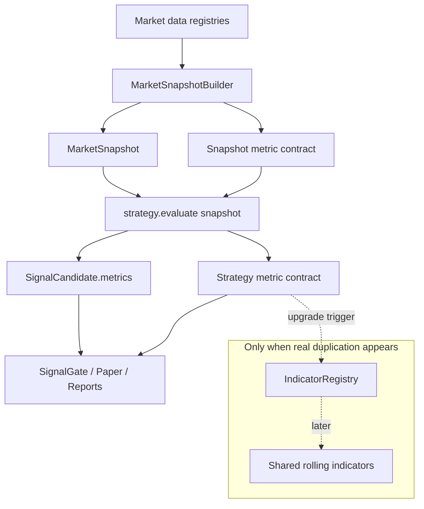

# 12 策略指标治理与 Point-in-Time 语义设计

**Status:** Draft
**Scope:** 一个独立的策略指标治理规格。先完成设计审阅，再按独立 worktree 执行实现；不要与既有 01-11 规格合并开发，也不要把它升级成统一指标服务或 feature store。
**Goal:** 在不改变现有策略公式、不引入重型指标引擎的前提下，把 `MarketSnapshot.metrics` 与 `SignalCandidate.metrics` 从松散 JSON 提升为可验证、可回放、可审计的指标契约，为后续新增策略保留清晰接入边界。

## 背景依据

当前 `docs/STRATEGY_INDICATOR_FLOW.md` 描述的链路是正确方向：

> 外部行情源 → 本地 Registry → `MarketSnapshot` → `strategy.evaluate(snapshot)` → `SignalCandidate.metrics`

当前源码与该文档一致：

- `MarketSnapshotBuilder.build()` 从 `OrderBookRegistry`、`SpotRegistry`、`PriceToBeatProvider` 组装 snapshot，并把 PTB provenance 与派生指标写入 `snapshot.metrics`。
- `MarketSnapshotBuilder._derived_metrics()` 派生 `up_ask`、`down_ask`、bid、spread、ask_sum、ask_skew、favorite_side、spot/PTB/diff 等字段。
- `BaseStrategy.evaluate(snapshot)` 是策略唯一输入边界；`BaseStrategy._candidate()` 把策略输出的 `metrics` 写入 `SignalCandidate`。
- `scheduler_processing.evaluate_candidates_*()` 负责对 snapshot 调用策略，不让策略自己拉行情源。
- 当前启用策略 `vwap_momentum`、`late_consensus`、`ptb_diff` 分别在策略内部或 snapshot 上计算指标。

外部成熟系统也支持这个方向：

- NautilusTrader 使用中央 `Cache` 存储市场数据、订单状态和自定义计算；策略通过 data handlers/cache 读取数据，不在每次决策时直接调用外部指标 API。
- Zipline/QuantConnect 都采用事件驱动的数据对象或 timeslice，把当前时点可见数据交给策略处理。
- Feast 等 feature-store 文档强调 point-in-time correctness，历史特征必须按 event timestamp 取当时已知值，避免训练/回放看到未来。

结论：本项目当前架构属于行业主流方向；问题不是“缺一个统一指标服务”，而是指标语义太松、时间边界和回放一致性没有被代码和文档明确约束。

## 问题

1. **`metrics` 是松散 dict**：`MarketSnapshot.metrics` 与 `SignalCandidate.metrics` 没有统一 schema，后续策略增加指标时容易出现同名不同义、单位不清、缺少 source 的问题。
2. **point-in-time 语义不够硬**：snapshot 有 `created_at`，freshness 有 `*_ms`，但没有明确规定指标只能使用 `created_at` 当时已知数据。
3. **滚动指标缺少 warmup 合约**：VWAP/momentum 这类策略内部缓存指标没有统一输出 `window_sec`、样本数、warmup 是否完成。
4. **缺少指标 provenance**：指标值无法稳定回答“来自哪个 snapshot、哪个数据源、哪个观察时间、哪个计算时间”。
5. **回放/live parity 不可验证**：同一历史事件流在 paper/live/replay 中是否产生同一指标，目前没有测试契约。
6. **策略接入规则不明确**：新增策略可以随意写 metrics key，长期会让 report、dashboard、gate、paper attribution 依赖隐式字段。
7. **过早统一指标层风险高**：当前只有少数策略，不同指标还没有形成稳定复用关系；现在引入 `IndicatorEngine` 会增加抽象债。

## 非目标

- 不新增统一 `IndicatorEngine` / `IndicatorRegistry` runtime 服务。
- 不引入 Feast、Tecton、NautilusTrader、Zipline、QuantConnect 或任何新 runtime 依赖。
- 不改策略交易公式、阈值、position sizing、gate、paper execution 语义。
- 不把所有历史 metrics 一次性迁移成强类型对象；先治理关键指标与新增策略接入规则。
- 不实现离线 feature store、训练集生成、ML serving、复杂特征版本化。
- 不为了未来策略提前设计插件系统、DSL、动态表达式引擎或跨进程指标服务。

## 方案比较

### 方案 A：保持现状，只在文档提示

继续允许策略自由写 `metrics: dict`，仅在 `docs/STRATEGY_INDICATOR_FLOW.md` 增加说明。

- 优点：零代码改动。
- 缺点：无法阻止后续策略写出不可回放、不可审计、单位混乱的指标。
- 结论：拒绝。

### 方案 B：立即建设统一指标层

新增 `IndicatorRegistry` / `IndicatorEngine`，由统一服务计算 VWAP、momentum、spread、PTB diff 等指标，策略只消费指标上下文。

- 优点：长期复用清晰。
- 缺点：当前策略数量和重复度不足；策略公式仍在演化，过早抽象会把局部逻辑固化成框架。
- 结论：暂不采用。只有当 3 个以上策略复用同一复杂滚动指标，或 replay/live parity 出现真实冲突时再升级。

### 方案 C：轻量指标治理，保留升级口（推荐）

保留现有 snapshot-first 架构，不新增统一指标服务；新增轻量指标契约、验证工具和策略接入规则，让当前 `metrics` dict 变成有 schema、有时间边界、有 provenance 的可审计输出。

- 优点：最小改动修复长期正确性问题；不阻塞新增策略；后续可平滑升级到统一指标层。
- 缺点：短期仍允许部分策略内部维护 rolling state，复用性不如统一指标层。
- 结论：采用。

## 目标行为

1. `strategy.evaluate(snapshot)` 继续是策略指标计算入口；策略不得在 evaluate 热路径中访问外部网络、数据库或行情 API。
2. `MarketSnapshot.metrics` 中的关键派生指标必须有 schema：指标名、类型、单位、source、observed_at、computed_at、freshness、point-in-time 标记。
3. `SignalCandidate.metrics` 中的策略指标必须声明来源：来自 snapshot 派生、策略内部滚动状态、配置阈值，或计算结果。
4. 所有指标必须满足 point-in-time：不得使用晚于 `snapshot.created_at` 的观察值。
5. 滚动指标必须输出 `window_sec`、样本数、warmup_ready、latest_observed_at。
6. warmup 不足的策略不得把该指标当作有效交易依据；可以返回空信号或明确 reason。
7. 指标 key 命名稳定，不允许同名不同单位；概率统一使用 0.0-1.0，价格/金额使用 USDC/USD 需明确单位。
8. 新增策略必须在代码或配置中声明需要的 snapshot fields 与输出 metrics keys。
9. replay/paper/live 对同一 snapshot 输入应产生相同策略 metrics，允许 signal_id/timestamp 等非指标字段不同。
10. 只有出现明确复用触发条件时，才升级为统一指标层。

## 设计概览



核心原则：指标治理先约束语义，不先造服务。当前系统已有正确数据流，应该保留；新增的是最小可验证契约，使后续策略不会把松散 JSON 变成长期债务。

## Proposed components

### 1. `MetricValue`：单个指标值契约

建议新增轻量 domain model，例如 `src/polysignal_lab/domain/metrics.py`：

```python
class MetricValue(BaseModel):
    name: str
    value: float | int | str | bool | None
    unit: str | None = None
    source: str
    observed_at: datetime | None = None
    computed_at: datetime
    freshness_ms: int | None = None
    window_sec: int | None = None
    sample_count: int | None = None
    warmup_ready: bool = True
    point_in_time_safe: bool = True
```

约束：

- `observed_at` 表示原始数据观察时间；纯配置阈值可为 `None`。
- `computed_at` 不得早于 snapshot `created_at` 太多，也不得晚于策略评估完成时间；测试只需要保证不使用未来 observed_at。
- `source` 使用小而稳定的字符串：`snapshot.orderbook`、`snapshot.spot`、`snapshot.ptb`、`strategy.trade_history`、`strategy.config`、`strategy.computed`。
- `unit` 使用稳定枚举或约定字符串：`probability`、`usd`、`usdc`、`seconds`、`milliseconds`、`contracts`、`ratio`、`side`。

### 2. `MetricSchema`：策略指标声明

策略不需要实现复杂插件，只需声明最小 schema：

```python
class MetricSchema(BaseModel):
    name: str
    unit: str | None
    required: bool = True
    source: str
    description: str
```

`BaseStrategy` 可提供默认空声明：

```python
@property
def input_metrics(self) -> tuple[MetricSchema, ...]:
    return ()

@property
def output_metrics(self) -> tuple[MetricSchema, ...]:
    return ()
```

新增策略必须声明 `output_metrics`；现有策略按最小集合补齐。

### 3. 保持 dict 输出，但增加规范化 helper

不要一次性把所有调用方改成 `dict[str, MetricValue]`。短期保留现有 report/dashboard 兼容性：

- 策略继续给 `_candidate(..., metrics={...})` 传普通 dict。
- 新增 helper 生成并校验旁路 metadata，例如 `metrics_meta` 或 `_metric_contract`。
- 或者在测试层校验关键 metrics key 是否符合策略声明。

推荐先采用测试层校验，避免大规模 schema 迁移。

### 4. Point-in-time validator

新增轻量函数：

```python
def validate_metric_point_in_time(metric: MetricValue, snapshot_created_at: datetime) -> None:
    if metric.observed_at is not None and metric.observed_at > snapshot_created_at:
        raise ValueError(...)
    if metric.point_in_time_safe is not True:
        raise ValueError(...)
```

使用位置：

- 单元测试：覆盖 builder 派生指标、VWAP rolling 指标、PTB diff 指标。
- 可选 runtime：仅在 debug/test 配置开启，不在每次 live evaluate 中强制 Pydantic 化所有指标，避免热路径额外开销。

### 5. Strategy onboarding rule

新增策略时必须满足：

- `evaluate(snapshot)` 只读 snapshot 与策略内存状态。
- 不在 evaluate 中执行 HTTP、SQLite、文件 I/O、sleep、blocking wait。
- 声明 `readiness.required_fields`。
- 声明 `output_metrics`。
- 滚动指标输出 `window_sec`、`sample_count`、`warmup_ready`。
- 若 warmup 不足，返回空候选或明确 `reason_codes`，不得输出看似有效的 confidence。

## 当前策略映射

### VWAP Momentum

关键指标：

- `vwap`：`unit=probability`，`source=strategy.trade_history`，`window_sec=config.vwap_window_sec`，需要 sample_count/warmup。
- `deviation_pct`：`unit=ratio`，`source=strategy.computed`。
- `momentum`：`unit=ratio`，`source=strategy.trade_history`，`window_sec=config.momentum_window_sec`。
- `fav_price` / favorite price：`unit=probability`，`source=snapshot.orderbook`。

要求：

- TradeHistory 的样本 observed_at 不得晚于 snapshot created_at。
- warmup 不足时不应产生交易候选。
- gate rejected 的候选不得消耗策略状态；该行为已有 callbacks 经验，指标 spec 必须延续。

### Late Consensus

关键指标：

- `ask_sum`：`unit=probability_sum`，`source=snapshot.orderbook`。
- `confidence_abs`：`unit=probability`，`source=strategy.computed`。
- `favorite_side`：`unit=side`，`source=strategy.computed`。
- `favorite_price`：`unit=probability`，`source=snapshot.orderbook`。
- `contracts`：`unit=contracts`，`source=strategy.config+computed`。

要求：

- `ask_sum` 与 snapshot 派生值语义一致。
- confidence 使用 `abs(up_ask - down_ask)`，不得与 signal confidence 混淆。
- `seconds_to_close` 来自 snapshot，不自行读取当前时间替代。

### PTB Diff

关键指标：

- `spot_price`：`unit=usd`，`source=snapshot.spot`。
- `price_to_beat`：`unit=usd`，`source=snapshot.ptb`。
- `diff_usd`：`unit=usd`，`source=strategy.computed`。
- `entry_prob` / `token_ask`：`unit=probability`，`source=snapshot.orderbook`。
- `probability_edge`：`unit=probability`，`source=strategy.computed`。
- `spread`：`unit=probability`，`source=snapshot.orderbook`。
- `orderbook_freshness_ms` / `spot_freshness_ms`：`unit=milliseconds`。

要求：

- `price_to_beat_verified` / `price_to_beat_from_anchor_service` provenance 继续保留。
- `diff_usd` 必须由同一 snapshot 中的 spot 与 PTB 计算，不允许重新拉 PTB 或 spot。

## 升级到统一指标层的触发条件

只有满足任一条件，才考虑后续新 spec 引入 `IndicatorRegistry`：

1. 3 个以上生产策略复用同一个复杂滚动指标，例如 VWAP、momentum、realized volatility、orderbook imbalance。
2. 同一指标在多个策略中出现同名不同公式或不同单位。
3. replay 与 live 对同一指标持续出现不可解释差异。
4. 指标需要跨 scheduler 重启恢复状态，策略内部内存缓存不再足够。
5. 指标计算成为性能瓶颈，需要集中缓存或批量计算。
6. dashboard/report 需要展示跨策略统一指标历史，而不是单个 signal 的局部 metrics。

未触发这些条件前，不建指标服务。

## 测试要求

1. `tests/test_metrics_contract.py`：验证 `MetricValue` point-in-time、unit/source、warmup 字段。
2. `tests/test_market_snapshot.py` 或现有 snapshot 测试：验证 snapshot 派生指标能生成对应 schema/meta。
3. `tests/test_vwap_momentum.py`：补 warmup/sample_count/window 语义测试。
4. `tests/test_late_consensus.py`：验证 `confidence_abs`、`ask_sum`、`favorite_price` 单位和含义不混淆。
5. `tests/test_ptb_diff.py`：验证 `diff_usd` 来自同一 snapshot，不能因后续 spot/PTB 变化改变已产出 signal metrics。
6. 新增策略模板测试：任何生产启用策略必须声明 output metrics schema。

测试原则：

- 不 mock 外部服务；使用现有 domain object 构造 snapshot。
- 不测字符串默认值本身；测语义，例如 future observed_at 被拒、warmup false 不产出交易候选。
- 不跑全量 Docker；本 spec 是策略指标治理，目标验证为 Python 单元测试。

## Rollout

1. 新增 `domain/metrics.py`，只包含 `MetricValue`、`MetricSchema` 和小 validator。
2. 给 `BaseStrategy` 增加 `input_metrics` / `output_metrics` 默认属性。
3. 给 3 个当前策略补最小 `output_metrics` 声明。
4. 给当前关键 metrics 增加测试级契约校验；暂不改变 dashboard/report JSON 格式。
5. 在 `docs/STRATEGY_INDICATOR_FLOW.md` 增加本 spec 的长期结论：当前不建统一指标服务，先执行指标治理。
6. 等真实复用触发条件出现，再单独写统一指标层 spec。

## 风险与缓解

- **风险：schema 迁移扩大 diff。** 缓解：短期不改变 metrics JSON 形状，只增加声明和测试。
- **风险：策略内部 rolling state 继续分散。** 缓解：只要没有跨策略复用，就比过早抽象更便宜；用升级触发条件管理。
- **风险：runtime 校验拖慢热路径。** 缓解：默认只在测试/debug 开启完整 `MetricValue` 校验。
- **风险：新增策略绕过规则。** 缓解：增加测试扫描生产策略 `output_metrics`，失败即阻止合并。

## 成功标准

- 当前 3 个策略仍按原公式输出信号。
- 每个生产策略有稳定 output metrics 声明。
- 关键指标具备单位、source、window/warmup 或 freshness 语义。
- 测试能捕获 future observed_at、缺失 warmup、同名单位冲突等错误。
- `docs/STRATEGY_INDICATOR_FLOW.md` 与本 spec 一致：当前架构是最佳实践方向，改进重点是治理，不是立刻造统一指标服务。

## 实施边界

本规格应作为单独实现计划执行。实现时默认使用新 worktree；通过 targeted pytest 验证即可。除非实现过程中改动 runtime config 或 Docker 服务，否则不需要重建容器。
