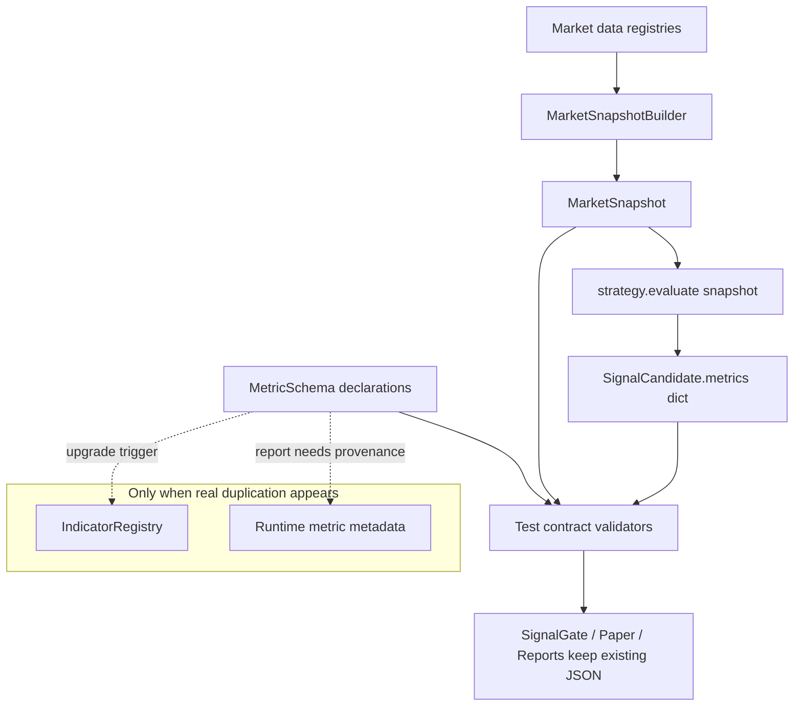

# 12 策略指标治理与 Point-in-Time 语义设计

**Status:** Draft, revised after code-grounded review
**Scope:** 一个独立的策略指标治理规格。先完成设计审阅，再按独立 worktree 执行实现；不要与既有 01-11 规格合并开发，也不要把它升级成统一指标服务、feature store 或 runtime 指标引擎。
**Goal:** 在不改变现有策略公式、不引入重型指标引擎、不改变 `metrics` JSON 存储形状的前提下，把当前生产启用策略的 `MarketSnapshot.metrics` 与 `SignalCandidate.metrics` 从松散 dict 提升为可声明、可测试、可回放、可审计的指标契约，为后续新增策略保留清晰接入边界。

## 背景依据

当前 `docs/STRATEGY_INDICATOR_FLOW.md` 描述的链路是正确方向：

> 外部行情源 → 本地 Registry → `MarketSnapshot` → `strategy.evaluate(snapshot)` → `SignalCandidate.metrics`

当前源码与该文档一致：

- `MarketSnapshotBuilder.build()` 从 `OrderBookRegistry`、`SpotRegistry`、`PriceToBeatProvider` 组装 snapshot，并把 PTB provenance 与派生指标写入 `snapshot.metrics`。
- `MarketSnapshotBuilder._derived_metrics()` 派生 `up_ask`、`down_ask`、bid、spread、ask_sum、ask_skew、favorite_side、spot/PTB/diff 等字段。
- `MarketSnapshot` 保留 `created_at`、order book、spot、PTB、freshness 与 `metrics: dict[str, Any]`。
- `BaseStrategy.evaluate(snapshot)` 是策略唯一输入边界；`BaseStrategy._candidate()` 把策略输出的 `metrics` 写入 `SignalCandidate`。
- `scheduler_processing.evaluate_candidates_*()` 负责对 snapshot 调用策略，不让策略自己拉行情源。
- `config/signal_bot.yaml` 当前生产启用策略是 `vwap_momentum`、`late_consensus`、`ptb_diff`。仓库里还有其他策略文件会写 `metrics`，但本规格第一阶段只约束生产启用策略，避免把研究/未启用策略一起拖入迁移。

外部成熟系统支持这个方向，但不要求本项目复制它们的重型架构：

- NautilusTrader 官方 Cache 文档把 `Cache` 定义为中央内存数据库，保存市场数据、订单历史和自定义计算；策略通过 `self.cache` 读取当前与历史数据。它证明“策略消费本地已采集数据”是合理方向，但本项目目前没有足够复用度去引入等价的统一 Cache/Indicator 服务。
- QuantConnect 官方 Timeslices 文档强调事件驱动引擎按时间片把同一时点可用数据交给 `OnData(Slice data)`，目标是避免 look-ahead bias。本项目的 `MarketSnapshot` 是更轻量的同类边界。
- Feast 官方 point-in-time joins 文档强调历史特征按实体事件时间向后查找并受 TTL 约束，目的是复现过去某个时点可见的特征状态。本项目不需要 feature store，但需要同样的 point-in-time 约束。

结论：当前架构属于行业主流方向；问题不是“缺一个统一指标服务”，而是指标语义太松、时间边界和回放一致性没有被代码和文档明确约束。

## 问题

1. **`metrics` 是松散 dict**：`MarketSnapshot.metrics` 与 `SignalCandidate.metrics` 没有统一声明，后续策略增加指标时容易出现同名不同义、单位不清、缺少 source 的问题。
2. **point-in-time 语义不够硬**：snapshot 有 `created_at`，freshness 有 `*_ms`，但没有明确规定指标只能使用该 snapshot 决策时点已可用的数据。
3. **`observed_at` 概念容易误用**：VWAP 现在用 REST/orderbook `best_ask` 写入 `TradeHistory`，timestamp 是 `snapshot.created_at`，不是原始成交时间。把它简单叫 trade observed time 会误导后续 WS trade feed 接入。
4. **滚动指标缺少 warmup 合约**：VWAP/momentum 这类策略内部缓存指标没有统一输出或测试 `window_sec`、样本数、warmup 是否完成。
5. **缺少指标 provenance**：指标值无法稳定回答“来自 snapshot、orderbook/spot/PTB、策略内存状态、配置阈值还是纯计算结果”。
6. **回放/live parity 不可验证**：同一 snapshot 输入在 paper/live/replay 中是否产生同一策略 metrics，目前没有测试契约。
7. **策略接入规则不明确**：新增生产策略可以随意写 metrics key，长期会让 report、dashboard、gate、paper attribution 依赖隐式字段。
8. **过早统一指标层风险高**：当前只有少数生产启用策略，不同指标还没有形成稳定复用关系；现在引入 `IndicatorEngine` 会增加抽象债。

## 非目标

- 不新增统一 `IndicatorEngine` / `IndicatorRegistry` runtime 服务。
- 不引入 Feast、Tecton、NautilusTrader、Zipline、QuantConnect 或任何新 runtime 依赖。
- 不改策略交易公式、阈值、position sizing、gate、paper execution 语义。
- 不改变现有 `SignalCandidate.metrics` 的 JSON shape、SQLite/JSONL 序列化格式、dashboard/report 读取格式。
- 不把所有历史 metrics 一次性迁移成强类型对象；先治理生产启用策略的关键指标与新增策略接入规则。
- 不实现离线 feature store、训练集生成、ML serving、复杂特征版本化。
- 不为了未来策略提前设计插件系统、DSL、动态表达式引擎或跨进程指标服务。

## 方案比较

### 方案 A：保持现状，只在文档提示

继续允许策略自由写 `metrics: dict`，仅在 `docs/STRATEGY_INDICATOR_FLOW.md` 增加说明。

- 优点：零代码改动。
- 缺点：无法阻止后续策略写出不可回放、不可审计、单位混乱的指标。
- 结论：拒绝。

### 方案 B：立即建设统一指标层

新增 `IndicatorRegistry` / `IndicatorEngine`，由统一服务计算 VWAP、momentum、spread、PTB diff 等指标，策略只消费指标上下文。

- 优点：长期复用清晰。
- 缺点：当前策略数量和重复度不足；策略公式仍在演化，过早抽象会把局部逻辑固化成框架。
- 结论：暂不采用。只有当 3 个以上生产策略复用同一复杂滚动指标，或 replay/live parity 出现真实冲突时再升级。

### 方案 C：为每个指标生成 runtime `MetricValue`

新增 `MetricValue` Pydantic model，包含 value、unit、source、observed_at、computed_at、freshness、window、warmup 等字段，并尝试让运行时逐步生成这些对象。

- 优点：语义表达完整。
- 缺点：本项目短期仍要保留 dict JSON shape；如果 runtime 不消费 `MetricValue`，它会变成测试专用 dead code。若强行接入 runtime，则会扩大 diff、拖慢热路径并冲击 report/dashboard。
- 结论：拒绝作为本规格第一阶段实现。未来只有当 report/dashboard 需要展示指标元数据，或持久化层需要完整指标 provenance 时，再单独设计。

### 方案 D：轻量指标声明 + 测试级契约治理（推荐）

保留现有 snapshot-first 架构，不新增统一指标服务，也不新增 runtime `MetricValue`。新增轻量 `MetricSchema` 声明、生产策略扫描测试、snapshot point-in-time 测试和策略 metrics 语义测试，让当前 dict 输出具备可审计契约。

- 优点：最小改动修复长期正确性问题；不阻塞新增策略；后续可平滑升级到统一指标层或 runtime metadata。
- 缺点：短期仍允许部分策略内部维护 rolling state，复用性不如统一指标层。
- 结论：采用。

## 目标行为

1. `strategy.evaluate(snapshot)` 继续是策略指标计算入口；策略不得在 evaluate 热路径中访问外部网络、数据库、文件 I/O、sleep 或 blocking wait。
2. `MarketSnapshot.metrics` 中的关键派生指标必须有测试级契约：指标名、类型、单位、source、freshness 或 point-in-time 来源字段。
3. `SignalCandidate.metrics` 中的生产策略指标必须声明来源：来自 snapshot 派生、策略内部滚动状态、配置阈值，或计算结果。
4. point-in-time 规则使用 **available-at cutoff**：任何用于决策的数据必须在 `snapshot.created_at` 时已经被本地系统接收或构造。原始 `event_time` 可早于 available-at，但不能用“事件发生早”掩盖“本地收到晚”。
5. REST/orderbook 派生 VWAP 样本的 `available_at` 定义为 `snapshot.created_at`；未来若接入真实 WS trade feed，trade event time 与 local available-at 必须分开建模。
6. 滚动指标必须声明 `window_sec` 与 warmup 语义，并在测试中覆盖样本不足时不产出交易候选。
7. 指标 key 命名稳定，不允许同名不同单位；概率统一使用 0.0-1.0，百分比展示字段必须明确是 percent 还是 ratio。
8. 新增生产策略必须声明 `output_metrics`；输入需求继续使用现有 `StrategyReadiness.required_fields`，不再新增第二套 input schema。
9. replay/paper/live 对同一 snapshot 输入应产生相同策略 metrics，允许 signal_id/timestamp 等非指标字段不同。
10. 只有出现明确复用触发条件时，才升级为统一指标层。

## 设计概览



核心原则：指标治理先约束语义，不先造服务。当前系统已有正确数据流，应该保留；新增的是最小可验证契约，使后续策略不会把松散 JSON 变成长期债务。

## Proposed components

### 1. `MetricSchema`：策略输出指标声明

建议新增轻量 domain model，例如 `src/polysignal_lab/domain/metrics.py`：

```python
from typing import Literal

from pydantic import BaseModel, ConfigDict

MetricUnit = Literal[
    "probability",
    "probability_sum",
    "ratio",
    "percent",
    "usd",
    "usdc",
    "seconds",
    "milliseconds",
    "contracts",
    "side",
    "count",
    "name",
    "enabled_flag",
]

MetricSource = Literal[
    "snapshot.orderbook",
    "snapshot.spot",
    "snapshot.ptb",
    "snapshot.freshness",
    "strategy.trade_history",
    "strategy.config",
    "strategy.computed",
    "strategy.execution_state",
]

MetricKind = Literal["number", "integer", "string", "boolean", "nullable_number"]

class MetricSchema(BaseModel):
    model_config = ConfigDict(frozen=True)

    name: str
    unit: MetricUnit
    source: MetricSource
    value_kind: MetricKind
    description: str
    produced_when: str = "when a SignalCandidate is emitted"
```

约束：

- 不新增 `required` 字段；是否出现由 `produced_when` 解释，并由测试对“实际产出的 signal metrics”做校验。这样避免 `required=True` 在 warmup/无信号场景中语义混乱。
- 不新增 runtime `MetricValue`；第一阶段只声明输出 metrics 的语义，不改变现有 dict。
- `unit`、`source` 使用 Literal 或枚举，优先让拼写错误在测试/类型检查中暴露。
- `percent` 只用于已经乘以 100 的展示值；`ratio` 用于 0.015 这类小数比例。

### 2. `BaseStrategy.output_metrics`

`BaseStrategy` 增加默认空声明：

```python
@property
def output_metrics(self) -> tuple[MetricSchema, ...]:
    return ()
```

新增规则：

- 生产启用策略必须覆盖 `output_metrics`。
- 输入字段继续使用现有 `readiness.required_fields`；不要新增 `input_metrics`，避免两套输入契约漂移。
- 研究/未启用策略可以暂不迁移，但如果未来进入 `config/signal_bot.yaml` 且 `enabled: true`，测试必须要求它声明输出指标。

### 3. 测试级 contract validators

新增测试 helper，而不是 runtime 热路径校验：

```python
def assert_metrics_match_schema(metrics: dict[str, object], schema: tuple[MetricSchema, ...]) -> None:
    declared = {item.name: item for item in schema}
    missing = sorted(name for name in declared if name not in metrics)
    unexpected = sorted(name for name in metrics if name not in declared)
    assert not missing
    assert not unexpected


def assert_no_metric_unit_conflicts(strategies: list[BaseStrategy]) -> None:
    seen: dict[str, tuple[str, str]] = {}
    for strategy in strategies:
        for metric in strategy.output_metrics:
            prior = seen.setdefault(metric.name, (metric.unit, metric.description))
            assert prior[0] == metric.unit
```

原则：

- 第一阶段允许同名同单位跨策略复用，例如 `seconds_to_close`。
- 同名不同单位必须失败，例如一个策略把 `momentum` 当 ratio，另一个把它当 percent。
- 是否允许 unexpected key 建议第一阶段对生产启用策略严格失败，迫使声明与实际 dict 对齐。

### 4. Point-in-time validators

新增测试级函数，验证 snapshot 源数据可用时间，而不是验证一个不存在的 `MetricValue.observed_at`：

```python
def assert_snapshot_sources_not_after_cutoff(snapshot: MarketSnapshot) -> None:
    cutoff = snapshot.created_at
    for book in (snapshot.up_book, snapshot.down_book):
        if book is not None:
            assert book.received_at <= cutoff
    if snapshot.spot is not None:
        assert snapshot.spot.received_at <= cutoff
        if snapshot.spot.event_time is not None:
            assert snapshot.spot.event_time <= cutoff
```

实现注意：

- 如果现有 `MarketSnapshotBuilder.build()` 的 `created_at` 早于异步 PTB 读取完成导致测试不稳定，实现时应把 snapshot decision cutoff 定义清楚：要么在所有本地读取完成后设置 `created_at`，要么显式拒绝 cutoff 之后才可用的数据。不要悄悄把未来数据塞进当前 snapshot。
- `OrderBook.source_timestamp` 是外部字符串，第一阶段不要依赖它做强校验；使用本地 `received_at` 作为 available-at。
- PTB 当前只有 value/source/provenance，没有统一 observed timestamp；第一阶段只能要求策略使用 snapshot 内的 PTB，不重新拉 PTB。
- VWAP 当前用 snapshot price 合成 TradeHistory 样本，样本 timestamp 应等于 `snapshot.created_at`；这代表 REST 采集可用时间，不代表真实成交事件时间。

### 5. Strategy onboarding rule

新增生产策略时必须满足：

- `evaluate(snapshot)` 只读 snapshot、配置和策略内存状态。
- 不在 evaluate 中执行 HTTP、SQLite、文件 I/O、sleep、blocking wait。
- 使用 `readiness.required_fields` 声明需要的 snapshot 字段。
- 声明 `output_metrics`，且实际 signal metrics 与声明严格一致。
- 滚动指标声明 `window_sec` 相关配置来源，并测试 warmup 不足时不产出交易候选。
- 若 warmup 不足，返回空候选或明确 reason，不得输出看似有效的 confidence。

## 当前生产策略 metrics 映射

### VWAP Momentum

当前实际输出 key：

| key | unit | source | 说明 |
| --- | --- | --- | --- |
| `vwap` | probability | strategy.trade_history | REST/orderbook price 样本滚动 VWAP |
| `deviation_pct` | ratio | strategy.computed | `(fav_price - vwap) / vwap` |
| `deviation_percent` | percent | strategy.computed | `deviation_pct * 100.0` 展示值 |
| `momentum_pct` | ratio | strategy.trade_history | 当前命名含 pct，但值是 ratio；实现可保留 key，schema 必须标成 ratio |
| `momentum` | ratio | strategy.trade_history | 与 `momentum_pct` 当前同值 |
| `favorite_side` | side | strategy.computed | UP/DOWN |
| `fav_price` | probability | snapshot.orderbook | favorite side 当前 price |
| `elapsed_sec` | seconds | strategy.computed | 市场开始后的秒数，可能为 null |
| `seconds_to_close` | seconds | snapshot.orderbook | snapshot `seconds_to_close` |
| `up_last_price` | probability | strategy.trade_history | 当前 UP 样本最新价 |
| `down_last_price` | probability | strategy.trade_history | 当前 DOWN 样本最新价 |

要求：

- TradeHistory 的 REST 样本 timestamp 定义为 `snapshot.created_at`，并在 gate reject 时继续 rollback pending samples。
- warmup 不足时不应产生交易候选；不要求输出 `sample_count` 到 runtime metrics dict，但测试必须覆盖样本不足路径。
- `momentum_pct` 名称历史上不精确；本规格不重命名以避免破坏 report/dashboard，但 schema 必须把它声明为 `ratio`。

### Late Consensus

当前实际输出 key：

| key | unit | source | 说明 |
| --- | --- | --- | --- |
| `confidence_raw` | probability | strategy.computed | 当前等于 `abs(up_ask - down_ask)` |
| `confidence_abs` | probability | strategy.computed | 与 `confidence_raw` 当前同值 |
| `ask_sum` | probability_sum | snapshot.orderbook | `up_ask + down_ask` |
| `up_ask` | probability | snapshot.orderbook | UP best ask |
| `down_ask` | probability | snapshot.orderbook | DOWN best ask |
| `favorite_side` | side | strategy.computed | ask 更高的一边 |
| `favorite_price` | probability | snapshot.orderbook | favorite side ask |
| `seconds_to_close` | seconds | snapshot.orderbook | snapshot `seconds_to_close` |
| `contracts` | contracts | strategy.config | 动态仓位大小 |
| `max_investment_per_market` | usdc | strategy.config | paper wallet enforcement metadata |
| `flip_stop_enabled` | enabled_flag | strategy.config | exit metadata |
| `flip_stop_price` | probability | strategy.config | exit metadata |
| `stop_loss_enabled` | enabled_flag | strategy.config | exit metadata |
| `stop_loss_config` | name | strategy.config | per-coin stop-loss 配置对象；第一阶段只声明存在，不强拆内部结构 |

要求：

- `ask_sum` 与 snapshot 派生值语义一致。
- `confidence_abs` 使用 `abs(up_ask - down_ask)`，不得与最终 signal confidence 混淆。
- `seconds_to_close` 来自 snapshot，不自行读取当前时间替代。

### PTB Diff

当前实际输出 key：

| key | unit | source | 说明 |
| --- | --- | --- | --- |
| `spot_price` | usd | snapshot.spot | Binance spot |
| `price_to_beat` | usd | snapshot.ptb | snapshot PTB |
| `diff_usd` | usd | strategy.computed | `spot_price - price_to_beat` |
| `abs_diff_usd` | usd | strategy.computed | `abs(diff_usd)` |
| `trigger` | name | strategy.config | 触发器名 |
| `trigger_side` | side | strategy.config | 触发器方向 |
| `entry_prob` | probability | snapshot.orderbook | entry price |
| `token_ask` | probability | snapshot.orderbook | 当前等于 entry price |
| `directional_probability` | probability | strategy.computed | diff 映射后的方向概率 |
| `max_token_price` | probability | strategy.config | trigger 上限 |
| `min_token_price` | probability | strategy.config | trigger 下限 |
| `probability_edge` | probability | strategy.computed | 方向概率减 entry price |
| `min_probability_edge` | probability | strategy.config | trigger 阈值 |
| `min_diff_usd` | usd | strategy.config | trigger 阈值 |
| `seconds_to_close` | seconds | snapshot.orderbook | snapshot `seconds_to_close` |
| `min_seconds_to_close` | seconds | strategy.config | trigger 阈值 |
| `max_seconds_to_close` | seconds | strategy.config | trigger 阈值 |
| `tp_sl_stop_prob` | probability | strategy.computed | TP/SL 计算结果 |
| `tp_sl_tp_prob` | probability | strategy.computed | TP 触发价，可能为 null；schema `value_kind=nullable_number` |
| `tp_sl_risk_abs` | probability | strategy.computed | entry-stop 风险差 |
| `tp_sl_stop_loss_pct` | ratio | strategy.config | stop loss pct |
| `tp_sl_take_profit_rr` | ratio | strategy.config | RR 倍数 |
| `tp_sl_take_profit_cap` | probability | strategy.config | TP 上限 |
| `spread` | probability | snapshot.orderbook | side book spread |
| `max_spread` | probability | strategy.config | 策略配置阈值 |
| `orderbook_freshness_ms` | milliseconds | snapshot.freshness | side book freshness |
| `max_lag_ms` | milliseconds | strategy.config | exit freshness 阈值 |
| `spot_freshness_ms` | milliseconds | snapshot.freshness | spot freshness |

要求：

- `price_to_beat_verified` / `price_to_beat_from_anchor_service` provenance 继续保留在 snapshot metrics，不要求重复写入 signal metrics。
- `diff_usd` 必须由同一 snapshot 中的 spot 与 PTB 计算，不允许重新拉 PTB 或 spot。
- 测试必须验证 signal 生成后，即使后续 spot/PTB 改变，已产出 metrics 不变。

## 升级到统一指标层的触发条件

只有满足任一条件，才考虑后续新 spec 引入 `IndicatorRegistry`：

1. 3 个以上生产策略复用同一个复杂滚动指标，例如 VWAP、momentum、realized volatility、orderbook imbalance。
2. 同一指标在多个策略中出现同名不同公式或不同单位。
3. replay 与 live 对同一指标持续出现不可解释差异。
4. 指标需要跨 scheduler 重启恢复状态，策略内部内存缓存不再足够。
5. 指标计算成为性能瓶颈，需要集中缓存或批量计算。
6. dashboard/report 需要展示跨策略统一指标历史，而不是单个 signal 的局部 metrics。
7. 持久化层需要保存完整指标 provenance，而不是只保存 signal 的 dict snapshot。

未触发这些条件前，不建指标服务。

## 测试要求

1. `tests/test_metrics_contract.py`：验证 `MetricSchema` 枚举、生产启用策略必须声明 `output_metrics`、实际 signal metrics 与声明严格一致、同名不同单位冲突会失败。
2. `tests/test_market_snapshot.py` 或现有 snapshot 测试：验证 snapshot 派生指标 key 与语义稳定，且 orderbook/spot available-at 不晚于 `snapshot.created_at`。
3. `tests/test_vwap_momentum.py`：补 warmup、REST 样本 timestamp、pending sample reject rollback、`momentum_pct` 是 ratio 不是 percent 的语义测试。
4. `tests/test_late_consensus.py`：验证 `confidence_abs`、`ask_sum`、`favorite_price` 单位和含义不混淆，且 output metrics schema 与实际 keys 完全对齐。
5. `tests/test_ptb_diff.py`：验证 `diff_usd` 来自同一 snapshot，不能因后续 spot/PTB 变化改变已产出 signal metrics；验证 freshness metrics 来源是 snapshot/book/spot，不是重新读取当前时间。
6. 新增策略模板测试：任何进入 `config/signal_bot.yaml` 且 `enabled: true` 的生产策略必须声明 output metrics schema。

测试原则：

- 不 mock 外部服务；使用现有 domain object 构造 snapshot。
- 不测字符串默认值本身；测语义，例如 future available-at 被拒、warmup false 不产出交易候选、同名不同单位冲突失败。
- 不跑全量 Docker作为本 spec 的最小验收；若实现阶段的代码改动合并为正式运行版本，仍按项目规则重建并验证 Docker。

## Rollout

1. 新增 `domain/metrics.py`，只包含 `MetricSchema`、Literal 类型和测试 helper 需要的稳定类型定义；不新增 runtime `MetricValue`。
2. 给 `BaseStrategy` 增加 `output_metrics` 默认属性。
3. 给 3 个当前生产启用策略补最小 `output_metrics` 声明，声明必须与实际 metrics dict keys 对齐。
4. 给当前关键 metrics 增加测试级契约校验；暂不改变 dashboard/report/SQLite/JSONL JSON 格式。
5. 在 `docs/STRATEGY_INDICATOR_FLOW.md` 增加本 spec 的长期结论：当前不建统一指标服务，先执行指标治理；文档更新应在代码和 targeted pytest 通过后进行。
6. 等真实复用触发条件出现，再单独写统一指标层 spec。

## 风险与缓解

- **风险：schema 迁移扩大 diff。** 缓解：短期不改变 metrics JSON 形状，只增加声明和测试。
- **风险：`MetricSchema` 声明与实际 dict 漂移。** 缓解：测试严格比较生产策略实际 signal metrics key 集合与 `output_metrics`。
- **风险：report/dashboard 依赖隐式 metrics key。** 缓解：第一阶段不重命名、不删除现有 key；像 `momentum_pct` 这种历史命名不准的问题先用 schema 描述真实单位。
- **风险：策略内部 rolling state 继续分散。** 缓解：只要没有跨策略复用，就比过早抽象更便宜；用升级触发条件管理。
- **风险：runtime 校验拖慢热路径。** 缓解：默认只在测试层做完整契约校验，不在 live evaluate 中 Pydantic 化每个指标值。
- **风险：新增策略绕过规则。** 缓解：增加测试扫描生产启用策略 `output_metrics`，失败即阻止合并。
- **风险：available-at 与 event-time 混淆。** 缓解：spec 明确 PIT 使用本地可用时间；REST 派生样本、WS trade event、spot event time 分别建模。

## 成功标准

- 当前 3 个生产启用策略仍按原公式输出信号。
- 每个生产启用策略有稳定 `output_metrics` 声明，且声明与实际 signal metrics keys 完全对齐。
- 关键指标具备单位、source、window/warmup 或 freshness 语义。
- 测试能捕获 future available-at、缺失 warmup、同名单位冲突、schema/key 漂移等错误。
- `docs/STRATEGY_INDICATOR_FLOW.md` 与本 spec 一致：当前架构是最佳实践方向，改进重点是治理，不是立刻造统一指标服务。

## 实施边界

本规格应作为单独实现计划执行。实现时默认使用新 worktree；最小验收为 targeted pytest。若实现改动被合并为正式运行版本，仍按项目规则执行 Docker rebuild/recreate 与健康检查后再认为正式环境已使用新版本。

## 参考来源

- Feast official docs, point-in-time joins: https://docs.feast.dev/getting-started/concepts/point-in-time-joins
- QuantConnect official docs, timeslices: https://www.quantconnect.com/docs/v2/writing-algorithms/key-concepts/time-modeling/timeslices
- NautilusTrader official docs, Cache: https://nautilustrader.io/docs/latest/concepts/cache/
