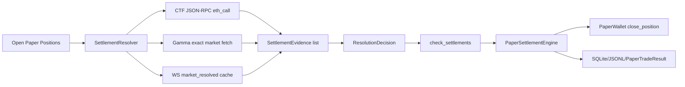

# 13 Polymarket 三源结算 Oracle 设计

**Status:** Draft
**Scope:** 一个独立的结算正确性规格。先完成设计审阅，再按独立 worktree 执行实现；不要与 Spec 11 paper parity 或其他策略修复合并开发。
**Goal:** 用链上 CTF payout、Gamma 精确查询、CLOB WebSocket `market_resolved` 三个来源共同判断 Polymarket 市场结算，修复已结束仓位卡在 OPEN、胜出方解析不全、50/50 payout 无法表达的问题。

## 背景依据

当前 PolySignal Lab 是 read-only Polymarket signal/paper lab。纸面结算只能影响模拟钱包、SQLite/reporting、Telegram paper result；不能引入真实交易、redeem、私钥或 authenticated CLOB API。

本规格来自 2026-06-24 对当前代码和官方资料的审查：

- 当前代码：`PaperSettlementEngine` 已支持显式 `outcome_value`，但默认路径仍根据 `Market.status` 与 `Market.resolved_outcome` 计算 WIN/LOSS/VOID/UNKNOWN，且不能写入 settlement provenance；`Market.from_gamma()` 能识别 resolved/status/winner/cancelled 等常见字段，但不识别 `umaResolutionStatus` 与 terminal `outcomePrices`；`MarketUniverseService.fetch_resolved()` 的生产 fallback 只扫 `GET /markets?closed=true&limit=200&offset=0` 后用 `market_id` 过滤；`PolymarketMarketWebSocket` 捕获 `market_resolved` 后只放入 queue，没有生产消费方。
- 真实 Gamma payload 示例：`/markets/2649672` 已 `closed=true`、`umaResolutionStatus="resolved"`、`outcomePrices='["1", "0"]'`，但没有 `resolved=true`、`winning_outcome`、`winning_asset_id`。当前 parser 会把它解析成 `CLOSED + resolved_outcome=None`，导致对应 open position 不会结算。
- 官方 Polymarket docs：market channel 的 `market_resolved` 包含 `winning_asset_id` 与 `winning_outcome`；Gamma market schema 包含 `outcomes`、`outcomePrices`、`clobTokenIds`、`umaResolutionStatus`；CTF redeem 以 payout vector 决定兑付。
- Gnosis ConditionalTokens 源码：`payoutDenominator[conditionId] > 0` 表示 condition 已收到 oracle result；`payoutNumerators[conditionId][i] / payoutDenominator[conditionId]` 是第 `i` 个 outcome slot 的最终 payout；`ConditionResolution` event 包含 `conditionId` 与 `payoutNumerators`。

官方地址与边界：

- Polygon mainnet chain id: `137`。
- Conditional Tokens contract: `0x4D97DCd97eC945f40cF65F87097ACe5EA0476045`。
- pUSD collateral: `0xC011a7E12a19f7B1f670d46F03B03f3342E82DFB`，本规格只读，不调用 approve/split/merge/redeem。
- UMA adapter: `0x6A9D222616C90FcA5754cd1333cFD9b7fb6a4F74`，仅作为 condition resolver 背景，不需要直接调用。
- 官方 Resolution docs 同时列出 UmaCtfAdapter v3 `0x157Ce2d672854c848c9b79C49a8Cc6cc89176a49` 与 v2 `0x6A9D222616C90FcA5754cd1333cFD9b7fb6a4F74`。本规格不重新计算 condition id、不调用 adapter；adapter 地址只作背景说明，链上查询以 Gamma/本地 market 的 `condition_id` 为输入。

## 问题

1. **结算 market 拉取方式会漏 open positions**：只扫 closed market 第一页，市场多时无法保证持仓对应 market 出现在第一页。
2. **Gamma resolved 形态解析不完整**：`umaResolutionStatus="resolved"` + terminal `outcomePrices` 是当前真实 crypto Up/Down 结算形态之一，但 parser 不识别。
3. **CLOB WS resolved 事件没有消费**：`market_resolved` 进入 queue 后无人读取，低延迟结算信号被浪费。
4. **没有链上最终真相**：Gamma/WS 是 API 层语义；CTF payout vector 才是 redeem 语义最终来源。当前系统无法在 API 字段缺失、冲突、延迟时自校验。
5. **50/50 payout 无法表达**：`Market.resolved_outcome: Side | None` 只能表达单边胜出，不能表达 `[0.5, 0.5]`。`PaperSettlementEngine.settle(..., outcome_value=0.5)` 已支持数值 payout，但没有上游来源提供它。
6. **UNKNOWN 与 VOID 语义混在一起的风险**：取消/50-50/API unknown/链上 unresolved 都可能表现为 `None`，但它们对 paper accounting 的含义不同。
7. **缺少结算 provenance**：paper result 的 `details` 只有 `resolved_outcome` 与 confidence，不能说明结果来自 chain/Gamma/WS、是否有冲突、是否 fallback。

## 非目标

- 不实现真实 redeem、claim、wallet transaction、私钥签名、authenticated CLOB user channel 或 live trading。
- 不引入 Web3.py、ethers、subgraph client、Bitquery 依赖；第一版用已有 `httpx` 发 JSON-RPC `eth_call`，少写代码少带依赖。
- 不实现全链事件索引器；不从 genesis 扫 `ConditionResolution` logs。
- 不改策略公式、不改 paper fill/exit 逻辑、不合并 Spec 11 的 fee/reservation/PnL 工作。
- 不做复杂投票仲裁器。三源冲突时 fail-safe 为 UNKNOWN/retry，而不是猜。
- 不把 historical closed market 全量回填作为本规格交付；只保证 open paper positions 能被正确结算。

## 方案比较

### 方案 A：只补 Gamma parser

给 `Market.from_gamma()` 增加 `umaResolutionStatus` 与 `outcomePrices` 解析。

- 优点：diff 最小，能修复当前卡住的真实 case。
- 缺点：仍依赖 Gamma；WS 事件仍浪费；无法验证 API 字段与链上 redeem payout 是否一致。
- 结论：作为本规格的一个子步骤保留，但不是完整方案。

### 方案 B：只用链上 CTF payout

所有结算都从 CTF `payoutDenominator/payoutNumerators` 查询。

- 优点：最终真相，天然支持 50/50 和任意 payout vector。
- 缺点：需要 Polygon RPC；RPC 失败时 paper settlement 会全部延迟；WS/Gamma 已有低延迟公开信号会被浪费；active market 的 asset/token metadata 仍来自 Gamma。
- 结论：链上作为权威来源，但不能作为唯一来源。

### 方案 C：三源 resolver，链上权威、Gamma 精确、WS 触发与辅助（推荐）

新增轻量 `SettlementResolver`：每轮对 open positions 所属 markets 并发收集链上 CTF、Gamma 精确查询、WS resolved cache 三类 evidence，按明确优先级合成 `ResolvedSettlement`。`PaperSettlementEngine` 接收数值 `outcome_value` 执行结算。

- 优点：修复漏查和字段漂移；链上能最终校验；Gamma 能在 RPC 不可用时继续服务；WS 提供低延迟触发；代码边界小。
- 缺点：要新增一个 resolver、一个 chain client、一个 WS resolved cache，以及少量 config/storage 字段。
- 结论：采用。

## 目标行为

1. 每次 settlement check 只处理 open paper positions 对应的 market，不扫描无关历史市场。
2. 对每个 open market 同时尝试三源 evidence：
   - Chain CTF payout：读取 `payoutDenominator(condition_id)` 与两个 `payoutNumerators(condition_id, index)`。
   - Gamma exact：优先 `GET /markets/{market_id}`；必要时 fallback `GET /markets?condition_ids=<condition_id>&closed=true`。
   - WS resolved cache：继续用 `custom_feature_enabled=true` 订阅 public CLOB `market_resolved` payload，消费/缓存后按 `condition_id`、`market`、`slug` 或 token id 匹配本地 market。
3. 合成规则固定、可测试：
   - Chain resolved evidence 是 authoritative。只要 `denominator > 0` 且 outcome vector 可映射 token，就使用链上 payout。
   - Chain outcome slot vector 必须按本地/Gamma `clobTokenIds` 顺序映射到 token；链上 getter 只返回 slot payout，不返回 token id。
   - Chain unresolved 或 RPC 失败时，Gamma exact resolved evidence 可作为 settlement source。
   - WS evidence 不单独结算，除非后续实现明确批准；第一版只作为低延迟 hint 和 conflict detector，触发本轮 Gamma/chain 精确 recheck。
   - Gamma 与 WS 冲突时，如果 chain unavailable，则不结算，返回 UNKNOWN/retry 并记录 conflict。
   - Chain 与 Gamma/WS 冲突时，chain 胜出，同时记录 conflict metric/system event。
4. `outcome_value` 从具体 position token/side 计算，而不是只用 market winner side：
   - UP token payout 1、DOWN token payout 0 => UP position WIN，DOWN position LOSS。
   - `[0, 1]` 相反。
   - `[0.5, 0.5]` => 两侧都 `VOID`，沿用现有 result states，并记录 `outcome_value=0.5`。
   - 如果 position token 不在 market tokens 中，结算 UNKNOWN，不猜 side index。
5. Result provenance 持久化在 `PaperTradeResult.details`：source、condition_id、payout vector、denominator、gamma status、ws event id、conflict 标记、observed_at。
6. RPC/Gamma/WS 单源失败不阻断 scheduler；只影响该 market 的结算 evidence，保持 open position 可重试。
7. 所有新增网络访问保持 public/read-only，无 API key、无钱包地址、无交易动作。

## 设计概览



核心原则：chain 是最终真相；Gamma 是可靠 fallback；WS 是触发器和辅助证据；任何冲突宁可 UNKNOWN/retry，不把 paper 钱包结错。

## Proposed components

### `SettlementEvidence`

新增 `src/polysignal_lab/paper/settlement_sources.py`。放在 `paper/` 下，因为它服务 paper accounting，不是通用 market data。

```python
from dataclasses import dataclass, field
from datetime import datetime
from typing import Literal

SettlementSource = Literal["chain", "gamma", "ws"]
SettlementConfidence = Literal["authoritative", "exact", "hint"]

@dataclass(frozen=True, slots=True)
class SettlementEvidence:
    source: SettlementSource
    confidence: SettlementConfidence
    market_id: str | None
    market_slug: str | None
    condition_id: str
    outcome_values_by_token: dict[str, float]
    status: Literal["resolved", "cancelled", "unresolved", "unknown", "error"]
    observed_at: datetime
    raw_status: str | None = None
    error: str | None = None
    event_id: str | None = None
    raw: dict[str, object] = field(default_factory=dict)
```

Rules:

- `outcome_values_by_token` uses actual CLOB token IDs, not `Side`, so 50/50 and non-Up/Down labels remain representable.
- `status="cancelled"` is reserved for Gamma cancellation/void metadata; chain CTF 50/50 is still `resolved` with values `{token: 0.5}`.
- `raw` must be bounded: store only relevant keys, not full huge event payload.

### `ResolutionDecision`

```python
@dataclass(frozen=True, slots=True)
class ResolutionDecision:
    market_id: str
    condition_id: str
    status: Literal["resolved", "cancelled", "unknown"]
    source: Literal["chain", "gamma", "ws", "none"]
    outcome_values_by_token: dict[str, float]
    conflict: bool
    conflict_sources: tuple[str, ...]
    details: dict[str, object]

    def outcome_value_for(self, token_id: str) -> float | None:
        return self.outcome_values_by_token.get(token_id)
```

Decision 不直接 close wallet；它只给 `check_settlements()` 提供 evidence。

### Chain client: `CtfResolutionClient`

新增 `src/polysignal_lab/data/ctf_resolution_client.py`。

最小接口：

```python
class CtfResolutionClient:
    def __init__(self, rpc_url: str, *, timeout_sec: float, contract: str) -> None: pass
    async def get_payouts(self, condition_id: str, token_ids: tuple[str, ...]) -> SettlementEvidence: raise NotImplementedError
```

实现方式：使用 `httpx.AsyncClient.post(rpc_url, json=rpc_payload)` 调 Polygon JSON-RPC `eth_call`。

需要读取的 Solidity public getters：

```solidity
payoutDenominator(bytes32 conditionId) returns (uint256)
payoutNumerators(bytes32 conditionId, uint256 index) returns (uint256)
getOutcomeSlotCount(bytes32 conditionId) returns (uint256)
```

为避免未 prepared / unresolved condition 读取 `payoutNumerators(conditionId, index)` 时因数组越界 revert，查询顺序必须是：

1. 校验 `condition_id` 格式。
2. 先查 `payoutDenominator(condition_id)`。
3. `denominator == 0` 直接返回 unresolved evidence，不再查 numerators。
4. `denominator > 0` 后查 `getOutcomeSlotCount(condition_id)`，第一版只接受 `2`。
5. 再查 `payoutNumerators(condition_id, 0)` 与 `payoutNumerators(condition_id, 1)`。

实现不引入 ABI dependency。用常量 function selector + ABI encoding：

- selector 可在实现时用一次性小测试验证；不要在 runtime 引入 keccak dependency只是为了两个固定函数。
- `bytes32 condition_id` 必须校验 `0x` + 64 hex。
- `uint256 index` 第一版只查 `0` 和 `1`，因为本项目 runtime 只交易二元 Up/Down markets。
- `denominator == 0` => unresolved evidence。
- `denominator > 0` => value = numerator / denominator。

如果实现者不想手写 selector，允许使用 Python 标准库以外的已装依赖吗？不允许新增 runtime dependency；可以把 selector 常量写死并用测试固定。

Error handling:

- RPC timeout/HTTP non-200/JSON-RPC error/malformed response => `SettlementEvidence(status="error", source="chain", error="<bounded reason>")`。
- condition id invalid => 不发 RPC，直接 error evidence。
- numerator 长度不匹配或 `denominator > 0` 但 all numerator zero => error evidence。

Config:

```yaml
data:
  polymarket:
    settlement:
      chain_enabled: true
      polygon_rpc_url: ""
      chain_timeout_sec: 3.0
      gamma_enabled: true
      ws_enabled: true
      prefer_chain: true
```

Environment override must use the existing settings/env override pattern. If `polygon_rpc_url` is empty, chain source is disabled and health shows `chain_disabled_missing_rpc`; do not fail startup.

### Gamma exact resolver

Create `GammaResolutionClient` and call it from `SettlementResolver`. Keep `MarketUniverseService.fetch_resolved()` as a compatibility wrapper that delegates to the resolver path for open-position settlement refresh.

Boundary:

```python
class GammaResolutionClient:
    async def get_market(self, market: Market) -> SettlementEvidence: raise NotImplementedError
```

Fetch order:

1. `GET {gamma_base_url}/markets/{market.market_id}`。
2. If 404 or malformed and condition_id exists: `GET {gamma_base_url}/markets?condition_ids={condition_id}&closed=true`。
3. If both fail: error evidence。

Parsing rules:

- Use `clobTokenIds` + `outcomes` arrays as index-aligned truth for token mapping.
- Winner parser priority:
  1. `outcomePrices` terminal vector maps by index. Only accept as resolved if `umaResolutionStatus == "resolved"` or `closed=true && acceptingOrders=false && automaticallyResolved=true`. Values must be near `[1,0]`, `[0,1]`, or `[0.5,0.5]`; use tolerance `1e-9` for parsed floats.
  2. `winning_asset_id` / `winningAssetId` / `winning_token_id` / `winningTokenId` maps directly to token => value 1 for that token, 0 for others.
  3. `winning_outcome` / `resolved_outcome` maps by normalized outcome label => value 1 for corresponding token, 0 for others.
  These `winning_*` fields are permissive fallbacks, not guaranteed by the current public Gamma OpenAPI schema.
- `cancelled/canceled` or void-like outcome => `status="cancelled"` with values equal to entry refund handled later by settlement engine, not represented as token payout unless Gamma explicitly reports 50/50 prices.
- `closed=true` alone is not enough to settle.

Important: current `Market.from_gamma()` may still be updated for normalized market state, but settlement should not depend solely on `Market.resolved_outcome`. The resolver owns settlement-specific parsing so a future UI/status parser change does not silently alter accounting.

### WS resolved cache

Modify `PolymarketMarketWebSocket` minimally:

- Keep current `resolved_events` queue for tests/backward compatibility.
- Preserve the existing market subscription `custom_feature_enabled=true`; official docs require it for `market_resolved`.
- Add a scheduler-owned `WsResolutionCache`; `PolymarketMarketWebSocket.handle_message()` calls `cache.remember(payload)` when the cache is attached.

Class:

```python
class WsResolutionCache:
    def remember(self, payload: dict[str, object]) -> None: raise NotImplementedError
    def evidence_for(self, market: Market) -> SettlementEvidence | None: raise NotImplementedError
    def prune(self, now: datetime, ttl_sec: int) -> None: raise NotImplementedError
```

Matching priority:

1. `condition_id` / `conditionId` / `market` equals local `market.condition_id`.
2. `slug` equals local `market.market_slug`.
3. `winning_asset_id` is one of local outcome token ids.

WS parser supports:

- `winning_asset_id` => token payout 1/0。
- `winning_outcome` => label payout 1/0。
- no 50/50 unless payload explicitly includes a payout/prices vector; current official `market_resolved` example does not.

First version: WS evidence is `confidence="hint"` and does not close positions alone. It triggers resolver to immediately attempt Gamma/chain exact checks in the next settlement cycle.

### `SettlementResolver`

New coordinator: `src/polysignal_lab/paper/settlement_resolver.py`:

```python
class SettlementResolver:
    def __init__(
        self,
        chain: CtfResolutionClient | None,
        gamma: GammaResolutionClient | None,
        ws_cache: WsResolutionCache | None,
        *,
        logger: logging.Logger,
    ) -> None: pass

    async def resolve_market(self, market: Market) -> ResolutionDecision: raise NotImplementedError
```

Flow:

1. Build tasks for enabled sources.
2. Run chain and Gamma concurrently with `anyio`/`asyncio.gather(return_exceptions=True)`; read WS cache synchronously.
3. Normalize exceptions into error evidence.
4. Call `choose_decision(evidence)` pure function.
5. Emit metrics/system event for source errors/conflicts.

Pure decision function:

```python
def choose_decision(evidence: list[SettlementEvidence], market: Market) -> ResolutionDecision:
    chain = first resolved chain evidence if any
    if chain:
        return decision(chain, conflict=has_conflict(chain, evidence))

    gamma = first resolved/cancelled gamma evidence if any
    ws = first resolved ws evidence if any

    if gamma and ws and conflicts(gamma, ws):
        return ResolutionDecision(market.market_id, market.condition_id, "unknown", "none", {}, True, ("gamma", "ws"), {"reason": "GAMMA_WS_CONFLICT"})
    if gamma:
        return decision(gamma, conflict=False)
    return ResolutionDecision(market.market_id, market.condition_id, "unknown", "none", {}, False, (), {"reason": "NO_RESOLVED_EVIDENCE"})
```

Do not average sources. Do not require quorum with chain when chain is configured but temporarily down; otherwise one RPC outage blocks all paper settlement. Chain result corrects conflicts later only while position is still open; once a Gamma-based close is persisted, chain conflict should produce a system event/manual audit, not mutate historical result automatically.

### Integrating `check_settlements()`

Current `scheduler_reporting.check_settlements()` loads `market` and switches on `market.status`.

Target behavior:

1. For each open position, find local market as today.
2. Ask `scheduler.settlement_resolver.resolve_market(market)`.
3. If decision `unknown`, continue/retry.
4. If decision `cancelled`, call current void/refund path.
   - 实现时必须让 current refund branch 明确生效：要么传入 `market.model_copy(update={"status": MarketStatus.CANCELLED})` 调用 `settle()`，要么给 `settle()` 增加显式 cancelled 参数；不要用 stale ACTIVE/CLOSED market 直接调用导致按 UNKNOWN 或错误 payout 处理。
5. If decision `resolved`, compute `outcome_value = decision.outcome_value_for(position.token_id)`.
6. Call `PaperSettlementEngine.settle(position, market, outcome_value=outcome_value)` even if `market.resolved_outcome` is absent.
7. Add decision details to result details before persistence.

Minimal `PaperSettlementEngine` change:

```python
def settle(
    self,
    position: PaperPosition,
    market: Market,
    outcome_value: float | None = None,
    details: dict[str, object] | None = None,
) -> PaperTradeResult:
    raise NotImplementedError
```

Status mapping for explicit `outcome_value`:

- `1.0` => WIN
- `0.0` => LOSS
- `0.0 < value < 1.0` => VOID, preserving current public result states
- invalid `<0` or `>1` => resolver must reject before calling `settle()`; engine should raise/UNKNOWN instead of silently VOID-closing.

### Persistence and health

No new database table in first version. Store bounded provenance in existing `PaperTradeResult.details` and append system events through existing persistence when conflicts/errors matter.

Add these health counters to the existing health snapshot/service; if dashboard field plumbing would expand scope, emit them through system events instead:

- `settlement_chain_ok` / `settlement_chain_error_count`
- `settlement_gamma_error_count`
- `settlement_ws_event_count`
- `settlement_conflict_count`
- `settlement_unknown_open_count`
- `settlement_source_counts.chain/gamma/ws`

If dashboard wiring would expand scope, metrics can stay in health/system events first. Do not create a new dashboard page for this spec.

## Data model adjustments

### `Market`

Do not add `resolution_values_by_token` or `resolution_provenance` fields to `Market` in the first implementation. Keep payout values in `ResolutionDecision`; this avoids turning `Market` into a second settlement ledger.

`Market.from_gamma()` still changes in this spec:

- `umaResolutionStatus="resolved"` means `MarketStatus.RESOLVED` if terminal vector or winner evidence exists.
- `outcomePrices` can set `resolved_outcome` for `[1,0]` or `[0,1]` binary markets.
- `[0.5,0.5]` leaves `resolved_outcome=None` but `status=RESOLVED`; resolver handles numeric payout.

### `PaperTradeResult.details`

Example details for chain result:

```json
{
  "resolved_outcome": "UP",
  "settlement_source": "chain",
  "condition_id": "0x344782db1d96903dddb98a0a858fa98cbc47c47b092d7d937c922e39b4c6df8d",
  "payout_denominator": 1,
  "payout_values_by_token": {
    "token-up": 1.0,
    "token-down": 0.0
  },
  "settlement_conflict": false,
  "gamma_status": "resolved",
  "ws_event_id": "resolved_20260624_example"
}
```

Keep details under a few KB; do not store full Gamma event payload.

## Error handling

- Chain RPC timeout: log warning/metric, continue with Gamma/WS; do not fail scheduler loop.
- Gamma exact 404: fallback condition query; if still missing, error evidence and retry later.
- WS cache miss: normal, no log spam.
- Source conflict without chain: no close; append `settlement_conflict` system event once per market/source version, not every loop.
- Chain says unresolved but Gamma says resolved: if denominator is `0`, chain is not authoritative yet; Gamma can close. Record `chain_unresolved_gamma_resolved` detail. This handles RPC lag or chain access to old state.
- Chain says resolved and Gamma says opposite: chain closes; append high-severity system event.
- Invalid token mapping: UNKNOWN; do not settle by side label alone if position token id cannot be mapped.
- Cancelled Gamma market: keep current paper refund semantics unless Gamma/chain provides explicit 50/50 vector. This preserves current PRD behavior while letting true 50/50 resolve via numeric payout.

## Acceptance criteria

1. A market shaped like real `/markets/2649672` (`closed=true`, `umaResolutionStatus="resolved"`, `outcomePrices='["1", "0"]'`, no `resolved=true`, no `winning_*`) settles an open DOWN position as LOSS and an UP position as WIN.
2. `fetch_resolved()` no longer relies on closed market first-page scanning for open positions; exact market lookup by id/condition is used.
3. `market_resolved` WS payload is consumed into a cache and can be surfaced as settlement evidence/hint.
4. Chain CTF payout `[1,0]`, `[0,1]`, and `[1,1] / denominator=2` map to outcome values `1/0`, `0/1`, and `0.5/0.5`.
5. Chain evidence wins over conflicting Gamma/WS evidence and records conflict provenance.
6. Gamma/WS conflict without chain leaves the position OPEN and records conflict evidence.
7. RPC/Gamma errors do not crash scheduler and do not close positions as LOSS/VOID by default.
8. `PaperTradeResult.details` records settlement source, condition id, payout vector or winner evidence, conflict flag, and observed source statuses.
9. No private keys, order placement, redeem calls, authenticated endpoints, or new trading-capable clients are introduced.
10. Existing settlement/report tests still pass; new tests cover all decision branches above.

## Test strategy

Unit tests:

- `tests/test_settlement_sources.py`
  - chain ABI response parser: denominator zero unresolved, `[1,0]`, `[0,1]`, `[1,1]/2`, malformed RPC error.
  - Gamma exact parser: `winning_asset_id`, `winning_outcome`, `outcomePrices`, `umaResolutionStatus`, cancelled/void.
  - WS cache parser/matching by condition id, slug, winning asset id.
  - `choose_decision()` conflict and priority matrix.

Integration tests:

- `tests/test_market_universe_service.py`
  - exact `/markets/{id}` used for open position market.
  - condition-id fallback used when id endpoint fails.
  - no closed-page scan dependency.

- `tests/test_scheduler_settlement_resolution.py`
  - open paper position settles from Gamma `outcomePrices` real payload shape.
  - open paper position stays open on Gamma/WS conflict with chain unavailable.
  - chain result closes even when local `Market.status` is stale ACTIVE.
  - 50/50 chain payout creates VOID result with `outcome_value=0.5` and partial settlement value.

- `tests/test_websocket_contracts.py`
  - `market_resolved` still increments metrics and queue size.
  - scheduler/cache integration consumes payload into `WsResolutionCache` without breaking existing public contract test.

Commands:

```bash
UV_PYTHON=/home/gyue/.local/bin/python3.11 uv run python -m pytest \
  tests/test_settlement.py \
  tests/test_market_parsing.py \
  tests/test_market_universe_service.py \
  tests/test_scheduler_cancelled_markets.py \
  tests/test_websocket_contracts.py \
  tests/test_settlement_sources.py \
  tests/test_scheduler_settlement_resolution.py
```

For formal runtime after implementation, follow project convention: full pytest, safety scan, rebuild/recreate Docker, then verify containers/health.

## Rollout

1. Add pure source parsers and decision tests first. No scheduler wiring.
2. Add chain JSON-RPC client with deterministic eth_call tests using fake HTTP transport. Chain disabled when RPC URL missing.
3. Add Gamma exact client and replace closed-page scan for open-position settlement refresh.
4. Add WS resolved cache and drain/caching integration.
5. Wire `SettlementResolver` into scheduler initialization and `check_settlements()`.
6. Extend `PaperSettlementEngine` to accept explicit details and numeric payout from resolver.
7. Add health/system event metrics for errors/conflicts.
8. Run targeted tests, then full validation before any production Docker rebuild.

## Open decisions resolved by this spec

- **Should WS alone close positions?** No. First version treats WS as hint/conflict evidence only. This avoids closing paper wallet on a transient event without exact Gamma or chain verification.
- **Should chain outage block all settlement?** No. Gamma exact can close when chain is unavailable/unresolved; chain conflicts are logged if discovered before close.
- **Should cancelled markets refund entry or pay 50/50?** Keep existing refund semantics for explicit Gamma cancelled/void. True on-chain 50/50 uses numeric payout `0.5`.
- **Should we add Web3.py?** No. Two public mapping calls do not justify a dependency.
- **Should we store full evidence rows?** No. First version stores bounded result details and system events. Add a table only if audit workflows need querying raw evidence history.
