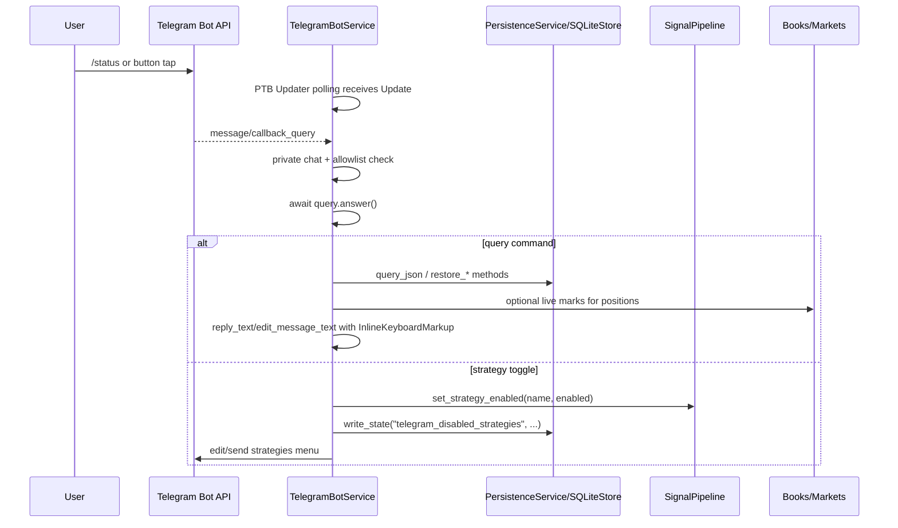

# Telegram Interactive Bot Design

**Date:** 2026-06-24
**Status:** Approved
**Related:** 2026-06-23-telegram-notification-template-design.md

---

## 0. 审查修正摘要

本版修正了原草案中会影响安全性、运行时正确性和 SDK 兼容性的设计问题：

- **必须使用 SDK** — 交互机器人基于 `python-telegram-bot` v22.x 开发，不手写 Telegram Bot API HTTP client、poll loop 或 `answerCallbackQuery` 请求封装；现有 `TelegramPublisher` 仍保留直接 HTTP 发送频道通知。
- **新增依赖是有意的** — `pyproject.toml` 增加 `python-telegram-bot[rate-limiter]>=22.5`；使用 SDK 的 `Application`、`CommandHandler`、`CallbackQueryHandler`、`InlineKeyboardMarkup`、`AIORateLimiter`。
- **私聊不是鉴权** — 仅检查 `chat.type == "private"` 只能排除群组/频道，不能证明发送者是操作员。交互机器人必须配置允许的 Telegram `chat.id` / `from_user.id` 白名单；空白名单时交互功能 fail-closed。
- **SDK 负责编码和请求细节** — 不在业务代码里拼 URL、`json.dumps(reply_markup)` 或解析 Telegram `ok/error_code` 响应；按钮使用 `InlineKeyboardButton` / `InlineKeyboardMarkup`，消息使用 `reply_text()` / `edit_message_text()`。
- **callback 必须确认** — 每个 `CallbackQueryHandler` 分支都调用 `await query.answer()`，即使不显示提示，否则客户端会持续显示进度条。
- **`callback_data` 限制** — Telegram 限制仍是 1-64 bytes，使用固定短码：`m`、`p`、`st`、`sg`、`dy`、`str`、`bk`、`tg:<name>`。
- **Polling 由 SDK 管理** — 使用 embedded `Application` lifecycle：`initialize()` → `start()` → `updater.start_polling()`；停止时反向调用 `updater.stop()` → `stop()` → `shutdown()`。
- **积压 updates 处理** — `start_polling(drop_pending_updates=True, allowed_updates=(\"message\", \"callback_query\"))` 默认丢弃启动前积压 updates，避免重启后处理旧按钮。
- **HTTP 429 处理** — SDK 抛出 `telegram.error.RetryAfter`；配合 `AIORateLimiter(max_retries=...)`，业务层只记录健康指标，不自己 sleep/解析 `retry_after`。
- **策略切换不能修改策略列表** — 当前 `SignalPipeline.evaluate_snapshot()` 直接遍历 `self.strategies`。交互按钮不得从列表中移除/添加策略，否则会破坏顺序、依赖关系和填单通知对象引用。改为 pipeline 维护 `disabled_strategies` 集合并跳过禁用策略。
- **日报格式化类型** — `SQLiteStore.restore_daily_reports()` 返回 `dict` payload；调用 `MessageFormatter.daily_report_message()` 前必须 `DailyReport.model_validate(payload)`。实现前需在 `PersistenceService` 增加 `restore_daily_reports()` 和 `restore_latest_system_event()` 代理方法。
- **持仓 PnL 不能只靠 SQLite** — `paper_positions` 只有入场价、shares、stake，没有当前盘口。`/positions` 需要只读访问运行时 `OrderBookRegistry`/`MarketRegistry` 才能展示 mark/PnL；没有 live book 时明确显示 `mark: n/a`。

参考依据：`python-telegram-bot` v22 文档（Application lifecycle、CommandHandler、CallbackQueryHandler、InlineKeyboardMarkup、AIORateLimiter、RetryAfter）、Telegram Bot API 官方约束（callback_data 64 bytes、CallbackQuery answer requirement、allowed_updates persistence）和当前 repo 代码：`TelegramConfig`、`TelegramPublisher`、`SQLiteStore`、`SignalPipeline`、`ServiceSupervisor`、`PaperPosition`、`DailyReport`、`OrderBookRegistry`、`MarketRegistry`、`PersistenceService`。

---

## 1. 动机

当前 Telegram 集成是单向的：系统推送信号、交易结果、启动/关闭通知和每日报告到配置频道。操作员无法在 Telegram 私聊中查询运行状态、查看 paper 持仓或临时暂停策略。运行实时 paper trading 后，需要一种无需 SSH 或打开 Web 面板的只读/低风险操作入口。

---

## 2. 范围

增加一个默认关闭的 Telegram 交互服务，只在 scheduler 进程内运行，支持：

- **Long polling via SDK** — 使用 `python-telegram-bot` 的 `Application` + `Updater.start_polling()` 接收私聊消息和 inline keyboard callback。
- **命令路由** — SDK `CommandHandler` 处理 `/start`、`/positions`、`/status`、`/signals`、`/strategies`、`/daily`。
- **内联菜单** — SDK `InlineKeyboardButton` / `InlineKeyboardMarkup` 构造主菜单、返回按钮、策略启停按钮。
- **授权白名单** — 仅允许配置中的 Telegram 用户/私聊 ID 使用。
- **只读查询** — 持仓、状态、信号、日报均不修改交易状态。
- **安全策略开关** — 唯一写操作；仅修改运行时 `disabled_strategies` 状态，不下单、不平仓、不改 YAML。
- **新增一个 SDK 依赖** — `python-telegram-bot[rate-limiter]>=22.5`；不新增 aiogram/Telethon，也不写自定义 Bot API client。

### 非目标

- 不支持 Webhook；使用 PTB polling，默认 `drop_pending_updates=True` 丢弃启动前积压 updates。
- 不支持群组、频道或多租户权限模型。
- 不支持平仓、调仓、撤单、下单、赎回或任何真实交易动作。
- 不持久化聊天会话状态；只持久化策略禁用集合。
- 不替代 dashboard API；这里只提供紧凑运维视图。

---

## 3. Telegram SDK 约束

### 3.1 SDK 选择

使用 `python-telegram-bot` v22.x：

```toml
dependencies = [
  # existing deps...
  "python-telegram-bot[rate-limiter]>=22.5",
]
```

理由：

- 当前项目是 Python 3.11 async runtime；PTB v22 原生 asyncio，能嵌入现有 scheduler event loop。
- PTB 提供 `Application`、`CommandHandler`、`CallbackQueryHandler`、`InlineKeyboardMarkup`，避免手写 Telegram HTTP 调用。
- `[rate-limiter]` extra 提供 `AIORateLimiter`，比业务层解析 429 更少代码。
- 不使用 aiogram：功能足够但会引入第二套路由/状态机模式；本需求只要 6 个命令和按钮。

### 3.2 Embedded polling lifecycle

不能使用 blocking `application.run_polling()`，因为 scheduler 已经管理主 event loop。使用手动 lifecycle：

```python
application = (
    ApplicationBuilder()
    .token(config.resolved_bot_token)
    .rate_limiter(AIORateLimiter(max_retries=config.retry_attempts))
    .build()
)

await application.initialize()
await application.start()
await application.updater.start_polling(
    poll_interval=config.interactive_poll_interval_sec,
    timeout=config.interactive_poll_timeout_sec,
    allowed_updates=("message", "callback_query"),
    drop_pending_updates=config.interactive_drop_pending_updates_on_start,
)
```

停止顺序：

```python
await application.updater.stop()
await application.stop()
await application.shutdown()
```

### 3.3 Handlers and buttons

命令注册：

```python
application.add_handler(CommandHandler("start", self._start))
application.add_handler(CommandHandler("positions", self._positions))
application.add_handler(CommandHandler("status", self._status))
application.add_handler(CommandHandler("signals", self._signals))
application.add_handler(CommandHandler("strategies", self._strategies))
application.add_handler(CommandHandler("daily", self._daily))
application.add_handler(CallbackQueryHandler(self._callback))
```

按钮使用 SDK 类型，不手写 `reply_markup` dict：

```python
InlineKeyboardMarkup(
    [[InlineKeyboardButton("💼 持仓", callback_data="p")]]
)
```

`callback_data` 仍必须保持 1-64 bytes。固定编码：

| callback_data | 含义 |
|---|---|
| `m` | 主菜单 |
| `p` | `/positions` |
| `st` | `/status` |
| `sg` | `/signals` |
| `dy` | `/daily` |
| `str` | `/strategies` |
| `bk` | 返回主菜单 |
| `tg:<strategy_name>` | 切换策略；只允许已知策略名，且总长度必须 ≤64 bytes |

### 3.4 Callback acknowledgement

每个 `CallbackQueryHandler` 路径都必须调用：

```python
query = update.callback_query
await query.answer()
```

即使 callback 被拒绝、未知或处理失败，也要确认；失败时可用 `await query.answer("Unauthorized", show_alert=True)`，但不得泄露内部错误。

### 3.5 SDK error / rate limit

`python-telegram-bot` 默认直接转发请求；启用 `AIORateLimiter(max_retries=config.retry_attempts)` 节流发送。业务代码只捕获 SDK 异常：

- `telegram.error.RetryAfter` → 记录 `rate_limited` 指标；SDK rate limiter 已按 retry_after 重试。
- `telegram.error.TimedOut` / `NetworkError` → 记录 degraded，不影响 scheduler 主循环。
- `telegram.error.TelegramError` → 记录 redacted error，不包含 token。

---

## 4. 架构

### 4.1 新增模块

新增 `src/polysignal_lab/publish/telegram_bot.py`：

```python
class TelegramBotService:
    name = "telegram_bot"

    def __init__(
        self,
        *,
        config: TelegramConfig,
        persistence: PersistenceService,
        signal_pipeline: SignalPipeline,
        books: OrderBookRegistry,
        markets: MarketRegistry,
        formatter: MessageFormatter,
        scheduler: PolySignalScheduler | None = None,
        application: Application | None = None,
    ) -> None: ...

    def configure_handlers(self) -> None: ...

    async def start(self) -> None: ...
    async def stop(self) -> None: ...
    def health(self) -> dict[str, object]: ...
```

`TelegramBotService` 是 `RuntimeService`，由 scheduler supervisor 启停。它持有嵌入式 PTB `Application`，只复用 bot token；频道推送继续由现有 `TelegramPublisher` 负责，避免把私聊交互和频道通知混成一个发送路径。

### 4.2 SignalPipeline 扩展

在 `src/polysignal_lab/app/services/signal_pipeline.py` 增加运行时禁用集合，不修改 `strategies` 列表：

```python
class SignalPipeline:
    disabled_strategies: set[str]

    def set_strategy_enabled(self, name: str, enabled: bool) -> None: ...
    def is_strategy_enabled(self, name: str) -> bool: ...
```

`evaluate_snapshot()` 在读取 strategy 前检查：

1. `strategy.name in disabled_strategies` → 跳过并持久化 `strategy_status`：`status="inactive"`、`reason="manual_disabled"`。
2. `strategy_schedule` 中某个依赖已禁用 → 跳过并持久化 `reason="dependency_disabled:<dep>"`。
3. 未禁用 → 按现有 readiness/gate/consensus 流程执行。

这样保留策略对象状态、执行顺序、DAG 依赖和 `PaperSimulator.fill_notifier` 引用。

### 4.3 Scheduler 集成

当前 scheduler 在 `run()` 中先 `_initialize_trading_components()`，再 `supervisor.start_all()`。`core_services`、`HealthService` 和 `ServiceSupervisor` 均在 `__init__` 中组装（行 200-212），`_initialize_trading_components()` 只构建策略和 paper 组件。

推荐集成方式（延迟绑定策略）：

1. `PolySignalScheduler.__init__` 末尾，在 `interactive_enabled=true` 时创建 `TelegramBotService`（不传 `strategy_schedule`），将其插入 `core_services` 中 `publish_service` 后，`health_service` 前。这样 HealthService/ServiceSupervisor 只创建一次，不需要重建。
2. `TelegramBotService.__init__` 接受可选 `scheduler` 引用。
3. `TelegramBotService.start()` 延迟从 `scheduler.strategy_schedule` 读取策略列表（此时 `_initialize_trading_components()` 已执行完毕）。若 scheduler 尚未初始化策略，记录 warning 但仍 polling（只是 `/strategies` 暂不可用）。
4. 这样避免重新创建 `HealthService`/`ServiceSupervisor`，减少对现有 `__init__` 流程的侵入。

### 4.4 数据流



---

## 5. 配置

扩展依赖和 `TelegramConfig`：

```toml
# pyproject.toml
dependencies = [
  "python-telegram-bot[rate-limiter]>=22.5",
]
```

```python
class TelegramConfig(BaseModel):
    enabled: bool = True
    bot_token_env: str = "TELEGRAM_BOT_TOKEN"
    channel_id_env: str = "TELEGRAM_CHANNEL_ID"
    parse_mode: str = "HTML"
    send_signals: bool = True
    send_consensus_signals: bool = True
    send_paper_results: bool = True
    send_daily_report: bool = True
    max_message_chars: int = 4096
    retry_attempts: int = 3
    publish_timeout_sec: float = 20.0
    dry_run: bool = True

    interactive_enabled: bool = False
    interactive_dry_run: bool = False
    interactive_allowed_chat_ids: tuple[int, ...] = ()
    interactive_poll_interval_sec: float = 0.0
    interactive_poll_timeout_sec: int = 30
    interactive_drop_pending_updates_on_start: bool = True
```

YAML 示例：

```yaml
telegram:
  enabled: true
  bot_token_env: TELEGRAM_BOT_TOKEN
  channel_id_env: TELEGRAM_CHANNEL_ID
  parse_mode: HTML
  send_signals: true
  send_consensus_signals: true
  send_paper_results: true
  send_daily_report: true
  max_message_chars: 4096
  retry_attempts: 3
  publish_timeout_sec: 20
  dry_run: true

  interactive_enabled: false
  interactive_dry_run: false
  interactive_allowed_chat_ids: []
  interactive_poll_interval_sec: 0.0
  interactive_poll_timeout_sec: 30
  interactive_drop_pending_updates_on_start: true

Rules:

- `interactive_enabled=false` → service 不注册。
- `interactive_enabled=true` 且 `interactive_dry_run=true` → 注册 handlers 并处理授权/路由，但不调用 `reply_text()` / `edit_message_text()`；记录 would-send 日志用于测试。`dry_run` 只控制频道推送（`TelegramPublisher`），`interactive_dry_run` 独立控制交互回复，常见场景是频道推送已上线但交互机器人仍在测试。
- `interactive_enabled=true` 且 `interactive_allowed_chat_ids=()` → fail-closed：service start 记录 warning 后不 polling。
- 交互功能只需要 `TELEGRAM_BOT_TOKEN`；频道推送仍按现有逻辑需要 `TELEGRAM_CHANNEL_ID`。

---

## 6. 安全模型

### 6.1 授权判断

对 message：

```python
chat = update.effective_chat
user = update.effective_user
allowed = (
    chat is not None
    and user is not None
    and chat.type == "private"
    and int(chat.id) in config.interactive_allowed_chat_ids
    and int(user.id) in config.interactive_allowed_chat_ids
)
```

对 callback 使用同一个 `Update` 对象判断；不要从 raw dict 解析：

```python
query = update.callback_query
allowed = self._authorized(update)
if query is not None and not allowed:
    await query.answer("Unauthorized", show_alert=True)
    return
```

未知、缺字段或不在白名单：

- 不执行命令。
- callback 仍调用 `query.answer("Unauthorized", show_alert=True)`。
- 记录 warning，包含 chat/user id，不记录 token。

### 6.2 写操作边界

`/strategies` 是唯一写操作，仅影响 `SignalPipeline.disabled_strategies` 和 StateStore：

```python
persistence.write_state("telegram_disabled_strategies", sorted(disabled))
```

不会：

- 修改 YAML。
- 下真实订单。
- 平仓或撤单。
- 访问 authenticated CLOB client。
- 写入密钥或 token。

---

## 7. 命令设计

### 7.1 `/start` / `m` — 主菜单

回复：

```text
PolySignal Lab
选择操作：
```

Inline keyboard：

```text
[💼 持仓] [📊 状态]
[📡 最近信号] [⚙️ 策略]
[📋 每日报告]
```

### 7.2 `/positions` / `p` — 持仓

数据来源：

- `persistence.restore_open_positions()` 获取 open paper positions。
- `markets` / `books` 只读计算当前 mark：优先当前 token best bid；没有盘口则 `n/a`。

格式：

```text
📈 BTC 15m · UP
Strategy  vwap_momentum
Entry     0.6400
Mark      0.7100
Shares    500.0000
PnL       +35.00 USDC (+10.94%)
Opened    2h15m ago
ID        pp_abc123
```

若无 mark：

```text
Mark      n/a (live book unavailable)
PnL       n/a
```

无持仓：`暂无 open paper positions。`

### 7.3 `/status` / `st` — 系统状态

数据来源：

- `persistence.counts()`：表总量。
- `persistence.restore_open_positions()`：open position count。
- `persistence.restore_latest_wallet_snapshot()`：equity/cash/open count。
- `persistence.restore_latest_system_event("health_snapshot")`：健康状态、组件指标（需先在 `PersistenceService` 新增代理方法）。
- `len(markets.markets)`：当前追踪 market 数（`MarketRegistry` 无 `.active()` 方法，直接用 dict 长度）。
- `signal_pipeline.disabled_strategies`：策略启用数。

格式：

```text
🟢 PolySignal Lab: ok
Health age  8s
Markets     24 active
Positions   3 open
Wallet      987.50 USDC equity
Signals     142 accepted / 91 rejected
Strategies  3/4 enabled
Telegram    polling ok · last update 12:34:56Z
```

### 7.4 `/signals` / `sg` — 最近信号

为避免“只查 accepted 却显示 rejected”的矛盾，本命令合并两张表：

- accepted：`query_json("signals", where="ORDER BY created_at DESC", limit=5)`。注意：`where` 参数名具有误导性，实际 `query_json` 将此字符串直接拼接到 `SELECT ... FROM {table} {where} LIMIT ?`，因此传 `ORDER BY` 子句可以工作但不是标准 WHERE 语义。
- rejected：`query_json("rejected_signals", where="ORDER BY rejected_at DESC", limit=5)`。
- 合并后按 timestamp desc 取 5 条。

格式：

```text
🟢 accepted · BTC 15m BUY UP
2m ago · vwap_momentum · sig_abc123

🔴 rejected · ETH 5m BUY DOWN
5m ago · late_consensus · stale_book
```

### 7.5 `/strategies` / `str` — 策略开关

数据来源：`strategy_schedule` + `signal_pipeline.disabled_strategies`。

格式：

```text
⚙️ Strategies
✅ vwap_momentum
⏸ late_consensus
✅ ptb_diff
✅ cross_market
```

每个按钮：`callback_data="tg:<strategy_name>"`。

切换规则：

- 未知策略名 → 拒绝，调用 `await query.answer("Unknown strategy", show_alert=True)`。
- 名称编码后超过 61 bytes（`tg:` 占 3 bytes）→ 不生成按钮；显示文本提示该策略无法从 Telegram 切换。
- 禁用策略 → 加入 `disabled_strategies`，持久化 state，写 system event：`event_type="strategy_toggle"`。
- 启用策略 → 移出 `disabled_strategies`，持久化 state，写 system event。
- 依赖禁用 → 被依赖策略仍显示 `dependency disabled`，直到依赖恢复。

### 7.6 `/daily` / `dy` — 每日报告

数据来源：`persistence.restore_daily_reports(limit=1)`（需先在 `PersistenceService` 新增代理方法，见 §0 修正摘要）。

处理：

```python
payload = reports[0]
report = DailyReport.model_validate(payload)
text = formatter.daily_report_message(report)
```

若无报告：`暂无 daily report。`

若 payload 无法验证：记录 error，返回紧凑 fallback：report id、date、total signals、pnl、win rate。

---

## 8. SDK Polling 实现

```python
class TelegramBotService:
    async def start(self) -> None:
        if not self.config.interactive_enabled:
            return
        if self.config.interactive_dry_run:
            self.logger.info("Telegram interactive bot interactive_dry_run enabled")
        if not self.config.resolved_bot_token:
            self.logger.warning("Telegram interactive bot disabled: missing bot token")
            return
        if not self.config.interactive_allowed_chat_ids:
            self.logger.warning("Telegram interactive bot disabled: no allowed chat ids")
            return

        self.application = self.application or (
            ApplicationBuilder()
            .token(self.config.resolved_bot_token)
            .rate_limiter(AIORateLimiter(max_retries=self.config.retry_attempts))
            .build()
        )
        self.configure_handlers()
        await self.application.initialize()
        await self.application.start()
        if self.application.updater is None:
            raise RuntimeError("telegram application updater is not available")
        await self.application.updater.start_polling(
            poll_interval=self.config.interactive_poll_interval_sec,
            timeout=self.config.interactive_poll_timeout_sec,
            allowed_updates=("message", "callback_query"),
            drop_pending_updates=self.config.interactive_drop_pending_updates_on_start,
        )
        self._running = True

    async def stop(self) -> None:
        self._running = False
        if self.application is None:
            return
        if self.application.updater is not None and self.application.updater.running:
            await self.application.updater.stop()
        if self.application.running:
            await self.application.stop()
        await self.application.shutdown()
        self.application = None
```

Handler pattern：

```python
async def _status(self, update: Update, context: ContextTypes.DEFAULT_TYPE) -> None:
    if not self._authorized(update):
        return
    text = self._format_status()
    if self.config.interactive_dry_run:
        self.logger.info("telegram interactive_dry_run status reply: %s", text)
        return
    await update.effective_message.reply_text(
        text,
        parse_mode=ParseMode.HTML,
        reply_markup=self._back_keyboard(),
    )

async def _callback(self, update: Update, context: ContextTypes.DEFAULT_TYPE) -> None:
    query = update.callback_query
    if query is None:
        return
    if not self._authorized(update):
        await query.answer("Unauthorized", show_alert=True)
        return
    await query.answer()
    text, keyboard = self._render_callback(query.data or "")
    if self.config.interactive_dry_run:
        self.logger.info("telegram interactive_dry_run callback reply: %s", text)
        return
    await query.edit_message_text(
        text=text,
        parse_mode=ParseMode.HTML,
        reply_markup=keyboard,
    )
```

Rules:

- 不直接调用 `https://api.telegram.org/bot...`。
- 不持有自建 `httpx.AsyncClient`。
- 不手写 `getUpdates` offset 循环；SDK polling 负责。
- `allowed_updates` 每次显式传入，避免继承旧 bot 设置。
- `drop_pending_updates` 默认 true，避免启动后处理旧消息/旧按钮。
- SDK 异常不允许冒泡到 scheduler 主循环；记录 health metric 后让 PTB 继续 polling。

---

## 9. 发送/编辑消息

发送规则：

- `reply_text()` / `edit_message_text()` 是唯一交互回复出口。
- `InlineKeyboardMarkup` / `InlineKeyboardButton` 是唯一按钮构造方式。
- 所有 HTML parse mode 消息必须 escape 动态字段；复用 `html.escape` 或现有 formatter。
- 长消息按 `max_message_chars` 截断，保留尾部 `[truncated for Telegram]`。
- callback 优先 `query.edit_message_text()` 更新原消息；没有可编辑消息时退回 `update.effective_message.reply_text()`。
- `telegram.error.TelegramError` 只影响交互回复，不影响 scheduler 主循环。

---

## 10. 健康指标

`TelegramBotService.health()`：

```python
{
    "name": "telegram_bot",
    "status": "ok" | "degraded" | "disabled",
    "metrics": {
        "enabled": bool,
        "running": bool,
        "authorized_chat_count": int,
        "last_update_id": int | None,
        "last_update_at": str | None,
        "poll_success": int,
        "poll_failure": int,
        "send_success": int,
        "send_failure": int,
        "rate_limited": int,
        "unauthorized_updates": int,
    },
    "error": str | None,
}
```

HealthService 会把该组件纳入已有 health snapshot。

---

## 11. 测试计划

| 测试 | 范围 |
|---|---|
| `test_telegram_bot_rejects_group_chat` | 单元 — 群组/频道 update 不执行命令 |
| `test_telegram_bot_rejects_private_chat_not_in_allowlist` | 单元 — 私聊但未授权 fail-closed |
| `test_telegram_bot_callback_always_answers` | 单元 — 成功、未知、未授权 callback 都调用 `query.answer()` |
| `test_telegram_bot_uses_ptb_inline_keyboard_markup` | 单元 — handlers 返回 `InlineKeyboardMarkup`，不手写 `reply_markup` dict |
| `test_telegram_bot_registers_ptb_handlers` | 单元 — Application 注册 CommandHandler/CallbackQueryHandler |
| `test_telegram_bot_start_uses_embedded_ptb_lifecycle` | 单元 — `initialize/start/updater.start_polling` 顺序正确 |
| `test_telegram_bot_start_polling_uses_drop_pending_updates` | 单元 — `allowed_updates` 和 `drop_pending_updates` 参数正确 |
| `test_telegram_bot_stop_uses_ptb_shutdown_order` | 单元 — `updater.stop/stop/shutdown` 顺序正确 |
| `test_telegram_bot_positions_marks_live_book_when_available` | 单元 — 有 book 显示 mark/PnL，无 book 显示 n/a |
| `test_telegram_bot_signals_merges_accepted_and_rejected` | 单元 — signals/rejected_signals 按时间合并 |
| `test_telegram_bot_daily_validates_payload_before_formatter` | 单元 — dict → `DailyReport.model_validate` |
| `test_signal_pipeline_manual_disabled_strategy_skips_without_mutating_list` | 单元 — disabled set 生效，策略列表顺序不变 |
| `test_signal_pipeline_dependency_disabled_skips_dependent` | 单元 — 依赖禁用时 dependent 不运行 |
| `test_scheduler_registers_telegram_bot_in_init_when_interactive_enabled` | 集成 — `interactive_enabled` 后 service 在 `__init__` 阶段注册到 supervisor/health 中 |
| `test_telegram_bot_interactive_dry_run_logs_no_send` | 单元 — `interactive_dry_run=true` 不调用 Telegram send/edit API，但 `dry_run` 不影响交互回复 |

测试不访问真实 Telegram API；使用 fake PTB `Application` / `Bot` / `Update` / `CallbackQuery` 对象或 monkeypatch SDK methods。不得加入 live token、真实 chat id、真实订单路径。

---

## 12. 实现顺序

1. 在 `pyproject.toml` 增加 `python-telegram-bot[rate-limiter]>=22.5`，并扩展 `TelegramConfig`（新增 `interactive_dry_run`） / `config/signal_bot.yaml` 默认字段。在 `PersistenceService` 新增 `restore_daily_reports()` 和 `restore_latest_system_event()` 代理方法。
2. 给 `SignalPipeline` 增加 `disabled_strategies`、依赖跳过和 state 可恢复接口。
3. 新增 `publish/telegram_bot.py`，实现 PTB `ApplicationBuilder` lifecycle、handler 注册、授权检查、health、start/stop。
4. 实现 `/start` 主菜单、`CallbackQueryHandler` routing、`await query.answer()` 覆盖。
5. 实现 `/status` 和 `/positions`，包含 live book 缺失 fallback。
6. 实现 `/signals` accepted/rejected 合并。
7. 实现 `/daily`，对 SQLite dict 做 `DailyReport.model_validate`。
8. 实现 `/strategies`，只改 `SignalPipeline.disabled_strategies`，持久化 StateStore + system event。
9. 在 scheduler 策略初始化后注册 `TelegramBotService`，并纳入 `HealthService`。
10. 补齐 PTB lifecycle/handler 单元测试和 scheduler 集成测试。
11. 运行目标测试，再运行项目要求的 pytest；代码/config 变更进入正式 runtime 前重建 Docker。

---

## 13. 接受标准

- 默认配置下交互机器人关闭，不改变现有 Telegram 推送行为。
- `interactive_dry_run` 独立于 `dry_run`：频道推送上线后可单独测试交互机器人回复而不影响频道。
- 启用交互但没有 token 或 allowlist 时 fail-closed，不 polling、不发送消息。
- 未授权用户即使在私聊也无法读取状态或切换策略。
- 每个 callback query 都被 answer，Telegram 客户端不会卡 loading。
- 策略切换不改变 `SignalPipeline.strategies` 列表对象和顺序。
- scheduler 停止后没有遗留 PTB polling task，且 `Application.shutdown()` 被调用。
- `/positions` 在没有 live book 时不伪造当前价格或 PnL。
- `/daily` 不把 SQLite dict 直接传给 `MessageFormatter.daily_report_message()`。
- 所有 Telegram API 错误日志都 redacted，不包含 bot token。
