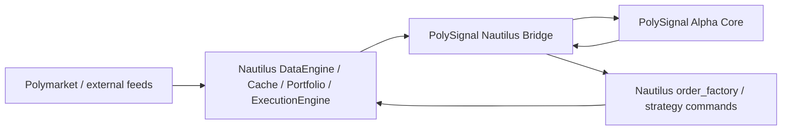
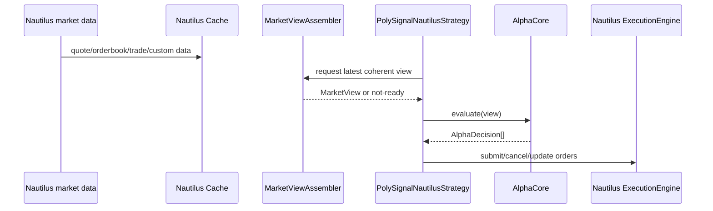

# 15 Nautilus Strategy Bridge Design

**Status:** Draft
**Scope:** 一个架构迁移规格，目标是把 PolySignal 的策略能力迁到 NautilusTrader `Strategy` 运行时，同时避免在 PolySignal 内继续扩张第二套执行层。
**Goal:** 保留 PolySignal 的策略知识、配置语义与研究资产；把市场数据、订单生命周期、组合状态与执行基础设施迁移到 NautilusTrader 的事件驱动 runtime 与 Polymarket adapter 边界上。

## Problem

PolySignal Lab 当前已经积累了较成熟的策略与 paper-trading 研究资产，但 runtime 结构与长期方向存在冲突：

1. **策略价值与运行时价值混在一起**
   `src/polysignal_lab/strategies/` 里同时承载了：
   - 有价值、可迁移的 alpha / signal logic；
   - 与当前 scheduler 强绑定的 `snapshot -> evaluate() -> process_signal()` 运行方式。
   这让“迁移策略能力”与“保留当前 runtime”被误绑成一件事。

2. **项目正在维护第二套交易 runtime**
   现有 `PolySignalScheduler` / `SignalPipeline` / `PaperPortfolioService` / `scheduler_processing.py` 已经承担了：
   - 市场数据整合；
   - 信号调度；
   - 订单生命周期；
   - wallet / fills / settlement / reporting；
   这与 NautilusTrader 已经提供的 runtime 能力高度重叠。

3. **Polymarket 低层不变量已经越来越像交易引擎问题，不再像单纯策略问题**
   例如：
   - orderbook 生命周期；
   - tick-size 变化；
   - order / fill / position 事件；
   - execution state 与 portfolio state；
   - reconnect / hydration / retry / cache housekeeping；
   这些更接近 NautilusTrader/adapter 应负责的运行时边界，而不是 PolySignal 继续自建的边界。

4. **当前轮询主循环不适合长期承载时间敏感策略**
   之前分析过，`refresh_interval_sec` 对 `LateConsensus`、`PTBDiff` exit、`DumpHedge`、`CrossMarketBot` 这类策略并不理想。
   如果目标是继续提高策略真实性与运行时质量，长期方向应转向事件驱动，而不是继续强化轮询 scheduler。

## Decision

采用 **方案 B：事件驱动桥接**。

- **NautilusTrader 成为运行时内核**
- **PolySignal 保留策略知识、配置语义、纯 alpha 逻辑与必要的业务域术语**
- **新增 bridge 层，把 PolySignal alpha 适配到 Nautilus `Strategy` 生命周期**
- **不再把 PolySignal scheduler 作为长期主 runtime 继续演化**
- **当前 repo 内默认实现保持 read-only / paper-safe；live Polymarket execution 不是这份 spec 的实现目标**

这不是“把 Nautilus adapter 接进 PolySignal”；
而是“把 PolySignal alpha 迁到 Nautilus runtime”。

## Background and Evidence

### 当前 PolySignal 结构
- `BaseStrategy.evaluate(snapshot)` 是当前策略统一入口。
- `SignalPipeline.evaluate_snapshot()` 负责策略循环、readiness check、rejection persistence；gate / consensus / dedup 在 `scheduler_processing.process_signal()` 中被独立调用。
- `scheduler_processing.process_signal()` 负责 signal 存储、发布、paper path。
- `PolySignalScheduler` 同时构造 market data、snapshot、signal、paper、publish、telegram、settlement 等多个子系统。
- 已有 spec 06 / 08 / 09 / 11 / 12 证明：
  - 当前 runtime 里许多正确性问题都在向“交易引擎”层收敛；
  - NautilusTrader 适合作为 Polymarket 语义与事件驱动运行时的参考。

### NautilusTrader / Polymarket 研究结论
- Nautilus 的 `Strategy` 是事件驱动：`on_quote_tick`, `on_order_book`, `on_trade_tick`, `on_order_filled`, `on_position_changed`, `on_save/on_load`。
- Polymarket adapter 已覆盖：
  - instrument hydration；
  - WebSocket market data；
  - order lifecycle；
  - cache / portfolio / execution state；
  - tick-size change / retry / reconciliation 等运行时问题。
- 其架构价值在于 **runtime**，不是只在于几个 API 调用。

### 当前策略迁移难度分层
从现有源码看，项目共有 12 个策略，迁移难度不等价：

#### Tier 0 — stateless，无回调（最适合首批）
- **PTBDiff**：基本无内部状态，无 `notify_fill` / `follow_up_signals` / `notify_signal_accepted` override。
- **SkewMeanReversion**：纯 evaluate，无任何 mutable state 或回调 override。

#### Tier 1 — 有 mutable state，无 notify 回调（可提前迁移）
- **FibonacciBot**：有 `_candles` / `_zigzag` 滚动价格历史，但无 `notify_fill` 等回调。
- **BinaryMomentum**：有 `_spot_prices` / `_vwap_stats` / `_entered_markets`，无回调。
- **OneCentBuy**：有 `_submitted_levels` 去重集合，无回调。
- **NinetyNineCentSniper**：有 `_sniped_markets` 去重集合，无回调。

#### Tier 2 — stateful + notify 回调（需验证 save/load）
- **LateConsensus**：有 `_last_entry_at` / `_accepted_counts` / `_last_favorite`，依赖 `notify_signal_accepted`。
- **VWAPMomentum**：有 trade-fed rolling state（`TradeHistory` / `_can_enter`）、`_pending_hedges`、`follow_up_signals` / `notify_fill` / `notify_cancel` 回调。
- **DumpHedge**：有 `_price_stats` / `_positions` / `_dump_detected` / `_last_price` 状态，有 `notify_fill` / `notify_leg_failure` 回调。
- **MidPriceSizing**：有 `_layer_count` / `_entry_prices` 马丁格尔层数状态，有 `notify_fill` 回调。
- **PreOrderMarket**：有 `_pre_ordered` / `_entered_markets` / `_positions` / `_reconciled` 状态，有 `notify_fill` 回调。
- **LowSideDualReversion**：有 `_entered_markets` / `_positions` 状态，有 `notify_fill` 回调。

#### Tier 3 — 跨市场 group evaluation
- **CrossMarketBot**：需要 `CrossMarketEvaluationContext` + `evaluate_group()` 接口，不适合第一批。

## Non-goals

这份 spec **不做**：

1. 不在当前 repo 中直接启用真实 Polymarket live trading。
2. 不把 `PolymarketExecutionClient`、私钥、API keys、allowance scripts 接入现有 Docker/runtime。
3. 不要求一次性迁掉所有 PolySignal 策略。
4. 不要求保留当前 scheduler 与 Nautilus runtime 的长期双栈并存。
5. 不在第一阶段实现 Telegram、dashboard、SQLite 报表与 legacy runtime 的完全 parity。
6. 不把所有现有 spec 全部重写；能复用的纯逻辑与语义继续复用。
7. 不把当前 `src/polysignal_lab` 直接改造成一个 live trading 系统。

## Target Architecture

### High-level boundary



### Runtime ownership

#### NautilusTrader owns
- Data ingestion
- Cache
- Strategy lifecycle
- Order lifecycle
- Position / portfolio state
- Execution engine boundary
- Event dispatch
- State save/load hooks

#### PolySignal retains
- Strategy formulas
- Strategy parameter semantics
- Market/timeframe/asset business interpretation
- PTB / anchor / extra research-side data semantics
- Select pure gating / sizing / metrics logic
- Migration-time wrappers for legacy runtime

#### Bridge owns
- Config mapping
- Instrument + market metadata mapping
- YES/NO pair assembly
- Event-to-view adaptation
- AlphaCore invocation
- Output mapping from alpha decisions to Nautilus orders/events

## Proposed Component Model

### 1. `AlphaCore` extraction layer
新增一层纯逻辑组件，位置建议：

- `src/polysignal_lab/alpha/`

每个迁移中的策略拆成两层：

1. **AlphaCore**
   纯业务判断，不直接依赖 scheduler / telegram / wallet / sqlite / Nautilus runtime。
2. **Host wrapper**
   - legacy wrapper：继续服务当前 `BaseStrategy.evaluate(snapshot)`
   - Nautilus wrapper：作为 `Strategy` 子类运行

最小接口：

```python
@dataclass(frozen=True, slots=True)
class MarketView:
    view_id: str                        # 用于 signal traceability（等价于 snapshot_id）
    market_id: str
    market_slug: str
    condition_id: str
    asset: str
    timeframe: str
    start_ts: datetime | None
    end_ts: datetime | None
    created_at: datetime
    seconds_to_close: int | None
    up: SideBookView
    down: SideBookView
    spot: SpotView | None
    price_to_beat: float | None
    up_trades: Sequence[Trade]          # Wave 2 VWAPMomentum 依赖 trade 数据
    down_trades: Sequence[Trade]        # 当前 MarketSnapshotBuilder 通过 metrics 注入
    metrics: Mapping[str, Any]
    freshness: FreshnessView

class AlphaCore(Protocol):
    def evaluate(self, view: MarketView) -> list[AlphaDecision]: ...
```

当前 `SignalCandidate` 不应原样成为运行时唯一输出。
桥接层应先把 alpha 输出收敛成更小的 `AlphaDecision` / `OrderIntentSpec`，再映射到 Nautilus orders。

### 2. `PolymarketMarketRegistry`
新增 market pairing / metadata 服务，负责把 Nautilus 的单个 `BinaryOption` instrument 组织回 PolySignal 习惯的“一个市场包含 YES/NO 两个 outcome token”的视图。

职责：
- 维护 `condition_id -> market pair`
- 维护 YES/NO instrument_id / token_id 映射
- 保存 asset / timeframe / slug / start / end 等业务元数据
- 为 `MarketViewAssembler` 提供 pair lookup

这是 bridge 成功的关键，因为 Nautilus 看到的是 instrument，PolySignal 策略看到的是 market pair。

> **当前限定：仅支持二元市场（YES/NO 两个 outcome token）。** Polymarket 也存在 >2 outcome 的 condition（如多选项市场），当前 `CrossMarketEvaluationContext.snapshots_by_condition_id` 已按 condition_id 索引；若未来需支持多 outcome 市场，`condition_id -> pair` 映射需扩展为 `condition_id -> outcome_set`。

### 3. `MarketViewAssembler`
作用等价于当前 `MarketSnapshotBuilder`，但宿主变成 Nautilus cache + custom data。

职责：
- 从 Nautilus cache 读取 YES/NO 两腿 book / quote / trade
- 注入外部 sidecar 数据：spot、PTB、anchor、extra metrics
- 生成不可变 `MarketView`
- 做 current-slot readiness / freshness / coherence 判定
- 对 cross-market relation 提供 group view

### 4. `PolySignalNautilusStrategy`
新的宿主策略基类，放在：

- `src/polysignal_lab/nautilus_bridge/strategies/`

它继承 Nautilus `Strategy`，只做运行时适配：

- `on_start()`：订阅 market data / custom data
- `on_quote_tick()` / `on_order_book()` / `on_trade_tick()`：触发 `MarketViewAssembler`
- `on_order_filled()` / `on_order_canceled()` / `on_order_expired()`：推进策略状态
- `on_save()` / `on_load()`：保存和恢复 stateful 策略状态

它不包含策略公式本身。

### 5. `ExternalDataSidecar`
Polymarket adapter 不提供 spot 与 PTB，所以当前 repo 的研究侧数据仍需保留，但宿主变化为 sidecar / custom data producer。

保留并重组：
- `AnchorPriceService`
- `PriceToBeatProvider`
- 必要的 market discovery / slug inference 逻辑

这些组件不再直接喂给 scheduler，而是喂给：
- Nautilus custom data topic
- 或 bridge 内的 sidecar registry

### 6. `DecisionPolicy`（后置，不进第一批实现）
当前 `SignalGate` / `ConsensusEngine` / rate limiting / dedupe 不是全都适合首批迁移。

策略：
- **保留纯函数部分**
- **推迟 mutable cross-strategy policy**
- 只在第二波需要时引入一个单独的 `DecisionPolicyActor`

首批目标是让独立策略能在 Nautilus runtime 里正确产生与管理 orders，不先复制整套 legacy signal pipeline。

## Mapping Current PolySignal Concepts to Nautilus

| PolySignal 现状 | Nautilus 目标 | 说明 |
|---|---|---|
| `BaseStrategy.evaluate(snapshot)` | `Strategy` callbacks + `AlphaCore.evaluate(view)` | 从轮询式快照评估变为事件驱动触发 |
| `notify_signal_accepted` | `on_order_submitted` / local state transition | 不再依赖 scheduler 回调 |
| `notify_fill` | `on_order_filled` | 直接使用原生 order event |
| `notify_cancel` | `on_order_canceled` / `on_order_expired` / `on_order_rejected` | `reason='GTD_EXPIRED'` → `on_order_expired`；其他原因 → `on_order_canceled` / `on_order_rejected`。VWAPMomentum 在 `notify_cancel(reason='GTD_EXPIRED')` 时清除 `_pending_hedges`，迁移时必须映射到 `on_order_expired` |
| `follow_up_signals()` | `on_order_filled` 内部直接生成下一步 order intent | 不再走 `_follow_up_signals` 全局队列 |
| `MarketSnapshot` | `MarketView` | 保留语义，换宿主与构造方式 |
| `PaperWallet / PaperSimulator` | Nautilus portfolio + emulated/sandbox execution | repo 内默认仍走 paper-safe execution |
| `SignalPipeline` | 拆散到 bridge + optional `DecisionPolicyActor` | 不整体照搬 |
| `_last_entry_at`, `_pending_hedges` 等实例状态 | `Strategy` 实例状态 + `on_save/on_load` | stateful strategy 原生保存/恢复 |

## Migration Units

### Wave 0 — freeze boundary + 依赖引入
在开始迁移前，明确项目边界并引入 NautilusTrader 依赖：

- `src/polysignal_lab` 继续作为当前实验/legacy runtime
- `src/polysignal_lab/nautilus_bridge` 为新 runtime 适配层
- 不再向 legacy scheduler 注入大型新功能，除非是 correctness bugfix
- **引入 `nautilus_trader` Python 依赖**：
  - 在 `pyproject.toml` 中添加可选依赖组（如 `[project.optional-dependencies] nautilus = ["nautilus-trader>=1.x"]`）
  - 验证 ARM64 (rk3588) 编译兼容性——NautilusTrader 有 Rust/Cython 组件，可能需要预编译 wheel 或源码编译环境
  - 如果当前 Docker base image 不含 Rust toolchain，需在 Dockerfile 中补充或使用多阶段构建
  - 此步骤完成后才能开始 Wave 1

### Wave 1 — extract pilot alpha core
**第一目标策略：`PTBDiffStrategy`**

同批可选（Tier 0 — stateless 无回调）：`SkewMeanReversionStrategy`

选择理由：
- 基本无内部状态
- 无 `notify_fill` / `follow_up_signals` 依赖
- readiness 明确
- 输出单一
- 涉及 spot / PTB / freshness，足够覆盖 bridge 难点

交付：
- `alpha/ptb_diff_core.py`
- legacy wrapper 继续可用
- `PTBDiffNautilusStrategy`
- `MarketViewAssembler` 最小版本
- external spot/PTB sidecar 最小版本
- emulated execution 跑通

### Wave 1.5 — Tier 1 stateful 但无回调策略（可选，视优先级）
候选：
- `FibonacciBot`：有 `_candles` / `_zigzag` 滚动价格历史，需 `on_save/on_load`
- `BinaryMomentum`：有 `_spot_prices` / `_vwap_stats` / `_entered_markets`
- `OneCentBuy`：有 `_submitted_levels` 去重集合
- `NinetyNineCentSniper`：有 `_sniped_markets` 去重集合

这些策略无 `notify_fill` 等回调，但有 mutable state 需要 save/load 验证。
可在 Wave 1 pilot 完成后、Wave 2 之前或之间穿插。

### Wave 2 — stateful single-market strategies (有 notify 回调)
优先顺序：
1. `LateConsensus`
2. `VWAPMomentum`
3. `DumpHedge`
4. `MidPriceSizing`、`PreOrderMarket`、`LowSideDualReversion`

原因：
- `LateConsensus` 先验证 `on_save/on_load`、accepted/frequency state
- `VWAPMomentum` 再验证 trade-fed rolling state、hedge follow-up、event chaining
- `DumpHedge` 验证 `notify_fill` / `notify_leg_failure` + 多字段位置状态（`_positions` / `_dump_detected` / `_price_stats`）
- `MidPriceSizing` / `PreOrderMarket` / `LowSideDualReversion` 均有 `notify_fill` + 位置跟踪状态，在 DumpHedge 模式验证后可快速跟进

### Wave 3 — relation and basket strategies
- `CrossMarketBot`

需要：
- coherent group view（`CrossMarketEvaluationContext` 等价物）
- relation-level trigger semantics（`evaluate_group()` 接口）
- basket state / multi-order coordination

### Wave 4 — optional external execution host
这不是当前 repo 默认实现目标。
如果将来需要真实 Polymarket execution，应在**单独审批**下：
- 放到单独 runner / package / repo target
- 与当前 read-only Docker/runtime 分离
- 默认关闭且不共享现有 paper-safe 部署路径

## Strategy Selection Rules

### 第一批必须满足
- 基本无内部事件回调依赖
- 无跨市场 group context
- 无多腿篮子状态
- 无复杂 follow-up order chain
- 数据依赖明确且可由 `MarketViewAssembler` 满足

### 第一批禁止选择
- `CrossMarketBot`（Tier 3 — 跨市场 group evaluation）
- `VWAPMomentum`（Tier 2 — 有 `follow_up_signals` / `notify_fill` / `notify_cancel` 回调链）
- `DumpHedge`（Tier 2 — 有 `notify_fill` / `notify_leg_failure` 回调 + 多字段位置状态）
- `LateConsensus`（Tier 2 — 有 `notify_signal_accepted` 回调 + 频率状态）
- `MidPriceSizing`、`PreOrderMarket`、`LowSideDualReversion`（Tier 2 — 有 `notify_fill` + 位置状态）
- 任何依赖当前 scheduler 全局队列或跨策略 consensus 才能正确工作的策略

## Data and Event Flow

### Single-market strategy flow



### Stateful strategy event loop
- Data callbacks create decision opportunities
- Order/position callbacks update strategy state
- Save/load hooks persist minimal state
- No external scheduler-level follow-up queue

## Safety Boundary

这份 spec 必须遵守当前项目的安全边界：

1. 当前 repo 中的默认实现 **不得启用真实 Polymarket authenticated execution**
2. 任何需要：
   - API key
   - private key
   - allowance setup
   - live order submission
   的路径，都不是本 spec 默认交付物

因此本 spec 的默认实现边界是：

- **Nautilus runtime + Polymarket market data adapter**
- **emulated / sandbox-safe execution path**
- **为未来 live execution 保留宿主兼容性，但不在本 repo 默认运行时启用**

这样做的原因不是保守，而是与当前 PolySignal Lab 的 read-only/paper project contract 一致。
否则会直接违反项目定位。

## Interaction with Existing Specs

### 与 spec 06（public market data boundary）
- 继续有效，但宿主变化：
  - 旧 runtime 中的只读边界继续保持
  - 新 bridge 中允许依赖 Nautilus Polymarket data adapter
- 不应把 live credentials 混进当前只读边界

### 与 spec 08（scheduler supervisor boundaries）
- 对 legacy runtime 仍有效
- 但长期重要性下降
  因为主 runtime 目标转向 Nautilus，不应在 legacy scheduler 上继续投入大规模结构演化

### 与 spec 09（strategy execution order optimization）
- 对 legacy runtime 仍成立
- 但对于迁移路线，应优先做 alpha extraction，而不是继续优化 legacy scheduler 的并行调度

### 与 spec 11（paper parity corrections）
- 其中的**纯执行不变量**依然有参考价值
- 但不应再把这些不变量继续固化到 PolySignal 自研 execution runtime 中
- 应转为：
  - 迁移到 alpha/core 需要保留的语义
  - 或迁移到 Nautilus-hosted policy / execution contract

### 与 spec 12（indicator governance）
- 继续有效
- strategy indicator / metrics 规范应落到 `AlphaCore` 与 `MarketView` 边界，而不是 legacy snapshot runtime

## Packaging and Directory Plan

建议新增目录：

```text
src/polysignal_lab/
  alpha/
    ptb_diff_core.py
    late_consensus_core.py
    vwap_momentum_core.py
    ...
  nautilus_bridge/
    config.py
    market_registry.py
    market_view.py
    market_view_assembler.py
    external_data.py
    strategy_base.py
    strategies/
      ptb_diff.py
      late_consensus.py
      ...
  legacy/
    # 可选；如果后续想明确 legacy runtime 归档边界
```

原则：
- **alpha/** 放纯逻辑
- **nautilus_bridge/** 放宿主适配
- 当前 `strategies/*.py` 在迁移期先做 thin wrapper，不一次性删除

## Acceptance Criteria

### Architecture
- 存在清晰的 `alpha/` 与 `nautilus_bridge/` 分层
- 不新增第二套 scheduler / wallet / execution runtime
- 至少一个策略通过 Nautilus `Strategy` 宿主成功运行

### Pilot migration
- `PTBDiffStrategy` 被拆成：
  - 可复用的 `AlphaCore`
  - legacy wrapper
  - Nautilus wrapper
- 在相同输入下，legacy wrapper 与 Nautilus wrapper 的 alpha 输出一致

### Data semantics
- `MarketViewAssembler` 能正确生成包含 YES/NO、spot、PTB、freshness 的 coherent view
- view 不 ready 时，策略不会错误下单

### Stateful contract
- 至少定义并验证一套标准 state migration 规则：
  - accepted state
  - fill/cancel state
  - save/load state
- 即便首批只实现 stateless 策略，也要把 stateful contract 写清楚

### Safety
- 默认实现不要求 live credentials
- 当前 Docker / 默认运行入口不引入真实交易能力
- Polymarket live execution 若将来需要，必须走单独审批与单独运行目标

## Test Strategy

### 1. Pure alpha equivalence tests
对每个迁移策略：
- 同一组 `MarketSnapshot` / `MarketView` 输入
- legacy strategy 与 `AlphaCore` 输出必须一致

### 2. MarketViewAssembler tests
验证：
- YES/NO pair assembly
- spot/PTB sidecar 注入
- freshness / readiness
- missing leg / stale data / hydration miss
- event ordering under partial updates

### 3. Nautilus bridge component tests
验证：
- callback -> view assembly -> alpha -> order intent
- `on_order_filled` / `on_order_canceled` / `on_order_expired` 状态推进
- `on_save/on_load` state serialization contract

### 4. Pilot integration tests
- 使用 Nautilus backtest/sandbox/emulated execution
- 跑 `PTBDiffNautilusStrategy`
- 验证 data path、decision path、order lifecycle、position updates

### 5. Non-regression tests for legacy wrapper
在迁移期，legacy runtime 不能因为抽 core 而行为漂移。

## Rollout

1. **引入 `nautilus_trader` 依赖并验证 ARM64 兼容性**
   当前项目在 rk3588 ARM64 上运行，NautilusTrader 有 Rust/Cython 组件，需先验证编译/安装
2. **冻结方向**
   明确 legacy scheduler 不再承接大规模新 runtime 能力
3. **提取 `PTBDiff` AlphaCore**（可同时提取 `SkewMeanReversion`）
4. **实现最小 `nautilus_bridge`**
   - `MarketRegistry`
   - `MarketViewAssembler`
   - external spot/PTB sidecar
5. **实现 `PTBDiffNautilusStrategy`**
6. **在 emulated/sandbox-safe 模式下验证**
7. **可选：迁移 Tier 1 无回调 stateful 策略**（`FibonacciBot`、`BinaryMomentum`、`OneCentBuy`、`NinetyNineCentSniper`）
8. **迁移 `LateConsensus`**
9. **迁移 `VWAPMomentum`**
10. **迁移 `DumpHedge`、`MidPriceSizing`、`PreOrderMarket`、`LowSideDualReversion`**
11. **最后再做 `CrossMarketBot`**
12. **只有在单独批准后，才设计 live execution host**

## Risks

1. **市场语义映射不足**
   Nautilus `BinaryOption` instrument 不自然携带 PolySignal 需要的 asset/timeframe/slug/start/end 等业务语义。
   需要 `MarketRegistry` 明确承担这层翻译。

2. **sidecar 数据成为新耦合点**
   spot/PTB 不在 Polymarket adapter 内，bridge 若设计差，会形成新的隐式依赖。
   必须把它们做成明确的 custom data / registry contract。

3. **stateful 策略迁移低估难度**
   `LateConsensus`、`VWAPMomentum`、`DumpHedge`、`MidPriceSizing`、`PreOrderMarket`、`LowSideDualReversion`、`CrossMarketBot` 共 7 个策略有 `notify_fill` / `notify_cancel` / `follow_up_signals` / `notify_leg_failure` 等回调和多字段 mutable state，不是简单改签名。
   必须在 Pilot 完成后再推进。

4. **试图保留双运行时太久**
   迁移期允许双宿主（legacy wrapper + Nautilus wrapper），
   但不允许长期双 runtime（scheduler + Nautilus）并行演化。

5. **ARM64 编译兼容性**
   当前部署在 rk3588 ARM64 上，NautilusTrader 依赖 Rust/Cython 编译。如果 PyPI 无 ARM64 预编译 wheel，需要本地构建环境（Rust toolchain + Python dev headers），可能延长 Wave 0 周期。应在冻结方向前验证。

## Final Recommendation

这条路线的核心不是“把每个策略文件改成继承 Nautilus `Strategy`”这么简单。
真正高效的做法是：

1. **先抽出 PolySignal 的 alpha 核心**
2. **把 alpha 核心放进 Nautilus runtime**
3. **停止在 PolySignal 内继续做执行层扩张**

第一批策略建议只做 **PTBDiff**（可同时做 **SkewMeanReversion**——同为 Tier 0 stateless 无回调）。
不要从 `LateConsensus`、`VWAPMomentum`、`DumpHedge`、`CrossMarketBot` 等 Tier 2/3 策略开始。
