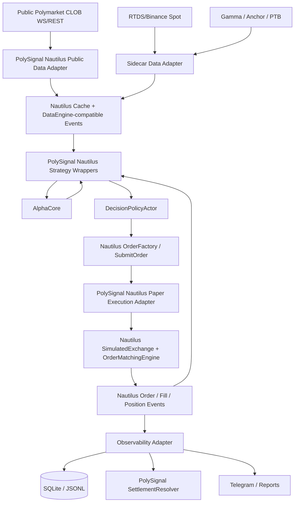

# Nautilus Matching Paper Migration Design

**Status:** Draft for review
**Scope:** Replace PolySignal's local paper fill simulator with NautilusTrader's matching engine for Polymarket paper trading. Keep the current local paper implementation present but deprecated until parity and rollback gates pass.
**Goal:** Use NautilusTrader matching as the default paper execution engine for Polymarket while preserving PolySignal's no-credential safety boundary, settlement/reporting outputs, and future path to live execution.

## Decision

Adopt **NautilusTrader `SimulatedExchange` / `OrderMatchingEngine` as the paper execution kernel**, not the Nautilus Polymarket live execution adapter.

Default runtime remains paper-only:

- Public Polymarket market data enters Nautilus as normalized instruments, order book updates, quotes, trades, and sidecar data.
- PolySignal strategies submit Nautilus orders through existing Nautilus strategy wrappers.
- A PolySignal-owned Nautilus paper execution adapter wraps Nautilus `SimulatedExchange` / matching internals and emits Nautilus order/fill/position events.
- Current `PaperSimulator`, `BestAskTakerExecutor`, `PassiveGtdExecutor`, and `PolySignalPaperExecutionClient` remain as `legacy_local` for rollback and equivalence checks only.
- Default code must not construct `PolymarketExecutionClient`, `PolymarketLiveExecClientFactory`, or authenticated `exec_clients`.

This is a matching-engine migration, not a live trading migration.

## Research Evidence

### NautilusTrader matching capabilities

Source: cloned upstream reference at `refs/nautilus_trader`, version `1.230.0`, commit `a3a72b2`.

- `BacktestVenueConfig` exposes matching behavior knobs: `book_type`, `fill_model`, `latency_model`, `fee_model`, `bar_execution`, `trade_execution`, `liquidity_consumption`, `queue_position`, `price_protection_points`, settlement prices, liquidation, and reduce-only behavior (`refs/nautilus_trader/nautilus_trader/backtest/config.py:50-180`).
- `liquidity_consumption=True` tracks per-level consumed liquidity; disabled mode allows repeated fills against the same historical book level (`refs/nautilus_trader/nautilus_trader/backtest/config.py:116-119`, `refs/nautilus_trader/docs/concepts/backtesting.md:725-793`).
- `queue_position=True` uses trade ticks to decrement quantity ahead at the resting limit price and only fills after queue clears (`refs/nautilus_trader/nautilus_trader/backtest/config.py:120-124`, `refs/nautilus_trader/docs/concepts/backtesting.md:931-1018`).
- Nautilus `FillModel` supports deterministic/probabilistic limit fills and one-tick slippage via `prob_fill_on_limit`, `prob_slippage`, and `random_seed` (`refs/nautilus_trader/nautilus_trader/backtest/config.py:457-527`, `refs/nautilus_trader/nautilus_trader/backtest/models/fill.pyx:34-157`).
- The matching engine asks `FillModel.get_orderbook_for_fill_simulation()` for a synthetic book; otherwise it falls back to standard market/limit fill logic (`refs/nautilus_trader/nautilus_trader/backtest/engine.pyx:6303-6340`, `refs/nautilus_trader/nautilus_trader/backtest/engine.pyx:6759-6786`).
- Maker limit fills are gated by `FillModel.is_limit_filled()` and then optionally capped by queue-position calculations (`refs/nautilus_trader/nautilus_trader/backtest/engine.pyx:6662-6723`).
- In L1 mode, `prob_slippage` can move fills one tick worse; with L2/L3 data, book depth determines price impact instead (`refs/nautilus_trader/nautilus_trader/backtest/engine.pyx:7379-7384`, `refs/nautilus_trader/docs/concepts/backtesting.md:689-723`).
- Nautilus sandbox execution also uses `SimulatedExchange` and `BacktestExecClient`, proving the matching engine can be used with live/sandbox data (`refs/nautilus_trader/nautilus_trader/adapters/sandbox/execution.py:58-146`).

### Nautilus sandbox limitation that affects this design

Nautilus `SandboxExecutionClientConfig` exposes `book_type`, `bar_execution`, `trade_execution`, GTD support, contingent order support, and reduce-only behavior, but it does **not** expose `liquidity_consumption`, `queue_position`, `price_protection_points`, custom `fill_model`, custom `fee_model`, or custom `latency_model` (`refs/nautilus_trader/nautilus_trader/adapters/sandbox/config.py:21-77`).

The upstream `SandboxExecutionClient` constructs `SimulatedExchange` with `FillModel()`, `MakerTakerFeeModel()`, `LatencyModel(0)`, and does not pass `liquidity_consumption` or `queue_position`, so those features remain at `SimulatedExchange` defaults (`refs/nautilus_trader/nautilus_trader/adapters/sandbox/execution.py:109-136`).

Therefore the migration must not simply toggle Nautilus sandbox adapter and call it done. It needs a PolySignal-owned Nautilus paper execution adapter that constructs `SimulatedExchange` with the required realism settings.

### Nautilus Polymarket adapter safety constraints

Nautilus Polymarket integration includes live data and live execution components:

- `PolymarketDataClient`
- `PolymarketExecutionClient`
- `PolymarketLiveDataClientFactory`
- `PolymarketLiveExecClientFactory`

Source: `refs/nautilus_trader/docs/integrations/polymarket.md:62-78`.

Both data and execution configs can source credentials from environment variables:

- `POLYMARKET_PK`
- `POLYMARKET_FUNDER`
- `POLYMARKET_API_KEY`
- `POLYMARKET_API_SECRET`
- `POLYMARKET_PASSPHRASE`

Source: `refs/nautilus_trader/docs/integrations/polymarket.md:221-234`, `refs/nautilus_trader/docs/integrations/polymarket.md:864-900`, `refs/nautilus_trader/docs/integrations/polymarket.md:952-957`.

Current project safety tests already ban live Polymarket execution symbols and credential env fallbacks in default Nautilus source (`tests/test_nautilus_platform_boundary.py:28-50`, `tests/test_nautilus_safety_boundary.py:5-29`). Current config also locks default Nautilus execution to `paper_sandbox` and rejects `allow_live_polymarket_execution=True` (`src/polysignal_lab/config.py:259-272`).

### Current PolySignal paper limitations

Current paper execution is intentionally simple and local:

- `FillModelConfig` defaults to fixed `slippage_bps=25`, full-depth requirement, and `reject_if_partial=True` (`src/polysignal_lab/config.py:198-204`).
- Default taker fills use `best_ask + slippage_bps`; depth is checked with `book.depth_until(limit_price)` but no per-level liquidity consumption is retained across orders (`src/polysignal_lab/paper/order_intent_executor.py:90-133`).
- FAK/FOK consume sorted ask levels for a single order and can produce partial FAK, but again without exchange-level order book state or global queue (`src/polysignal_lab/paper/order_intent_executor.py:135-237`).
- Passive GTD stores local `RestingOrder` objects and fills when `book.best_ask <= limit_price`; it has no queue-position model and no trade-tick-driven queue depletion (`src/polysignal_lab/paper/order_intent_executor.py:276-380`).
- `PolySignalPaperExecutionClient` is credential-free and local, but it wraps the same local paper path rather than Nautilus matching (`src/polysignal_lab/nautilus_runtime/execution.py:189-310`).

## Non-goals

1. Do not delete legacy paper modules in this migration.
2. Do not enable real Polymarket live execution by default.
3. Do not read `POLYMARKET_*` credentials in default paper mode.
4. Do not wire Nautilus `PolymarketExecutionClient` or `PolymarketLiveExecClientFactory` into default runtime.
5. Do not introduce a second speculative strategy abstraction; existing `AlphaCore` and Nautilus strategy wrappers remain the strategy boundary.
6. Do not migrate settlement oracle logic into Nautilus. Resolution still uses PolySignal settlement services.
7. Do not require Nautilus for default package import on Python 3.11; Nautilus remains optional and runtime-isolated until the project runtime moves to Python 3.12+.

## Approaches Considered

### Option A — Use upstream `SandboxExecutionClient` directly

Pros:

- Smallest code delta.
- Uses Nautilus `SimulatedExchange` and `BacktestExecClient`.
- Fits Nautilus sandbox/live environment vocabulary.

Cons:

- Upstream config does not expose `liquidity_consumption`, `queue_position`, `price_protection_points`, fee model, latency model, or custom fill model.
- Defaults are too optimistic for passive Polymarket queues.
- Harder to preserve PolySignal-specific audit fields and settlement persistence without adapter glue.

Rejected as the default because it does not meet the stated accuracy goal.

### Option B — PolySignal-owned Nautilus paper execution adapter around `SimulatedExchange`

Pros:

- Uses Nautilus matching engine for order lifecycle and fills.
- Can pass `liquidity_consumption=True`, `queue_position=True`, `trade_execution=True`, `support_gtd_orders=True`, and explicit fee/latency/fill models.
- Keeps default paper credential-free and independent of Polymarket live execution adapter.
- Lets PolySignal preserve existing telemetry, settlement, Telegram, and SQLite/JSONL outputs through event adapters.

Cons:

- More integration code than upstream sandbox client.
- Requires careful mapping between Polymarket binary tokens and Nautilus instruments.
- Requires robust tests around event ordering, precision, and old-vs-new parity.

Recommended.

### Option C — Full Nautilus `TradingNode` with Nautilus Polymarket data client and custom paper execution

Pros:

- Cleanest long-term architecture.
- Same strategy/data/execution event flow as future live mode.
- Least long-term dependency on old scheduler runtime.

Cons:

- Nautilus Polymarket data config has credential fallback hazards.
- Larger migration surface: data client, execution client, node config, state, observability, tests, deployment.
- Harder to prove paper correctness before data path correctness.

Deferred target. Option B should be implemented first and shaped so Option C is a cutover, not a rewrite.

## Target Architecture

### Runtime ownership

Nautilus owns:

- Order objects and identifiers.
- Order state transitions.
- Time-in-force behavior for IOC/FOK/GTD where supported.
- Matching, partial fills, price/size precision, queue-position gating, liquidity-consumption gating.
- Fill, order, and position events.

PolySignal owns:

- Public Polymarket data ingestion safety boundary.
- Market discovery, condition/token mapping, asset/timeframe/slug metadata.
- Strategy alpha logic and decision policy.
- Paper risk limits that are not represented by Nautilus account state.
- Settlement oracle, Telegram templates, reports, health, and persistence.
- Safety scanner rules.

## Component Design

### 1. `NautilusMatchingPaperExecutionClient`

Create a new execution adapter under `src/polysignal_lab/nautilus_runtime/` that owns a Nautilus `SimulatedExchange` instance.

Responsibilities:

- Construct `SimulatedExchange` with explicit paper realism settings:
  - `account_type="CASH"`
  - `oms_type="NETTING"` unless strategy hedging requires per-position IDs.
  - `book_type="L2_MBP"` when Polymarket depth is available.
  - `trade_execution=True`
  - `bar_execution=False` for short-cycle Polymarket unless later historical bars are introduced.
  - `liquidity_consumption=True`
  - `queue_position=True`
  - `support_gtd_orders=True`
  - `support_contingent_orders=False` initially; strategies continue to manage paired/hedge semantics explicitly.
  - `use_reduce_only=True`
  - nonzero `price_protection_points` only after precision tests prove the mapping.
- Register instruments before any order submission.
- Convert `NautilusOrderSpec` / strategy order intents into real Nautilus orders.
- Feed order book deltas, quote ticks, and trade ticks into the exchange before strategy evaluation or matching cycles.
- Emit execution results to existing observability without creating local `PaperFill` directly as source of truth.

Non-responsibilities:

- It does not call Polymarket CLOB order endpoints.
- It does not read private keys or API credentials.
- It does not decide strategy acceptance; `DecisionPolicyActor` remains upstream.

### 2. Public Polymarket Nautilus data adapter

Do not use Nautilus `PolymarketDataClient` in default paper mode until credential-free construction is proven in tests.

Instead, reuse the current public data sources and translate them into Nautilus-compatible data:

- Current CLOB REST/WS books become Nautilus order book snapshots/deltas or quote/depth events.
- Current last-trade fields become Nautilus `TradeTick` where side/size/timestamp is available.
- Current RTDS/Binance spot and PTB/anchor metadata remain sidecar custom data.

Requirements:

- Preserve current `PublicCLOBClient` alias convention and avoid blocked `ClobClient(` source token.
- Preserve freshness metadata and reject stale books before they reach matching if staleness would violate `max_book_staleness_ms`.
- Generate stable Nautilus instrument IDs from Polymarket token IDs.
- Store condition ID, market ID, slug, UP/DOWN side, tick size, and min order size in a registry available to strategies and observability.

### 3. Instrument model mapping

Each Polymarket outcome token maps to one Nautilus binary-option-like instrument.

Minimum required fields:

- venue: paper-only venue, e.g. `POLYSIGNAL_PM_PAPER`.
- instrument ID: stable token-derived ID.
- price precision: derived from Polymarket tick size; default 0.001 only if metadata is missing and safety tests mark the fallback.
- size precision: derived from CLOB size increments; default must be explicit and tested.
- quote currency: USD/USDC-equivalent account currency.
- expiry: market close/end timestamp when available.

The mapping must be deterministic. A token ID must never map to a different Nautilus instrument ID across restarts.

### 4. Order intent mapping

Current intent semantics map to Nautilus order types/time-in-force:

| PolySignal intent | Nautilus order shape | Matching expectation |
|---|---|---|
| default taker | Limit buy at `max_entry_price`, submitted aggressive when `best_ask <= max_entry_price` | fills through book depth, with matching-engine price impact |
| `TAKER_IOC` | Limit IOC | partial or cancel remainder according to Nautilus IOC behavior |
| `TAKER_FAK` | Limit IOC | accept partial fills; strategy callback handles partial state |
| `TAKER_FOK` | Limit FOK | all-or-none; reject/cancel if insufficient matchable depth |
| `PASSIVE_GTD` | Limit GTD | rests in matching engine; fills only when book/trade events clear price and queue conditions |

Important correction from current runtime: LateConsensus `max_entry_price` remains a ceiling, not the execution price. The submitted Nautilus order can use `max_entry_price` as limit, while actual fills must come from matching against current book/trade liquidity.

### 5. Legacy paper deprecation

Keep these modules intact for now:

- `src/polysignal_lab/paper/simulator.py`
- `src/polysignal_lab/paper/fill_model.py`
- `src/polysignal_lab/paper/order_intent_executor.py`
- `src/polysignal_lab/nautilus_runtime/execution.py` current `PolySignalPaperExecutionClient`

Add a config-level backend selector:

- `runtime.nautilus.paper_backend = "nautilus_matching"` default for Nautilus runtime.
- `runtime.nautilus.paper_backend = "legacy_local"` allowed only as explicit rollback.

Deprecation rule:

- Legacy backend may be imported and tested.
- Legacy backend must not be selected by default in `runtime.engine="nautilus"`.
- Legacy backend removal waits until Nautilus matching paper has parity evidence and at least one production dry-run cycle.

### 6. Observability and persistence bridge

Nautilus events become the source of truth for order/fill/position state. The bridge converts events into existing storage rows for compatibility:

- `OrderSubmitted` / `OrderAccepted` / `OrderRejected` -> existing paper order/audit records.
- `OrderFilled` partial/full -> existing paper fill and position records.
- `OrderCanceled` / `OrderExpired` -> existing rejection/cancel fields.
- Strategy tags carry `strategy`, `asset`, `timeframe`, `condition_id`, `market_id`, `market_slug`, `signal_id`, `max_entry_price`, `entry_reference_price`, `order_intent`, `pair_id`, `hedge_leg`.

Settlement remains PolySignal-owned:

- Open Nautilus-filled paper positions must be mirrored into the shared paper position state used by `scheduler.check_settlements()` until settlement is itself ported.
- The three-source `SettlementResolver` remains unchanged: CTF chain -> Gamma exact lookup -> WS cache hints.

### 7. Accuracy modes

Provide three explicit modes. Do not hide assumptions behind one `paper` label.

#### `fast_l1`

- `book_type="L1_MBP"`
- `trade_execution=True`
- `queue_position=False`
- used only for quick smoke and environments without depth.

#### `depth_l2` default

- `book_type="L2_MBP"`
- `trade_execution=True`
- `liquidity_consumption=True`
- `queue_position=False` if trade side/size quality is insufficient.
- default first production paper mode if Polymarket trade ticks are incomplete.

#### `queue_l2` target

- `book_type="L2_MBP"`
- `trade_execution=True`
- `liquidity_consumption=True`
- `queue_position=True`
- requires trade ticks with price, size, timestamp, and usable aggressor side or an explicit documented fallback.

The runtime must log the active accuracy mode in startup, health, daily report, and paper execution assumptions.

## Data Flow

1. Market refresh loads active Polymarket markets and builds token -> instrument mappings.
2. Public order book snapshots/deltas update Nautilus matching books.
3. Trade ticks update Nautilus matching state and drive passive order queue depletion.
4. Sidecar spot/PTB/anchor updates feed strategy views.
5. Strategy wrappers evaluate `AlphaCore` and produce `AlphaDecision`.
6. `DecisionPolicyActor` applies freshness, dedupe, consensus, and exposure policy.
7. Accepted decisions become Nautilus orders with strategy tags.
8. Nautilus matching engine accepts, rejects, fills, partially fills, cancels, or expires orders.
9. Execution events update strategy callbacks, observability, persistence, wallet mirror, settlement queue, Telegram, and reports.
10. Legacy paper receives no order in default Nautilus matching mode.

## Safety Requirements

1. Default paper mode must pass the current safety boundary tests banning `PolymarketExecutionClient`, `PolymarketLiveExecClientFactory`, `exec_clients`, and `POLYMARKET_*` fallback tokens in default runtime source.
2. If future live mode is added, it must live behind a separate explicit `runtime.nautilus.execution_mode="live_polymarket"` or equivalent, not a boolean.
3. `allow_live_polymarket_execution=True` must remain invalid for default config.
4. No default runtime path may instantiate Nautilus `PolymarketExecClientConfig`.
5. No default runtime path may call allowance or API-key helper scripts.
6. Public data adapter failures must degrade paper trading, not silently switch to authenticated Nautilus data clients.
7. The safety scanner must keep flagging blocked live symbols in default runtime code.

## Testing Strategy

### Unit tests

- Instrument mapping determinism: token ID -> Nautilus instrument ID remains stable.
- Price/size precision: 0.001-style binary market ticks round correctly and reject invalid prices.
- Order intent mapping:
  - default taker uses limit ceiling but fills at book-derived price.
  - IOC allows partial/cancel behavior.
  - FOK rejects if full depth is unavailable.
  - GTD rests and expires.
- Event translation: Nautilus order/fill/cancel events produce existing SQLite-compatible payloads.
- Legacy backend selector: `nautilus_matching` default; `legacy_local` explicit only.

### Parity tests against legacy local paper

Use deterministic books where both engines should agree:

- best ask below max entry, full depth available -> filled.
- best ask above max entry -> rejected/canceled.
- malformed or stale book -> rejected before matching.
- FOK insufficient depth -> no fill.
- LateConsensus max-entry ceiling -> actual fill from best ask/depth, not fixed 0.92.

Parity is not required for passive queue behavior because legacy paper is known less accurate. Differences must be asserted and explained.

### Accuracy regression tests

Use synthetic L2 book and trade tick sequences:

- Two orders against the same level with `liquidity_consumption=True`: second order only fills remaining displayed liquidity.
- Passive BUY GTD with queue ahead: first trade only clears queue; second trade fills excess.
- Trade tick inside stale spread: fill quantity is capped by trade size.
- L1 `prob_slippage` mode: slippage moves one tick worse only in L1 mode.

### Safety tests

- Default Nautilus matching source contains no forbidden live Polymarket execution symbols.
- Config validation rejects live execution in default mode.
- Default import still works without Nautilus installed on Python 3.11.
- Nautilus-dependent tests are isolated behind Python 3.12+ / optional extra checks.

### Runtime smoke

- Run one bounded Nautilus matching paper cycle against fixture data.
- Verify fills produce SQLite/JSONL order/fill/position rows.
- Verify settlement can close a mirrored Nautilus-filled paper position.
- Verify Telegram signal/result formatting still uses existing message formatter path.
- Verify daily report includes paper engine = `nautilus_matching` and accuracy mode.

## Migration Waves

### Wave 0 — Proof gates

- Prove current Nautilus optional dependency still does not affect default Python 3.11 import.
- Prove refs/source assumptions against current Nautilus version used in `uv.lock`.
- Add tests documenting that upstream `SandboxExecutionClient` is insufficient for `queue_position` / `liquidity_consumption` default needs, so a custom adapter is intentional.

### Wave 1 — Matching adapter foundation

- Add Nautilus instrument registry for Polymarket outcome tokens.
- Add data translation for order book snapshots/deltas and trade ticks.
- Add `NautilusMatchingPaperExecutionClient` backed by `SimulatedExchange`.
- Keep strategy wrappers and decision policy unchanged where possible.

### Wave 2 — Order/event integration

- Replace `PolySignalPaperExecutionClient` submitter in Nautilus runtime with Nautilus matching submitter.
- Translate Nautilus events back to strategy callbacks and observability.
- Mirror open positions into settlement-compatible storage.
- Add parity and divergence tests.

### Wave 3 — Default cutover with rollback

- Set Nautilus runtime default paper backend to `nautilus_matching`.
- Keep `legacy_local` explicit rollback.
- Daily report and health expose selected backend and accuracy mode.
- Docker runtime uses matching backend after rebuild.

### Wave 4 — Historical calibration and live runway

- Add fixture/replay comparison against recorded Polymarket books/trades.
- Calibrate `depth_l2` vs `queue_l2` assumptions.
- Draft a separate live-execution spec. Live must not piggyback on this paper migration.

## Acceptance Criteria

1. In Nautilus runtime, default accepted signals submit Nautilus orders and receive Nautilus matching events; no local paper fills are generated as source of truth.
2. Passive GTD orders are resting Nautilus orders, not local `RestingOrder` objects.
3. L2 depth mode prevents repeated consumption of the same displayed liquidity when `liquidity_consumption=True`.
4. Queue mode uses trade ticks to delay passive fills until quantity ahead is cleared.
5. Current local paper remains available as explicit `legacy_local` rollback and remains covered by existing tests.
6. Existing settlement, Telegram, SQLite/JSONL, and daily report outputs continue to work from Nautilus matching events.
7. Default runtime remains credential-free and does not instantiate Nautilus Polymarket live execution classes.
8. Nautilus-dependent runtime remains optional/isolated from default Python 3.11 imports until a separate runtime upgrade decision.

## Risks and Mitigations

| Risk | Mitigation |
|---|---|
| Nautilus Python support is 3.12+ while project default is 3.11 | Keep Nautilus imports optional and runtime-isolated; use Python 3.12+ only for matching-runtime verification. |
| Upstream sandbox config lacks accuracy knobs | Use PolySignal-owned adapter around `SimulatedExchange`; do not rely on upstream sandbox defaults. |
| Polymarket data client can source credentials | Default paper uses PolySignal public data adapter; live/data-client adoption requires separate safety proof. |
| Trade ticks lack reliable aggressor side | Default to `depth_l2`; enable `queue_l2` only when data quality is proven or fallback is explicitly documented. |
| Event translation duplicates or loses fills | Use Nautilus order/fill IDs as idempotency keys and test duplicate-event replay. |
| Settlement reads legacy wallet state | Mirror Nautilus-filled positions into the current settlement-compatible paper position store until settlement is ported. |
| Legacy and Nautilus paper diverge | Treat divergence as expected only for documented accuracy upgrades; assert deterministic parity cases. |

## Open Decisions for Review

1. Default first production accuracy mode: recommended `depth_l2`; `queue_l2` only after trade tick side/size quality is proven.
2. Venue/account model: recommended `CASH` + `NETTING` for binary outcome token positions; use `HEDGING` only if strategy pair semantics require separate position IDs.
3. Fee model: start with explicit zero-fee mode if current paper ignores fees; add Polymarket fee model in the same wave only if PnL reports must include fees immediately.
4. Live roadmap: should be a separate spec after paper matching proves stable.

## Review Checklist

- The spec migrates matching, not strategy alpha logic.
- Legacy local paper is deprecated but not deleted.
- Default runtime remains paper-only and credential-free.
- Nautilus matching realism settings are explicit.
- Upstream sandbox limitations are called out.
- Tests distinguish parity requirements from intentional accuracy improvements.
