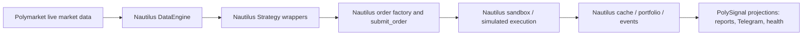

# NautilusTrader Full Strategy and Paper Trading Refactor Design

Date: 2026-06-27
Status: Approved direction, pending spec review

## Conclusion

Polysignal-lab will migrate strategy execution and paper trading to NautilusTrader as the runtime owner.

PolySignal keeps only:

- Strategy algorithm code: the alpha decision logic that decides whether a market is interesting.
- Configuration: strategy parameters, market universe choices, notification settings.
- Output projections: Telegram messages, health summaries, daily reports.

NautilusTrader owns everything else:

- Polymarket market data ingestion and dispatch.
- Strategy lifecycle and data-triggered evaluation.
- Signal creation location.
- Order creation and submission.
- Paper matching and fills.
- Account, portfolio, order, fill, and position state.
- Event cache as the trading truth source.

The default runtime must not use live Polymarket execution. It uses real Polymarket market data plus Nautilus sandbox/simulated execution.

## Why this change is needed

The current Nautilus runtime is only partially Nautilus-driven.

Evidence from the current code:

- `src/polysignal_lab/nautilus_runtime/node.py` says `build_trading_node` returns a component dict with "no Nautilus TradingNode dependency".
- `src/polysignal_lab/nautilus_runtime/orchestrator.py` manually runs market refresh, sync, strategy evaluation, event drain, resting orders, exits, settlement, and reporting.
- `src/polysignal_lab/nautilus_runtime/strategies/base.py` has `PolySignalNautilusStrategy.evaluate_all_conditions()`, which manually builds views, calls alpha cores, and submits `NautilusOrderSpec` objects through a custom submitter.
- `src/polysignal_lab/nautilus_runtime/matching.py` uses Nautilus `SimulatedExchange`, but mirrors results back into custom `PaperFill`, `PaperPosition`, `PaperTradeResult`, and `PaperWallet` objects.

This creates two sources of truth: Nautilus matching state and PolySignal paper state. The refactor removes that split.

## External NautilusTrader facts that shape the design

NautilusTrader Polymarket support provides:

- `PolymarketDataClient`, `PolymarketDataClientConfig`, and `PolymarketLiveDataClientFactory` for market data.
- `PolymarketExecutionClient`, `PolymarketExecClientConfig`, and `PolymarketLiveExecClientFactory` for real CLOB execution.
- `BinaryOption` instruments for Polymarket outcome tokens.
- `get_polymarket_instrument_id(condition_id, token_id)` for instrument IDs.
- `PolymarketDataLoader` and `BacktestEngine` examples for historical backtests.
- `PolymarketFeeModel` for backtest/simulated fee modeling.

Polymarket execution constraints:

- Market BUY orders must use quote quantity semantics.
- `reduce_only` is not supported by Polymarket live execution.
- `IOC` maps to Polymarket `FAK`.
- `GTC` and `GTD` are valid resting limit order scopes.
- Batch submit is limited to 15 independent limit orders.
- Tick size can change during market conditions.
- Newly-minted markets can have a CLOB hydration delay.

NautilusTrader does not document an integrated Polymarket paper adapter. The correct paper architecture is custom assembly: real Polymarket data client plus Nautilus generic sandbox/simulated execution.

## Target architecture



Plain-language version:

- PolySignal decides what it would like to trade.
- Nautilus decides when the strategy sees data, how orders are submitted, how paper fills happen, and what the account/position state is.
- PolySignal reads Nautilus results to tell humans what happened.

## Component responsibilities

| Component | Responsibility after refactor | Notes |
|---|---|---|
| PolySignal alpha cores | Strategy math only | They receive a market view and return decisions. They do not submit orders or update paper state. |
| Nautilus strategy wrappers | Strategy lifecycle, data callbacks, signal generation, order submission | Each wrapper is a real Nautilus strategy/actor-style component. Signal generation happens inside this layer. |
| Nautilus Polymarket data client | Real-time Polymarket market data | Instruments, quotes, trades, book deltas, tick-size changes, and market resolution events come through Nautilus. |
| Nautilus sandbox execution | Paper order matching | No real CLOB orders. No default `PolymarketExecutionClient`. |
| Nautilus cache/portfolio | Trading truth source | Orders, fills, positions, account balances, and state recovery come from Nautilus. |
| PolySignal projections | Reports, Telegram, health | Projection code may shape Nautilus events into existing output formats but must not be the trading truth source. |

## Signal generation design

The important behavioral change is where signals are produced.

Current model:

```text
PolySignal orchestrator scans markets
-> PolySignal builds market views
-> PolySignal calls strategy logic
-> PolySignal creates a signal/order spec
-> Nautilus is used only near the matching boundary
```

Target model:

```text
Nautilus DataEngine emits Polymarket data
-> Nautilus Strategy callback runs
-> Strategy wrapper builds the minimal market view needed by the alpha core
-> Alpha core returns a decision
-> Strategy wrapper creates a Nautilus order
-> Strategy wrapper calls Nautilus submit_order
```

This means PolySignal no longer has an external signal scheduler. The signal generation entry point is Nautilus strategy execution.

## Paper execution design

The default runtime uses Nautilus sandbox/simulated execution.

Required sandbox semantics:

- Venue: Polymarket-compatible simulated venue.
- Instrument type: `BinaryOption`.
- Account model: cash account.
- OMS type: netting.
- Base/settlement currency: pUSD/USDC-compatible configuration.
- Matching: Nautilus simulated exchange/order matching, with L2 depth when available.
- Fees: Polymarket-compatible fee model where available.
- Fills and positions: generated and stored by Nautilus.

No custom `PaperWallet` can be a source of truth. If compatibility requires a wallet-shaped object during migration, it must be a read-only projection from Nautilus state.

## Data flow

1. Runtime starts a Nautilus `TradingNode` or equivalent Nautilus-owned node lifecycle.
2. Polymarket instrument universe is configured from the existing market selection rules.
3. Nautilus loads or auto-loads `BinaryOption` instruments.
4. Nautilus subscribes to quotes, trades, order book deltas, and resolution/status events needed by strategies.
5. Nautilus dispatches data to strategy wrappers.
6. Strategy wrappers call existing PolySignal alpha cores.
7. Strategy wrappers convert approved decisions to Nautilus orders.
8. Nautilus sandbox execution accepts, rejects, rests, partially fills, or fills orders.
9. Nautilus cache/portfolio records order/fill/position/account events.
10. PolySignal projection code reads Nautilus events for Telegram, reports, and health.

## Order semantics

The wrapper must map PolySignal intent to Nautilus-native orders, not `NautilusOrderSpec` as the final runtime contract.

Rules:

- Taker paper entries become Nautilus orders with IOC/FAK-like behavior in the sandbox.
- Passive GTD entries become Nautilus limit orders with expiry.
- FOK behavior must reject partial fills when full depth is unavailable.
- Market BUY live semantics are not used in default paper mode, but order sizing must still be quote/notional-aware so future live migration does not invert quantity meaning.
- Reduce-only must not be modeled as a Polymarket live feature. Paper exits are normal simulated opposite-side closes in Nautilus state.
- All order IDs, client order IDs, tags, strategy IDs, and instrument IDs must be Nautilus-native and traceable back to strategy/market metadata.

## Error handling

| Case | Behavior |
|---|---|
| Missing instrument | Do not synthesize a local paper market. Wait for Nautilus loading or reject with a clear instrument-loading reason. |
| Stale data | Strategy must not submit; rejection is recorded as a strategy/risk decision, not a fake fill. |
| Insufficient depth | Nautilus sandbox outcome is authoritative: reject, partial fill, or fill according to order type. |
| Tick-size change | Nautilus Polymarket data handling owns instrument/book epoch updates. Strategy wrappers must use current instrument precision. |
| Market resolution | Nautilus instrument close/status events drive close/settlement projection. |
| Projection/report failure | Does not alter trading state. Trading state remains in Nautilus cache/portfolio. |
| Accidental live execution config | Runtime refuses to start in default paper mode if live Polymarket execution client symbols/config are present. |

## Migration boundaries

### Keep

- Existing alpha core strategy calculations.
- Strategy configuration values.
- Market universe rules, once converted into Nautilus instrument-provider configuration.
- Telegram and report output shape, as projections.
- Safety tests preventing default live Polymarket execution.

### Replace

- Manual `NautilusOrchestrator` strategy cycle.
- `PolySignalNautilusStrategy.evaluate_all_conditions()` as an external scheduler entry point.
- `NautilusMatchingPaperExecutionClient` as the paper client API.
- `PaperWallet` as account truth.
- `PaperExecutionResult` as runtime truth.
- Custom fill/position mirroring.

### Temporary compatibility only

The migration may temporarily expose adapter projections for existing reports/tests. These adapters must be explicitly read-only and must not feed back into execution decisions.

## Testing strategy

Tests should prove behavior, not implementation names.

Required checks:

1. A Nautilus strategy wrapper receives Nautilus-dispatched market data and calls the alpha core.
2. An approved alpha decision creates a Nautilus order through order factory/submission, not a custom paper client.
3. Sandbox execution produces accepted/rejected/partial/fill outcomes from market depth.
4. Nautilus cache/portfolio contains the resulting order, fill, position, and account state.
5. Telegram/report projections can render from Nautilus events without a `PaperWallet` truth source.
6. Default runtime refuses real Polymarket execution configuration.
7. Existing strategy math outputs remain unchanged for identical market views.
8. Passive GTD, IOC/FAK, FOK, insufficient depth, stale data, and market resolution paths are covered.

## Non-goals

- No live Polymarket execution in this spec.
- No new strategy algorithms.
- No rewrite of alpha math unless a strategy depends on old paper-trading side effects.
- No attempt to make Nautilus invent signals. Nautilus owns lifecycle and trading mechanics; PolySignal alpha code still owns the trading idea.
- No second paper wallet or second position ledger.

## Acceptance criteria

The refactor is complete when:

- The default Polymarket paper runtime starts through Nautilus-owned lifecycle.
- Strategy signal generation occurs inside Nautilus strategy callbacks.
- Orders are Nautilus-native and submitted through Nautilus.
- Paper fills and positions are produced by Nautilus sandbox/simulated execution.
- Account/portfolio/order/fill/position truth is read from Nautilus cache/portfolio.
- Existing reports and Telegram output still work as projections.
- Safety checks prove the default runtime cannot submit real Polymarket orders.
- Old custom paper execution truth sources are removed or made read-only compatibility projections.
