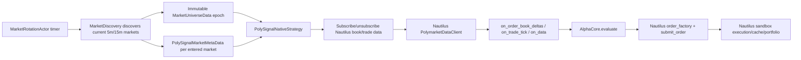

# Nautilus 5m/15m 加密货币市场自动轮换设计

Date: 2026-06-28
Status: Draft spec, ready for review

## 结论

默认 Nautilus runtime 必须支持持续执行策略，并在 Polymarket 加密货币 Up/Down 5m/15m 市场切换时自动切到新市场。

推荐方案：在 Nautilus runtime 内新增一个 node-owned `MarketRotationActor`，周期性发现当前 5m/15m 市场，发布不可变的市场宇宙 epoch 消息；现有 `PolySignalNativeStrategy` 在收到新市场 metadata/universe 消息时动态订阅新 instruments、退订过期 instruments，并在不中断 `TradingNode` 的情况下继续执行同一批策略。

不重启 `TradingNode`，不恢复 legacy external scheduler 扫描执行，不让 PolySignal 重新成为交易状态 owner。

## 目标

1. 默认 `nautilus` runtime 启动后持续运行策略。
2. 当前 5m/15m BTC/ETH/SOL/XRP Up/Down 市场结束或新市场出现后，策略自动切换到新的 active markets。
3. 每个策略保持同一个 Nautilus strategy lifecycle，不通过重建 node 来换市场。
4. 新市场的 instrument、metadata、spot、price-to-beat、order book、trade tick 都能进入 Nautilus callback 路径。
5. 过期市场不再触发新入场；已有订单/持仓仍由 Nautilus cache/portfolio/execution state 管理。
6. 默认 runtime 仍是 paper-safe：真实 Polymarket data + Nautilus sandbox execution，不启用 live Polymarket execution。

## 非目标

- 不实现 live Polymarket execution。
- 不改变三策略核心 alpha 规则。
- 不把 legacy `PaperWallet` 恢复为 trading truth source。
- 不引入新的独立市场数据 scheduler 来手动调用策略。
- 不要求一次性支持所有 Polymarket 市场；本 spec 只覆盖配置里的 crypto Up/Down `assets × timeframes`。

## 外部 NautilusTrader 事实

设计依据来自 NautilusTrader 文档和当前 vendored source。

- Developer Guide：Nautilus core 是 Rust，Python 是 strategy logic、configuration、orchestration 的 control plane。见 https://nautilustrader.io/docs/latest/developer_guide/。
- Design Principles：request/response/event/command message 创建后不得被修改；组件如需不同表示，应派生本地状态或创建新消息。见 https://nautilustrader.io/docs/latest/developer_guide/design_principles/。
- Message Bus：Nautilus 组件通过 message passing 解耦；`Actor`/`Strategy` 可用 `publish_data()`/`subscribe_data()` 发布订阅结构化 custom data；custom data 需要 timestamp/order 语义。见 https://nautilustrader.io/docs/latest/concepts/message_bus/。
- Data concepts：market data 属于 instrument；order book deltas、quotes、trades 是 Nautilus 的内建数据流；策略应围绕 instrument data callback 工作。见 https://nautilustrader.io/docs/latest/concepts/data/。
- Live Trading：同一 actor/strategy/execution algorithm 应在 backtest/live node 下运行，live node 是执行生命周期 owner。见 https://nautilustrader.io/docs/latest/concepts/live/。
- Vendored Polymarket adapter source：`PolymarketDataClientConfig` 支持 `auto_load_missing_instruments`、`subscribe_new_markets`、`update_instruments_interval_mins`；unknown instrument 订阅可触发 provider ad-hoc load。见 `refs/nautilus_trader/crates/adapters/polymarket/src/config.rs` 和 `refs/nautilus_trader/crates/adapters/polymarket/src/data/mod.rs`。

设计约束：遵守 Nautilus message immutability，不修改已发布 metadata/universe data；每次轮换创建新的 epoch message，策略只更新自己的本地订阅状态。

## 当前问题

现状代码已有两条路径：

1. legacy scheduler 路径有市场刷新：
   - `MarketDiscovery._current_slot_slugs()` 生成当前 `asset-updown-{5m|15m}-{slot}` slug。
   - `MarketUniverseService.refresh_once()` 更新 registry 和 token ids。
   - `scheduler_market_data.refresh_markets_once()` 能刷新 REST books 并在 legacy WS 已启动时同步 token 订阅。
2. 默认 Nautilus runtime 没有持续轮换：
   - `_prepare_nautilus_runtime_context()` 启动时只调用一次 `scheduler.market_universe.refresh_once()`。
   - `build_trading_node()` 用这批 startup markets 生成 `PolymarketInstrumentProviderConfig(load_ids=...)`。
   - `PolySignalRuntimeSidecarActor` 保存静态 `markets` tuple，`on_start()` 只发布一次 metadata/PTB。
   - `PolySignalNativeStrategy.condition_ids` 是启动时固定 tuple，`on_start()` 只订阅启动时 instruments。

结果：默认 `nautilus` runtime 可以执行配置的策略，但策略只会持续看启动时 markets。5m/15m 新时间窗出现后不会自动切换。

## 方案比较

### 方案 A：每个市场窗口重启 TradingNode

做法：轮换时停止 node，重新 discovery，重建 `TradingNodeConfig(load_ids=...)`，再启动 node。

优点：最少修改 strategy callback 代码。

缺点：

- 打断策略生命周期和 Nautilus execution state。
- 启停窗口内可能漏行情、漏订单状态。
- 与 Nautilus live trading 的连续 node lifecycle 不匹配。
- 难以做到平滑处理正在 resting 的 GTD paper orders。

结论：拒绝。

### 方案 B：Nautilus 内部动态市场轮换 Actor（推荐）

做法：保持一个长期运行的 `TradingNode`。新增 node-owned actor 周期 discovery 当前 5m/15m markets，发布新的不可变 universe epoch 和每个新 market 的 metadata。native strategies 动态订阅/退订 instruments，更新本地 active condition set，并继续通过 Nautilus data callbacks 执行。

优点：

- 不重启 node。
- 符合 Nautilus Actor/Strategy message-driven 模型。
- 保留 Nautilus cache/portfolio/execution truth source。
- 复用现有 `MarketDiscovery`、instrument mapping、metadata/PTB custom data。
- 能测试“新 epoch → subscribe new instruments → old epoch inactive”。

缺点：

- 需要改 native strategy 的 subscription lifecycle。
- 需要定义清楚过期市场退订、订单/持仓留存边界。

结论：采用。

### 方案 C：恢复旧 orchestrator 的 `_phase_market_refresh()`

做法：把 `NautilusOrchestrator.run_once()` 重新接回默认 runtime，用它定时 refresh/sync/evaluate。

优点：已有一部分 phase code。

缺点：

- 回到 PolySignal 外部循环扫描策略，违背“策略由 Nautilus callback 持续驱动”。
- 与当前 full strategy paper refactor 的方向冲突。
- 易重新引入双 truth source。

结论：拒绝。

## 目标架构



Plain-language version:

- 一个 Nautilus actor 负责“当前应该交易哪些 markets”。
- 策略不再持有启动时固定 condition list，而是持有当前 epoch 的 active set。
- 新 market 进入时，策略订阅它的 up/down instruments。
- market 退出时，策略退订它并停止新入场。
- 订单和持仓状态仍交给 Nautilus。

## 新组件

### `MarketRotationActor`

位置：`src/polysignal_lab/nautilus_runtime/market_rotation.py`

职责：

- 持有 `MarketDiscovery`、`MarketRegistry`、persistence adapter、PTB provider、spot/anchor dependencies。
- 按配置周期调用 discovery，计算 active universe。
- 每次 active universe 变化时发布一个新的 immutable `PolySignalMarketUniverseData`。
- 对新进入的 markets 发布 `PolySignalMarketMetaData`。
- 对新进入或仍 active 的 markets 触发 PTB 发布。
- 对过期/退出 markets 只发布 universe epoch 的 `exited_condition_ids`，不修改旧 metadata message。
- 写 health metrics：last epoch、active count、entered count、exited count、discovery error、last success time。

非职责：

- 不调用 strategy alpha core。
- 不提交订单。
- 不维护 paper wallet。
- 不直接修改 strategy internals；通过 Nautilus custom data/message bus 通知。

### `PolySignalMarketUniverseData`

位置：`src/polysignal_lab/nautilus_runtime/market_data.py`

字段：

- `epoch: int`
- `active_condition_ids: tuple[str, ...]`
- `entered_condition_ids: tuple[str, ...]`
- `exited_condition_ids: tuple[str, ...]`
- `condition_to_up_token: dict[str, str]`
- `condition_to_down_token: dict[str, str]`
- `condition_to_asset: dict[str, str]`
- `condition_to_timeframe: dict[str, str]`
- `ts_event: int`
- `ts_init: int`

约束：

- 发布后不可修改。
- 每次 discovery 结果变化创建新对象。
- `dict` 字段在构造后不得被 handler 修改；如实现上无法冻结，则 handler 必须 `dict(...)` 复制成本地状态。

### `MarketSubscriptionState`

位置：可放在 `native_strategy.py` 内部小 dataclass，或单独 `src/polysignal_lab/nautilus_runtime/market_subscription.py`。

职责：

- 记录每个 native strategy 已订阅的 `condition_id -> instrument ids`。
- 计算 `to_subscribe` / `to_unsubscribe`。
- 保证订阅幂等。
- 避免对同一个 instrument 重复 subscribe/unsubscribe。

## 修改现有组件

### `build_trading_node()`

现状：只接受启动时 markets，生成固定 `load_ids`。

目标：

- 仍允许 startup discovery 传入初始 markets，保证 node 启动后立即有当前 markets。
- 同时配置 Polymarket data client 支持动态 unknown instrument auto-load：
  - `auto_load_missing_instruments=True`
  - 保持 `auto_load_debounce_ms` 默认或配置化。
  - 保持 `auto_load_max_retries`，允许 CLOB hydration delay 后重试。
- 可选开启 `subscribe_new_markets=True` 作为 adapter-side signal；但默认 active universe 仍由 `MarketRotationActor` 的 Polysignal discovery epoch 决定。
- 把 `MarketRotationActor` 加入 `node.trader.add_actor(...)`。
- `sidecar_actor` 不再是唯一 metadata/PTB publisher；可合并到 rotation actor，或让 rotation actor 复用 `SidecarDataActor`。

### `build_paper_trading_node_config()`

目标：

- 把现有 `PolymarketDataClientConfig(instrument_config=...)` 扩展为显式传入动态加载参数。
- 不启用 live execution client。
- 保持 sandbox exec config 不变。

### `PolySignalRuntimeSidecarActor`

现状：持有静态 `markets` tuple。

目标：

- 将静态 market metadata/PTB 发布职责迁移到 `MarketRotationActor`；或把该 actor 改造成 rotation actor。
- RTDS spot feed 可以继续留在 sidecar actor，但 `_on_spot()` 不能只遍历启动时 `self.markets`。
- 如果保留 sidecar actor，则它必须从最新 universe state 获取 active markets，而不是构造时 tuple。

推荐最小重构：保留 `SidecarDataActor` helper，新增 `MarketRotationActor` 组合它；逐步减少 `PolySignalRuntimeSidecarActor` 的市场持有职责。

### `PolySignalNativeStrategy`

现状：

- `condition_ids` 是固定 tuple。
- `on_start()` 对 startup registry 的 instruments 一次性订阅。
- 收到 `PolySignalMarketMetaData` 时只注册 registry 和重算 asset map，不订阅新 instruments。

目标：

- 将 `condition_ids` 改为 startup seed；新增 `_active_condition_ids: set[str]`。
- 新增 `_subscription_state` 管理 instrument subscriptions。
- `on_start()` 订阅 startup seed。
- `on_data(PolySignalMarketMetaData)`：
  - 注册 market metadata。
  - 如果 condition 在当前 universe active set 或尚未收到 universe 但属于 startup seed，则订阅 up/down instruments。
  - 更新 `_asset_condition_ids`。
- `on_data(PolySignalMarketUniverseData)`：
  - 复制 active/entered/exited 到本地 state。
  - 对 entered 或 active-but-not-subscribed 的 condition 订阅 instruments。
  - 对 exited condition 退订 book deltas/trades，并从 `_active_condition_ids` 移除。
  - 不删除 Nautilus cache/order/fill/position truth。
- `evaluate_condition()` 必须先检查 condition 是否 active。exited condition 的 late book/trade tick 只更新 data provider，不产生新订单。

订阅动作：

- 对每个 up/down instrument：
  - `subscribe_order_book_deltas(instrument_id=..., book_type=...)`
  - `subscribe_trade_ticks(instrument_id)`
- 退订动作：
  - 优先使用 Nautilus strategy API 的 `unsubscribe_order_book_deltas` / `unsubscribe_trade_ticks`（若可用）。
  - 若 API 不可用，保守方案是停止 evaluation，但保留订阅直到 node 停止；spec 要求先探明 API 并测试。

## 数据流

### 启动

1. `run_nautilus_cli()` 加载 `config/signal_bot.yaml`。
2. `_prepare_nautilus_runtime_context()` 做一次 discovery，得到 startup markets。
3. `build_trading_node()` 用 startup markets 构建 initial `load_ids`。
4. 构建并注册：
   - `MarketRotationActor`
   - `PolySignalNativeStrategy` wrappers
   - observability/report projection actors
5. `node.run()` 开始。
6. strategies `on_start()` 订阅 startup markets。

### 周期轮换

1. `MarketRotationActor` 每 `settings.markets.refresh_interval_sec` 或更保守的 `rotation_interval_sec` 触发 discovery。
2. discovery 生成当前 active 5m/15m markets。
3. actor 与上一 epoch 比较：
   - `entered = current - previous`
   - `exited = previous - current`
   - `unchanged = current ∩ previous`
4. actor 发布 `PolySignalMarketUniverseData(epoch=N, ...)`。
5. actor 对 `entered` 发布 `PolySignalMarketMetaData`。
6. strategies 收到 universe/meta 后动态订阅/退订 instruments。
7. Nautilus Polymarket data client 对 unknown instrument 自动 load，再接入 WS orderbook/trades。
8. orderbook/trade/spot/PTB callbacks 驱动 alpha core 持续执行。

### 市场退出

退出条件：

- discovery 不再返回 market；或
- `market.end_ts < now`；或
- status resolved/cancelled；或
- Polymarket adapter/instrument status 显示不可继续 live subscription。

行为：

- 停止新信号。
- 退订 market instruments 的 book/trade 流。
- 不取消/修改已有 Nautilus orders，除非已有策略/position policy 决定。
- 报表/settlement 继续从 Nautilus cache/portfolio/read model 投影。

## 配置

新增可选配置：

```yaml
runtime:
  nautilus:
    market_rotation:
      enabled: true
      interval_sec: 10
      include_next_periods: 1
      stale_grace_sec: 5
      unsubscribe_exited: true
      allow_adapter_new_market_events: false
```

含义：

- `enabled`: 默认 true。
- `interval_sec`: discovery 周期；默认沿用 `markets.refresh_interval_sec`。
- `include_next_periods`: 可选预加载未来 N 个 period。默认 1，降低 CLOB hydration 造成的切换空窗。
- `stale_grace_sec`: market 到期后的短暂宽限，避免时钟/接口抖动导致频繁进出。
- `unsubscribe_exited`: 默认 true；如 Nautilus Python API 不支持退订，则实现降级为 false 并记录 warning。
- `allow_adapter_new_market_events`: 默认 false；先以 Polysignal deterministic polling 为准，后续可接入 Polymarket `subscribe_new_markets`。

## 错误处理

| 场景 | 行为 |
|---|---|
| Gamma discovery 失败 | 保留上一 epoch，不清空 active set；health degraded；下一轮重试。 |
| 新市场缺 token IDs | 不进入 active universe；记录 `market_rotation_missing_tokens`。 |
| 新 instrument auto-load 暂时失败 | 保持 condition pending；不提交订单；依赖 adapter retry 或下一轮 discovery 重试。 |
| 新 market metadata 已发布但 order book 未到 | `assembler.build()` 返回 None 或 freshness gate 拒绝；不提交订单。 |
| 旧 market book/trade late tick 到达 | 更新 book provider 可接受，但 `evaluate_condition()` 因 inactive 不产出订单。 |
| 退订 API 不存在 | 不退订 wire stream，只从 active set 移除并记录 health warning。 |
| actor task 崩溃 | node 不应静默继续；health degraded，supervisor/TradingNode log 明确失败。 |
| message handler 修改 payload | 禁止；测试覆盖 payload handler 后字段不变。 |

## Testing / 验证要求

### 单元测试

1. `MarketRotationActor`：
   - 初始 discovery 发布 epoch 1。
   - 第二轮相同 markets 不重复发布 entered metadata。
   - 新 slot 出现时 `entered_condition_ids` 正确。
   - 旧 slot 过期时 `exited_condition_ids` 正确。
   - discovery 异常时保留 last-good epoch。

2. `PolySignalNativeStrategy`：
   - 收到 startup metadata 后订阅 up/down orderbook/trades。
   - 收到 `PolySignalMarketUniverseData` entered 后订阅新 instruments。
   - 收到 exited 后不再 evaluate old condition。
   - late tick for exited condition 不提交订单。
   - 重复 universe epoch 幂等，不重复订阅。

3. `build_paper_trading_node_config()`：
   - Polymarket data config 保持 `auto_load_missing_instruments=True`。
   - default runtime 仍拒绝 live Polymarket execution client。

4. Message immutability：
   - universe data 在 strategy handler 之后内容不变。
   - metadata message 在 registry/register 后内容不变。

### 集成 smoke

1. 构造 fake discovery：第一轮返回 `condition-btc-5m-A`，第二轮返回 `condition-btc-5m-B`。
2. 启动 fake Nautilus node + native strategy。
3. 断言：
   - A 被订阅并能触发策略 evaluate。
   - B 出现后被订阅并能触发策略 evaluate。
   - A 退出后 late tick 不触发新订单。
   - strategy instance identity 不变。
   - node 未重建。

### 回归测试

必须覆盖当前失败点：默认 `nautilus` runtime 不能只用 startup `load_ids`。测试应证明新 5m/15m market 可以在 node run 期间进入 active set。

## 迁移步骤

1. 新增 market universe custom data 类型。
2. 新增 `MarketRotationActor`，先用 fake publisher 测试 epoch diff。
3. 把 `SidecarDataActor` helper 复用到 rotation actor，发布 metadata/PTB。
4. 修改 `PolySignalNativeStrategy` 支持动态 active set 和 subscription state。
5. 修改 `build_trading_node()` 注册 rotation actor。
6. 修改 `build_paper_trading_node_config()` 显式配置 Polymarket data client dynamic load 参数。
7. 增加 focused tests。
8. 跑 focused pytest + basedpyright。

## 验收标准

- `python -m polysignal_lab.app.main --mode nautilus --config config/signal_bot.yaml` 对应的默认路径包含 `MarketRotationActor`。
- 配置 `markets.timeframes: [5m, 15m]` 时，actor 会发现并发布两个 timeframe 的 active markets。
- 当前 3 个策略不重建、不重启，在新 market metadata 到达后订阅新 instruments 并继续由 Nautilus callbacks 驱动。
- 旧 market 退出 active set 后不会产生新订单。
- 所有 trading truth 仍来自 Nautilus cache/portfolio/events。
- 默认 runtime 不启用 live Polymarket execution。
- 测试证明 TradingNode 不重建且 strategy instance 不变。

## 需要 implementation 阶段确认的 API 细节

这些不是产品需求空白；是实现前要用 Nautilus API/source 验证的技术细节：

1. 当前 Python Strategy API 是否暴露 `unsubscribe_order_book_deltas` 和 `unsubscribe_trade_ticks`。若没有，执行 active-set gate，不做 wire-level unsubscribe。
2. Python `PolymarketDataClientConfig` 是否能从 config builder 直接设置全部 dynamic load 参数；vendored Rust/PyO3 source 显示这些字段存在。
3. `subscribe_new_markets=True` 是否应在第一版开启。推荐第一版不开启，只用 deterministic polling；后续可作为 adapter-side acceleration。

## 自检

- 没有通过重启 TradingNode 来规避动态订阅问题。
- 没有恢复 legacy scheduler 作为策略执行 owner。
- 每次市场轮换都通过新 message 表达，不修改旧 message。
- 过期 market 与 existing Nautilus order/position state 分离处理。
- 设计聚焦 5m/15m crypto Up/Down 自动轮换，没有扩展到 unrelated 市场类型。
