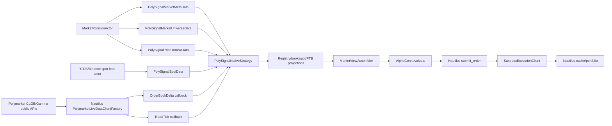

# Pure Nautilus Polymarket market-data path design

Date: 2026-06-29
Status: Approved

## 结论

采用 **Pure Nautilus bridge**：默认 runtime 保持一个长期运行的 Nautilus `TradingNode`，用 Nautilus Polymarket data adapter 接入真实 Polymarket market data，用 Nautilus strategy/actor callbacks 驱动 PolySignal 策略评价，用 Nautilus sandbox execution client 执行 paper orders。

不再让 legacy scheduler/orchestrator 定期把 REST books、spot、PTB 同步进策略评价循环；scheduler 只保留 discovery/config/persistence 相关能力，不能成为 market-data owner 或 strategy-evaluation owner。

保持 paper-safe：不注册 `PolymarketLiveExecClientFactory`，不读取 Polymarket 私钥/API credential 环境变量，不做 live Polymarket execution。

## 目标

1. Polymarket order book deltas 和 trade ticks 由 Nautilus data client 订阅，并通过 `on_order_book_deltas()` / `on_trade_tick()` 更新 strategy-local market view。
2. Gamma market metadata、active universe、spot、price-to-beat 作为 Nautilus custom data 发布，由 strategies 通过 `subscribe_data()` / `on_data()` 接收。
3. `MarketView` 只从 Nautilus callback 更新后的 registry/book/sidecar projection 构建；projection 明确不是 truth source。
4. 策略评价只由 Nautilus callback 触发，不再由 `NautilusOrchestrator.run_once()` 的 `_phase_sync()` + `_phase_strategy_eval()` 扫描触发。
5. 默认 runtime 继续使用 `PolymarketLiveDataClientFactory` + `SandboxLiveExecClientFactory`。
6. market rotation 继续通过 Nautilus actor/universe epoch 进入策略，不重启 `TradingNode`。
7. 每个 strategy 必须能可靠 bootstrap metadata/spot/PTB；禁止“registry is None 时订阅了数据但丢弃 metadata”的半解耦状态。

## 非目标

- 不实现 live Polymarket execution。
- 不改变三条默认策略 alpha 规则：`vwap_momentum`、`late_consensus`、`ptb_diff`。
- 不重写 Nautilus Polymarket adapter。
- 不引入新的 market-data scheduler。
- 不把 Nautilus cache/portfolio 转回 PolySignal 自有 truth source。
- 不增加新依赖。

## 外部 NautilusTrader 事实

设计依据来自 NautilusTrader 文档和当前 vendored source：

- Nautilus custom data 支持 Python/Rust 自定义 data，经 runtime registration 后走同一 data-engine、actor、strategy subscription flow。见 https://nautilustrader.io/docs/latest/concepts/custom_data/。
- `CustomData` 用 `DataType(type_name, metadata, identifier)` 路由；message bus topic equality 基于 `type_name` 和 `metadata`，`identifier` 只影响 catalog path。见 https://nautilustrader.io/docs/latest/concepts/custom_data/。
- Actor/Strategy 可用 `publish_data()` 发布 custom data，用 `subscribe_data()` 订阅；收到数据后 `on_data()` 被调用。见 https://nautilustrader.io/docs/latest/concepts/message_bus/。
- Strategies/actors 通过 `subscribe_order_book_deltas(instrument_id)` 和 `subscribe_trade_ticks(instrument_id)` 订阅 order book/trade data。见 https://nautilustrader.io/docs/latest/concepts/order_book/ 和 https://nautilustrader.io/docs/latest/concepts/data/。
- Nautilus Polymarket adapter 把 Polymarket outcome tokens 表示为 `BinaryOption` instruments。见 https://nautilustrader.io/docs/latest/integrations/polymarket/。
- Polymarket Python adapter config 包含 public data client 参数：`instrument_config`、`ws_max_subscriptions_per_connection`、`auto_load_missing_instruments`、`subscribe_new_markets`、`update_instruments_interval_mins`。见 https://nautilustrader.io/docs/latest/integrations/polymarket/ 和 `refs/nautilus_trader/nautilus_trader/adapters/polymarket/config.py`。
- Polymarket execution config 需要 private key/funder/API credentials/pUSD allowance；这不属于本项目默认 paper-safe runtime。见 https://nautilustrader.io/docs/latest/integrations/polymarket/。

## 当前代码事实

### 已经符合方向的部分

- `src/polysignal_lab/nautilus_runtime/trading_node.py:45-84` 构建 `TradingNodeConfig`，注册 `PolymarketDataClientConfig` 和 sandbox `SandboxExecutionClientConfig`，并调用 `assert_no_live_polymarket_execution(config)`。
- `src/polysignal_lab/nautilus_runtime/trading_node.py:87-98` 注册 `PolymarketLiveDataClientFactory` 和 `SandboxLiveExecClientFactory`。
- `src/polysignal_lab/nautilus_runtime/node.py:261-321` 在 node 组装阶段创建 shared `PolymarketMarketRegistry`、`ExternalDataSidecar`、`NautilusBookDataProvider`、`MarketViewAssembler`，再把 strategies 加到 `node.trader`。
- `src/polysignal_lab/nautilus_runtime/native_strategy.py:301-342` 已有 Nautilus-native `on_order_book_deltas()` / `on_trade_tick()` callbacks，能从 Nautilus cache/tick 更新 book/trade projection 后评价 condition。
- `src/polysignal_lab/nautilus_runtime/native_strategy.py:674-735` 已能按 condition 订阅 book deltas 和 trade ticks。
- `src/polysignal_lab/nautilus_runtime/sidecar_data.py:55-174` 已有 `SidecarDataActor`，能发布 spot、PTB、market metadata、market universe custom data。
- `src/polysignal_lab/nautilus_runtime/sidecar_data.py:175-264` 的 runtime actor 已能在 Nautilus actor lifecycle 内发布 metadata/PTB/spot。

### 必须替换的旧 owner 路径

- `src/polysignal_lab/nautilus_runtime/orchestrator.py:82-93` 仍描述一个外部 phase loop。
- `src/polysignal_lab/nautilus_runtime/orchestrator.py:97-130` 中 `_phase_market_refresh()`、`_phase_sync()`、`_phase_strategy_eval()` 串联了 scheduler refresh、manual data sync、manual strategy evaluation。
- `src/polysignal_lab/nautilus_runtime/data_ingestor.py:59-64` 的 `sync_all()` 主动同步 markets/orderbooks/spots/PTB。
- `src/polysignal_lab/nautilus_runtime/data_ingestor.py:77-128` 从 PolySignal registries 推送 books/trades/spots/PTB 到 matching/sidecar，而不是让 Nautilus callbacks 成为唯一策略评价入口。

这些可以保留作 legacy/manual compatibility，但不能是默认 Nautilus runtime 的 data path。

### 当前 bootstrap 缺口

`PolySignalNativeStrategy` 的 decoupled path 还不成立：

- `native_strategy.py:216-225` 中 `registry is None` 时只订阅 `self.data_names` 和 `PolySignalMarketUniverseData`，没有订阅 `PolySignalMarketMetaData`、`PolySignalSpotData`、`PolySignalPriceToBeatData`。
- `native_strategy.py:258-260` 中收到 `PolySignalMarketMetaData` 后，如果 `self.registry is None` 直接 return。
- 结果：没有 shared registry/sidecar 的 strategy 无法只靠 Nautilus custom data bootstrap metadata/spot/PTB。

设计要求：默认 runtime 必须注入 registry/sidecar，或 strategy 必须创建自己的 local registry/sidecar；不能允许 `registry is None` 且 metadata 被丢弃的状态进入生产路径。

## 方案比较

### 方案 A：继续 hybrid scheduler sync

做法：保留 `NautilusOrchestrator.run_once()`，定时 `_phase_market_refresh()`、`_phase_sync()`、`_phase_strategy_eval()`。

优点：改动少。

缺点：

- 策略评价仍由外部 loop 扫描触发，不是 Nautilus callback-driven。
- REST book sync 和 Nautilus data client 可能形成双 market-data owner。
- 难以证明 Nautilus cache/data-engine 是唯一 runtime truth/projection 源头。

结论：拒绝。

### 方案 B：纯 Nautilus market data + shared projections（推荐）

做法：默认 runtime 继续在 `build_trading_node()` 中创建 shared registry/sidecar/book provider；这些对象只作为 callback-fed projections。Nautilus actor 发布 metadata/universe/spot/PTB custom data；native strategy 订阅 custom data + book/trade streams；所有 strategy evaluation 从 `on_data()`、`on_order_book_deltas()`、`on_trade_tick()` 触发。

优点：

- 最小改动复用现有 `MarketViewAssembler`。
- 已有 production assembly 注入 shared registry/sidecar。
- Nautilus adapter/callback 是 market-data ingress。
- Sandbox execution 保持 paper-safe。

缺点：

- Shared projection 对象仍在 Python 进程内共享，需要文档和 tests 防止被误认为 truth source。
- decoupled strategy path 仍需修正或禁止。

结论：采用。

### 方案 C：每个 strategy 完全自带 registry/sidecar

做法：每个 `PolySignalNativeStrategy` 在没有注入 registry/sidecar 时创建 local `PolymarketMarketRegistry`、`ExternalDataSidecar`、`NautilusBookDataProvider`，完全依赖 custom data bus bootstrap。

优点：strategy 更独立，测试单元隔离更强。

缺点：

- 每个策略重复存 metadata/spot/PTB projection。
- 需要更大改动和更多同步测试。
- 当前 default runtime 已有 shared injected objects，没必要为了理论解耦扩大 diff。

结论：只作为 fallback 修正，不作为默认架构。

## 目标架构

Plain-language version:

- Polymarket books/trades enter via Nautilus adapter, not `DataIngestor.sync_orderbooks()`.
- Metadata/universe/PTB/spot enter via Nautilus custom data, not scheduler-side direct calls into strategies.
- `MarketViewAssembler` remains the small adapter from callback-fed projections to alpha input.
- Order/fill/position truth remains Nautilus cache/portfolio.

## Component changes

### `build_paper_trading_node_config()`

Location: `src/polysignal_lab/nautilus_runtime/trading_node.py`

Keep:

- `data_clients={POLYMARKET_CLIENT_ID: PolymarketDataClientConfig(...)}`.
- `exec_clients={PAPER_EXEC_CLIENT_ID: SandboxExecutionClientConfig(...)}`.
- `assert_no_live_polymarket_execution(config)`.

Require:

- `auto_load_missing_instruments=True`.
- `auto_load_debounce_ms` bounded.
- `auto_load_max_retries` bounded.
- `subscribe_new_markets` controlled by `settings.runtime.nautilus.market_rotation.allow_adapter_new_market_events`.
- no `PolymarketExecClientConfig` / `PolymarketLiveExecClientFactory` in default config.

### `build_trading_node()`

Location: `src/polysignal_lab/nautilus_runtime/node.py`

Keep shared projections, but rename/document them as projections:

- `PolymarketMarketRegistry`: metadata projection built from custom data and startup discovery.
- `ExternalDataSidecar`: spot/PTB projection built from custom data.
- `NautilusBookDataProvider`: order book/trade projection built from Nautilus callbacks.

Require:

- Strategies are constructed with non-`None` registry, sidecar, book provider, and assembler in default runtime.
- `MarketRotationActor` or equivalent Nautilus actor is added before strategies start publishing/consuming market universe data.
- Startup markets are only initial hydration; rotation/custom data owns ongoing updates.

### `PolySignalNativeStrategy.on_start()`

Location: `src/polysignal_lab/nautilus_runtime/native_strategy.py`

Current issue: `registry is None` path does not subscribe to metadata/spot/PTB and later drops metadata.

Required behavior:

1. Always subscribe to all PolySignal custom data types used for bootstrap:
   - `PolySignalMarketMetaData`
   - `PolySignalMarketUniverseData`
   - `PolySignalSpotData`
   - `PolySignalPriceToBeatData`
2. If `registry`/`sidecar`/`assembler` are not injected, create local projection objects before subscribing.
3. If local projection creation is not implemented, fail fast during strategy construction; do not silently run with `registry is None`.
4. After metadata registration, call `_refresh_asset_conditions()` and subscribe active conditions if the universe epoch already marks them active.

Lazy implementation path: keep default runtime injection and add a constructor/runtime assertion that `registry`, `sidecar`, and `assembler` are present for native runtime. Add local-projection support only if an actual test/user path needs fully decoupled strategies.

### `PolySignalNativeStrategy.on_data()`

Location: `src/polysignal_lab/nautilus_runtime/native_strategy.py`

Required behavior:

- `PolySignalMarketMetaData`: register `MarketPairMeta`, refresh asset mapping, subscribe condition if active.
- `PolySignalMarketUniverseData`: replace active set for the epoch, unsubscribe exited streams when possible, subscribe active streams, record pending metadata for unresolved conditions.
- `PolySignalSpotData`: update sidecar projection, evaluate affected active conditions for that asset.
- `PolySignalPriceToBeatData`: update sidecar projection, evaluate that condition.
- Unknown custom data: delegate to assembler updater only if present.

No metadata message may be dropped solely because a shared registry was not injected.

### `PolySignalNativeStrategy` market-data callbacks

Location: `src/polysignal_lab/nautilus_runtime/native_strategy.py`

Keep current direction:

- `on_order_book_deltas()` resolves `instrument_id -> token_id/condition_id`, reads Nautilus cache order book, updates `NautilusBookDataProvider`, evaluates condition.
- `on_trade_tick()` resolves `instrument_id -> token_id/condition_id`, updates trade projection, evaluates condition.

Add tests for both callbacks proving that strategy evaluation happens without `NautilusDataIngestor.sync_all()`.

### `NautilusDataIngestor`

Location: `src/polysignal_lab/nautilus_runtime/data_ingestor.py`

Default runtime requirement:

- Not called by default strategy loop.
- Not responsible for books/trades/spot/PTB in pure Nautilus runtime.

Allowed uses:

- Legacy compatibility.
- Test fixtures.
- One-shot migration/smoke helpers.

If retained, mark as legacy/manual sync and ensure default node assembly does not depend on it for strategy decisions.

### `NautilusOrchestrator`

Location: `src/polysignal_lab/nautilus_runtime/orchestrator.py`

Default runtime requirement:

- `run_once()` must not be the default Nautilus strategy execution mechanism.
- `_phase_strategy_eval()` must not be scheduled for live/default `nautilus` mode.

Allowed uses:

- Legacy smoke/manual command mode only, clearly labeled.

### `MarketViewAssembler`

Location: `src/polysignal_lab/nautilus_bridge/market_view_assembler.py`

Keep it small:

- Input: callback-fed projections.
- Output: immutable `MarketView` for alpha core.
- Missing book/spot/PTB returns `None`; no fallback REST fetch inside assembler.

No new abstraction unless two implementations exist.

## State and ownership rules

| Data | Owner | PolySignal object | Notes |
| --- | --- | --- | --- |
| Instruments | Nautilus Polymarket adapter/provider | registry projection | Instrument IDs map condition/token to Nautilus instruments. |
| Order book deltas | Nautilus data engine/cache | book projection | Strategy reads Nautilus cache in callback. |
| Trade ticks | Nautilus data engine | trade projection | Strategy updates recent trade projection from callback. |
| Metadata/universe | Nautilus actor custom data | registry projection | Actor publishes immutable custom data. |
| Spot | Nautilus actor/custom data | sidecar projection | External feed enters Nautilus actor, not strategy direct poll. |
| PTB | Nautilus actor/custom data | sidecar projection | Changed-only publishing remains required. |
| Orders/fills/positions | Nautilus execution/cache/portfolio | read-only reports | PolySignal projections are non-truth. |

## Subscription rules

1. Subscribe to both `book_deltas` and `trade_ticks` for each active outcome instrument.
2. Track wire subscriptions separately from trading eligibility:
   - active condition set controls whether strategy may evaluate/enter.
   - wire condition/instrument sets record data stream presence.
3. If metadata is missing, mark condition pending metadata and do not call subscribe repeatedly every epoch.
4. If unsubscribe API exists, unsubscribe exited instruments.
5. If unsubscribe API is unavailable or fails, retain wire stream, remove condition from active set, and record retained/degraded state.
6. Do not remove condition wire state until both UP and DOWN instruments have no retained stream.

## Paper-safety rules

Must remain true in default runtime:

- No `PolymarketLiveExecClientFactory` registration.
- No `PolymarketExecClientConfig` in `exec_clients`.
- No reads of `POLYMARKET_PK`, `POLYMARKET_FUNDER`, `POLYMARKET_API_KEY`, `POLYMARKET_API_SECRET`, `POLYMARKET_PASSPHRASE` for default paper runtime.
- Sandbox execution venue routes to `POLYMARKET` data venue but does not submit live orders.
- Reduce-only is not forced into sandbox config to mimic unsupported Polymarket reduce-only behavior.

## Acceptance criteria

### AC1 — Default node wiring is paper-safe

Given `build_paper_trading_node_config()` runs,
then config contains:

- Polymarket data client config under `POLYMARKET`.
- Sandbox execution client config under paper exec client id.
- No live Polymarket execution client.
- `assert_no_live_polymarket_execution(config)` passes.

### AC2 — Strategy bootstraps custom data

Given a native strategy starts,
then it subscribes to:

- `PolySignalMarketMetaData`
- `PolySignalMarketUniverseData`
- `PolySignalSpotData`
- `PolySignalPriceToBeatData`

And either:

- it has injected registry/sidecar/assembler projections, or
- it creates local projections before any `on_data()` handling.

A strategy must not drop metadata only because `registry is None`.

### AC3 — No default manual sync strategy loop

Given default `nautilus` runtime is running,
then accepted/rejected decisions are produced from Nautilus callbacks/custom data events, not from `NautilusOrchestrator._phase_strategy_eval()`.

### AC4 — Order book callback evaluates condition

Given a Nautilus order book delta callback arrives for a subscribed outcome instrument,
then the strategy:

1. resolves instrument id to token and condition,
2. reads Nautilus cache order book,
3. updates `NautilusBookDataProvider`,
4. builds `MarketView` if spot/PTB/opposite book are present,
5. evaluates the condition once.

### AC5 — Trade tick callback evaluates condition

Given a Nautilus trade tick callback arrives for a subscribed outcome instrument,
then the strategy updates the trade projection and evaluates the matching condition once.

### AC6 — Metadata/universe drives dynamic subscription

Given a new market enters the universe epoch,
then strategy registers metadata, resolves UP/DOWN instruments, and subscribes book deltas/trade ticks for both.

Given a market exits the universe epoch,
then strategy removes it from active trading eligibility and unsubscribes streams when supported.

### AC7 — Missing metadata does not storm subscriptions

Given a universe epoch references a condition without registered metadata,
then strategy marks it pending metadata and does not repeatedly call Nautilus subscribe APIs on every epoch.

### AC8 — Spot/PTB are custom-data driven

Given spot or PTB custom data arrives,
then strategy updates sidecar projection and evaluates only affected active conditions.

No REST fallback is allowed inside `MarketViewAssembler` or strategy evaluation.

### AC9 — Changed-only PTB publishing remains intact

Given PTB refresh returns the same PTB value/source tuple for a condition,
then no duplicate `PolySignalPriceToBeatData` event is published.

### AC10 — Logs remain explainable

Given decisions are recorded,
then `logs/nautilus_decisions.jsonl` identifies strategy, market, condition, token, side, data freshness, reason codes, and metrics.

Given a duplicate is rejected,
then `logs/rejected_signals.jsonl` records `reason_code=DUPLICATE_SIGNAL` and the candidate payload.

## Test plan

Smallest useful tests only:

1. Update `tests/test_nautilus_trading_node_runtime.py` or existing equivalent to assert data client + sandbox exec client only.
2. Update `tests/test_nautilus_native_strategy.py` to assert native strategy subscribes metadata/universe/spot/PTB custom data at start.
3. Add/extend a callback test proving `on_order_book_deltas()` updates book projection and calls `evaluate_condition()` without `NautilusDataIngestor.sync_all()`.
4. Add/extend a callback test proving `on_trade_tick()` updates trade projection and calls `evaluate_condition()`.
5. Add/extend a universe test proving missing metadata enters pending state without repeated subscribe calls.
6. Add/extend a bootstrap test for the `registry is None` path: either it creates local projections and processes metadata, or construction fails fast with a clear error.

No live Polymarket credentials. No broad Docker/system prune. No mocks for market behavior beyond lightweight fake Nautilus callback objects already used in tests.

## Migration sequence

1. Lock default node wiring: verify data client + sandbox exec config and live execution guard.
2. Fix strategy bootstrap invariant:
   - preferred minimal path: require injected registry/sidecar/assembler in default runtime and fail fast otherwise;
   - optional path: create local projections for standalone strategy tests.
3. Make custom data subscriptions unconditional for metadata/universe/spot/PTB.
4. Ensure `on_data()` never drops metadata because registry was absent.
5. Keep `MarketViewAssembler` pure projection-to-view; no fetches.
6. Mark `NautilusDataIngestor` and `NautilusOrchestrator` manual-sync path as legacy/non-default if they remain.
7. Add focused tests from the test plan.
8. Run targeted tests covering node config, native strategy subscriptions/callbacks, and market rotation/subscription state.

## Open decisions

1. Whether to delete `NautilusOrchestrator` default entry points now or leave them as explicit legacy/manual mode.
2. Whether to implement fully local strategy projections now, or fail fast when registry/sidecar/assembler are missing.
3. Whether `PolySignalRuntimeSidecarActor` should be merged into `MarketRotationActor` or kept as a small publisher helper.

Recommended lazy choices:

- Keep `NautilusOrchestrator` only as legacy/manual compatibility until no callers remain.
- Fail fast on missing injected projections in default runtime; implement local strategy projections only if a real standalone path needs them.
- Keep `SidecarDataActor` as the publisher helper; avoid a new abstraction.
