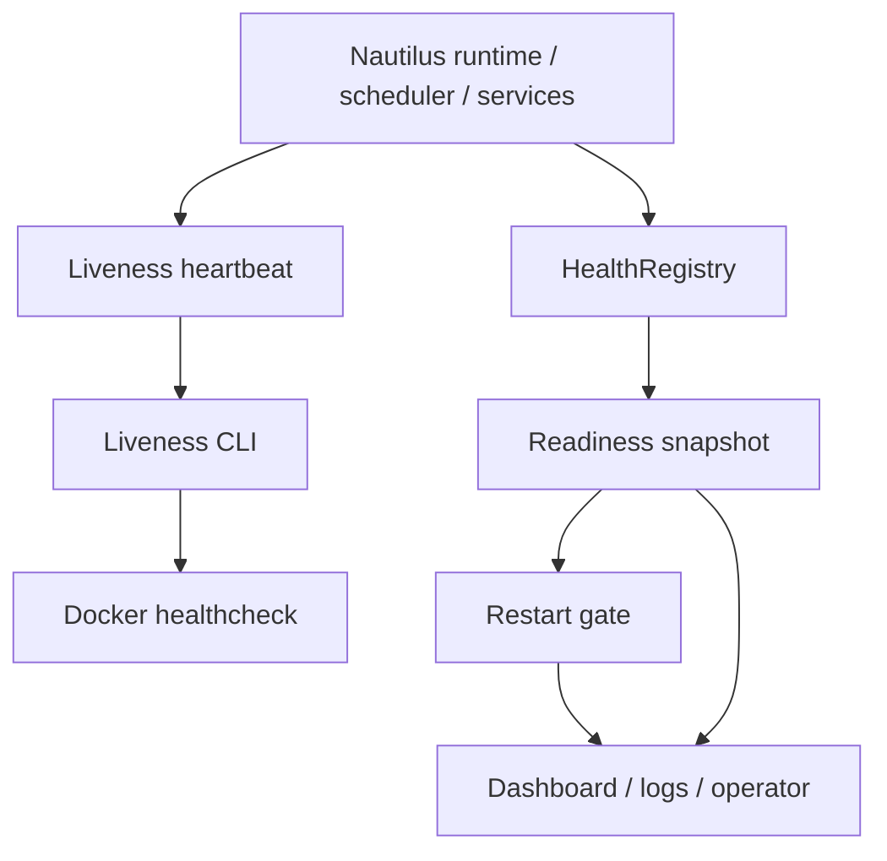

# 容器健康检查优化设计

日期：2026-06-30

状态：已批准进入规格文档阶段

## 目标

解决“健康检查误判导致容器重启”的问题。

核心原则：

- Docker healthcheck 不承担完整业务健康判断。
- 短暂外部依赖异常、启动 warmup、市场数据抖动，不直接触发容器重启。
- 业务健康状态仍真实暴露，方便 dashboard、日志和人工排障。
- 只有“明确不可恢复”或“关键组件持续失败”进入重启建议路径。

推荐设计：**liveness / readiness / restart gate 三层分离**。

## 1. 当前上下文

### 主容器 healthcheck

`docker-compose.yml` 中 `polysignal-lab` 当前 healthcheck 是：

```yaml
test: ["CMD", "python", "-c", "import sqlite3; sqlite3.connect('data/polysignal_lab.sqlite3').execute('SELECT 1')"]
interval: 30s
timeout: 5s
retries: 3
start_period: 10s
```

它只证明：

- Python 能启动；
- SQLite 文件能打开；
- `SELECT 1` 能执行。

它不能证明：

- Nautilus runtime 正常；
- scheduler 正常；
- market data 正常；
- strategies 仍活跃；
- Telegram/publisher 正常；
- 容器主进程没有卡死；
- 系统是否应该重启。

所以它既可能假阳性，也可能在 SQLite 短暂 busy/locked 时产生假阴性。

### Dashboard healthcheck

`dashboard` 容器 healthcheck 调 `/health`：

```yaml
test: ["CMD", "python", "-c", "import urllib.request; urllib.request.urlopen('http://localhost:8080/health')"]
```

这适合 dashboard 自身活性检查，但不替代主 runtime 健康判断。

### 现有健康模型

项目已有：

- `src/polysignal_lab/observability/health.py`
- `HealthRegistry`
- `ComponentHealth`
- `HealthSnapshot`
- 状态：`ok | degraded | down`
- transition event 机制：只在状态变化时产生事件

这套模型适合做 readiness / observability，不需要新造一套健康框架。

### Docker 语义

在普通 Docker Compose 下：

- `healthcheck` 失败会把容器标成 `unhealthy`；
- `restart: unless-stopped` 不会因为 `unhealthy` 自动重启；
- `restart: unless-stopped` 主要在进程退出时重启。

所以如果实际发生“健康误判导致重启”，可能存在三种情况：

1. 使用了 Docker Swarm 或外部 supervisor；
2. 项目中有 ops 自动重启逻辑消费了 unhealthy/readiness 状态；
3. 主进程因为误判触发 fatal/exit，然后 Docker restart policy 拉起。

设计同时避免这三类误判链路。

## 2. 推荐方案

采用三层健康模型：

```text
Docker healthcheck 只看 liveness
Dashboard / logs 看 readiness
自动/人工重启参考 restart gate
```

| 层级 | 用途 | 消费者 | 是否直接触发 Docker 失败 |
|---|---|---|---|
| Liveness | 容器进程是否还活着 | Docker healthcheck | 是 |
| Readiness | 业务组件是否正常 | dashboard / logs / operator | 否 |
| Restart gate | 是否值得重启 | ops / manual / optional automation | 默认否 |

## 3. Liveness 设计

### 职责

回答一个问题：

> 这个容器里的主 runtime 是否还活着，并且仍有机会自愈？

它不回答：

- 市场数据是否完整；
- 当前是否有信号；
- 策略是否盈利；
- CLOB/Binance 是否短暂可用；
- Telegram 是否能发消息；
- SQLite 是否出现过短暂 busy。

### 输入

liveness probe 基于最少信息：

- 主进程存在；
- 主 runtime 最近 heartbeat 时间未过期；
- 主事件循环仍能响应；
- 没有明确 fatal 标记。

### 输出

- 成功：exit `0`
- 失败：exit non-zero

### 判失败条件

只允许这些情况让 liveness 失败：

1. 主 runtime 明确 fatal；
2. 主 heartbeat 长时间未更新；
3. probe 自身无法读取必要状态；
4. 主进程/事件循环不可响应；
5. Nautilus node 已退出且无恢复路径。

### 不判失败条件

这些只进入 readiness，不让 liveness 失败：

- CLOB WS 短暂断线；
- Binance WS 短暂断线；
- REST fallback 被触发；
- 单个 market metadata 缺失；
- instrument cache 启动中；
- subscription warmup 中；
- SQLite 短暂 locked/busy；
- Telegram 发送失败；
- dashboard 读不到最新业务数据；
- 当前没有策略信号；
- 某个非关键组件 `degraded`。

### 启动期

启动期必须更宽松。

当前 `start_period: 10s` 对 Nautilus runtime 偏短，尤其存在：

- instrument cache loading；
- market discovery；
- custom data sidecar；
- strategy subscription；
- Nautilus startup。

设计要求：

- liveness 在启动期只检查主进程和 probe 可执行；
- readiness 可以显示 `degraded` 或启动阶段 metrics；
- Docker `start_period` 覆盖真实 warmup 时间；
- 不在启动期因 market/cache/subscription 未就绪失败。

状态仍使用现有 `ok | degraded | down`，不新增 `starting` 状态。启动状态作为 metric 暴露，例如：

```json
{
  "runtime_phase": "starting",
  "startup_elapsed_sec": 42,
  "instrument_cache_ready": false
}
```

## 4. Readiness 设计

### 职责

readiness 是业务健康事实源。

回答：

> 系统当前哪些组件正常、退化、不可用？

它用于：

- dashboard；
- JSONL/system events；
- manual health check；
- smoke verification；
- future ops automation。

### 状态语义

沿用现有状态。

#### `ok`

组件正常工作。

#### `degraded`

组件有问题，但系统仍可继续运行或自愈。

例子：

- CLOB WS reconnecting；
- Binance WS stale；
- Telegram send failure；
- 某个 market 缺少 metadata；
- REST fallback 被使用；
- 部分 market data stale；
- subscription 正在恢复。

#### `down`

组件当前不可用，且影响明显。

例子：

- runtime 已停止；
- scheduler 主循环停止；
- SQLite 长时间不可写；
- CLOB REST 长时间不可用且无 fallback；
- 所有关键 market data 均不可用；
- Nautilus node 已退出；
- strategy execution callback 不再运行。

### Readiness 组件

优先复用已有 HealthRegistry 信号。

#### `runtime`

主 runtime / Nautilus node 状态。

关键 metrics：

- `heartbeat_age_sec`
- `runtime_phase`
- `active_strategy_count`
- `node_running`
- `last_success_at`
- `last_error`

#### `scheduler`

scheduler 是否还在推进周期。

metrics：

- `last_tick_at`
- `last_tick_age_sec`
- `active_market_count`
- `last_cycle_error`

#### `clob_ws`

Polymarket CLOB websocket。

metrics：

- `connected`
- `subscribed_token_count`
- `stale_token_count`
- `reconnect_count`
- `last_message_age_sec`

#### `clob_rest`

Polymarket REST fallback / snapshot loading。

metrics：

- `batch_success_count`
- `fallback_count`
- `last_success_at`
- `last_error`

#### `binance_ws`

anchor/spot side data。

metrics：

- `connected`
- `last_tick_age_sec`
- `stale_symbol_count`

#### `sqlite`

persistence。

metrics：

- `last_write_success_at`
- `last_write_error`
- `busy_count`
- `write_latency_ms`

#### `publisher`

Telegram / publish service。

metrics：

- `send_success`
- `send_failure`
- `rate_limited`
- `last_error`

### Readiness 聚合规则

整体状态：

- 任一关键组件 `down` → overall `down`
- 否则任一组件 `degraded` → overall `degraded`
- 否则 `ok`

关键组件初始建议：

- `runtime`
- `scheduler`
- `sqlite`
- `clob_rest` 或 `clob_ws`，按当前系统是否能靠 fallback 自愈确定

非关键组件：

- `telegram`
- `dashboard`
- 单个外部 stream
- 单个 market metadata

## 5. Restart gate 设计

### 职责

restart gate 不是健康事实源。

它只回答：

> 当前状态是否严重且持续到值得重启？

默认不直接喂给 Docker healthcheck，而是暴露给 dashboard/log/ops。

### 输入

- readiness snapshot；
- critical component list；
- startup grace period；
- failure duration threshold；
- consecutive failure count；
- last recovery time。

### 输出

```json
{
  "restart_recommended": false,
  "reason": null,
  "critical_down_components": [],
  "down_duration_sec": 0,
  "consecutive_failures": 0
}
```

或：

```json
{
  "restart_recommended": true,
  "reason": "runtime heartbeat stale for 300s",
  "critical_down_components": ["runtime"],
  "down_duration_sec": 300,
  "consecutive_failures": 10
}
```

### 默认门控规则

1. 启动宽限期内永不建议重启，除非主进程 fatal。
2. 非关键组件 `degraded/down` 不建议重启。
3. 关键组件单次 `down` 不建议重启。
4. 关键组件连续 `down` 超过阈值才建议重启。
5. 任一关键组件恢复 `ok` 后清零连续失败计数。
6. fatal 状态可以立即建议重启。

### 建议阈值

保守默认：

```yaml
health:
  startup_grace_sec: 180
  restart_gate:
    critical_down_sec: 300
    min_consecutive_failures: 5
```

解释：

- healthcheck interval 当前是 30s；
- 5 次连续失败约等于 150s；
- `critical_down_sec: 300` 更保守；
- 二者同时满足才建议重启，避免短抖动。

如果需要更快自动恢复，后续通过配置调小阈值。

### 自动重启模式

默认：不自动重启，只推荐。

可选配置：

```yaml
health:
  restart_gate:
    docker_healthcheck_fails_on_restart_recommended: false
```

如果改为 `true`：

- liveness probe 在 `restart_recommended=true` 时返回非零；
- 适合 Swarm/外部 supervisor；
- 风险更高，必须显式开启。

默认不加复杂自动动作。先切断误判，再让 operator 看见清楚状态。

## 6. Docker healthcheck 设计

### 主容器

当前：

```yaml
test: ["CMD", "python", "-c", "import sqlite3; sqlite3.connect('data/polysignal_lab.sqlite3').execute('SELECT 1')"]
```

目标：

```yaml
test: ["CMD", "python", "-m", "polysignal_lab.healthcheck", "liveness"]
```

或等价最小 CLI。

行为：

- 成功：runtime 活着；
- 失败：runtime fatal / heartbeat stale / probe 无法执行。

不把 SQLite `SELECT 1` 作为唯一条件。

### 参数建议

```yaml
interval: 30s
timeout: 5s
retries: 3
start_period: 180s
```

理由：

- `interval`/`timeout` 保持现有；
- `retries: 3` 保持现有；
- `start_period` 从 10s 提到更符合 Nautilus warmup 的值。

如果实际 startup 更慢，后续用运行日志校准。

### Dashboard 容器

Dashboard 仍检查 `/health`。

Dashboard `/health` 只代表 dashboard 自身可响应，不代表主策略 runtime 完全健康。

如果 dashboard 读取主 runtime readiness，也作为 payload 字段暴露，不让 dashboard 自己返回 500。

## 7. 数据流



解释：

- runtime 每个主循环或关键阶段更新 heartbeat；
- HealthRegistry 接收组件状态；
- readiness 聚合组件状态；
- restart gate 消费 readiness，但默认只输出建议；
- Docker healthcheck 只调用 liveness probe；
- dashboard 同时展示 readiness 和 restart recommendation。

## 8. 错误处理

### Probe 自身失败

如果 liveness probe 无法运行，返回失败。

例如：

- Python import 失败；
- 状态文件不可读；
- heartbeat 文件格式损坏；
- probe 超时。

这是合理的 liveness 失败，因为容器已经不能自我报告。

### SQLite locked/busy

SQLite 错误不直接让 liveness 失败。

规则：

- 短暂 busy → readiness `degraded`
- 持续不可写 → readiness `down`
- 持续 `down` 超阈值 → restart gate 建议重启

原因：SQLite busy 可能是正常短暂写竞争，不能直接杀容器。

### 外部 API 故障

CLOB/Binance/Gamma 故障不直接让 liveness 失败。

规则：

- 单源故障 → degraded；
- 所有数据源不可用且持续超阈值 → down；
- critical down 持续超阈值 → restart gate 建议。

### Startup

启动期不因 readiness degraded 失败。

规则：

- startup grace 内只检查主进程/probe；
- readiness 仍记录真实状态；
- grace 后再启用 restart gate 计时。

### 状态恢复

恢复规则：

- 组件回到 `ok` 时清除 active error；
- transition event 记录恢复；
- restart gate 清零该组件连续失败；
- 不重复刷 warning，只记录状态变化。

这符合项目既有健康状态约定：状态不变时更新指标，状态变化时才产生警告或事件。

## 9. 配置设计

最小配置块：

```yaml
health:
  startup_grace_sec: 180
  liveness:
    heartbeat_max_age_sec: 120
  restart_gate:
    enabled: true
    critical_components:
      - runtime
      - scheduler
      - sqlite
    critical_down_sec: 300
    min_consecutive_failures: 5
    docker_healthcheck_fails_on_restart_recommended: false
```

默认值：

- `startup_grace_sec: 180`
- `heartbeat_max_age_sec: 120`
- `critical_down_sec: 300`
- `min_consecutive_failures: 5`
- `docker_healthcheck_fails_on_restart_recommended: false`

不把每个组件和阈值都做成复杂配置。默认关键组件固定即可；真有运维差异，再加 override。

## 10. 文件/接口边界设计

本节只描述目标边界，不实施代码。

### Liveness probe CLI

目标入口：

```bash
python -m polysignal_lab.healthcheck liveness
```

职责：

- 读取 heartbeat/fatal 状态；
- 应用 startup grace；
- 返回 exit code。

### Runtime heartbeat writer

runtime 主循环或 orchestrator 定期写：

```json
{
  "updated_at": "2026-06-30T00:00:00Z",
  "phase": "running",
  "fatal": false,
  "fatal_reason": null
}
```

存放位置使用现有 `state/` 目录。

### Readiness snapshot

继续使用 `HealthRegistry.snapshot()`。

不新建健康状态模型。

### Restart gate evaluator

纯函数输入 readiness + config + now，输出 restart recommendation。

保持可测试，不依赖 Docker。

## 11. 测试设计

只做能防回归的最小测试。

### Liveness unit tests

覆盖：

1. heartbeat 新鲜 → exit success；
2. heartbeat stale → exit failure；
3. fatal marker → exit failure；
4. startup grace 内 heartbeat 尚未 ready → success；
5. corrupted heartbeat → failure；
6. missing heartbeat after grace → failure。

### Restart gate unit tests

覆盖：

1. 非关键组件 down → 不建议重启；
2. 关键组件单次 down → 不建议重启；
3. 关键组件连续 down 未达阈值 → 不建议重启；
4. 关键组件持续 down 达阈值 → 建议重启；
5. 组件恢复 ok → 清零失败计数；
6. startup grace 内 → 不建议重启。

### Readiness unit tests

覆盖：

1. 任一 down → overall down；
2. 任一 degraded 且无 down → overall degraded；
3. 全 ok → overall ok；
4. transition event 只在状态变化时产生。

已有 `test_health_metrics.py` 可扩展，不需要新测试框架。

### Config tests

覆盖：

1. 默认配置保守；
2. YAML 覆盖生效；
3. `docker_healthcheck_fails_on_restart_recommended` 默认为 false。

### Compose/config verification

覆盖：

- 主容器 healthcheck 不再执行 SQLite `SELECT 1`；
- `start_period` 合理增加；
- dashboard healthcheck 保持 dashboard 自身探针。

### 不做的测试

暂不做：

- full Docker E2E；
- live Polymarket 网络故障注入；
- Swarm 自动重启集成测试；
- dashboard UI 大改测试。

原因：本次目标是切断误判重启，核心逻辑可用小测试覆盖。

## 12. 验收标准

实现应满足：

1. 主容器 Docker healthcheck 不再只检查 SQLite `SELECT 1`。
2. 短暂 SQLite busy 不导致 liveness 失败。
3. 短暂 CLOB/Binance/Gamma 故障不导致 liveness 失败。
4. 启动 warmup 期间 readiness 可 degraded，但 liveness 成功。
5. runtime heartbeat stale 会导致 liveness 失败。
6. fatal runtime 状态会导致 liveness 失败。
7. readiness 继续暴露组件 `ok | degraded | down`。
8. restart gate 对关键组件持续 down 才建议重启。
9. 状态恢复后 restart gate 清零连续失败。
10. Docker healthcheck 默认不消费 restart gate 的重启建议。
11. 如果显式开启 aggressive 模式，restart gate 可让 healthcheck 失败。
12. 相关 unit tests 覆盖 liveness、readiness、restart gate。
13. `docker compose config` 能解析新的 healthcheck 配置。
14. 不引入新依赖。
15. 不改变策略逻辑、market discovery、Telegram 发布、PTB/anchor 逻辑。

## 13. 非目标

本设计不做：

- 自动修复所有业务健康问题；
- 新建完整监控系统；
- 引入 Prometheus/Grafana；
- 改策略阈值；
- 改 Nautilus trading semantics；
- 改 Telegram 功能；
- 改 dashboard 大 UI；
- 实现自动无限重启策略；
- 给每个组件做复杂配置 DSL。

## 14. 推荐最终取舍

采用：

> Docker healthcheck = conservative liveness
> HealthRegistry = readiness observability
> Restart gate = sustained critical failure recommendation

默认不自动把业务 degraded 转成容器失败。

原因：

- 最小改变能解决误判重启；
- 不隐藏业务健康问题；
- 不让 Docker 负责复杂业务判断；
- 复用已有 HealthRegistry；
- 避免新依赖和大框架；
- 后续如果确认 Swarm/ops 需要自动重启，可显式打开 aggressive 模式。

## 15. 设计摘要

把“容器是否活着”和“业务是否完美健康”拆开：Docker 只杀真正死掉的容器，业务退化交给 readiness 和 restart gate 处理。
